# SRS Diagrams Reference

**Software Requirements Specification - Vending Machine Control System:**

Version: 1.0  
Date: October 23, 2025  
Document Purpose: Maps SRS Section 11 diagram requirements to actual implementation

---

## Table of Contents

- [11.1 System Context Diagram](#111-system-context-diagram)
- [11.2 Service Interaction Sequence Diagrams](#112-service-interaction-sequence-diagrams)
- [11.3 Kafka Topic Flow Diagram](#113-kafka-topic-flow-diagram)
- [11.4 Component Diagram](#114-component-diagram)
- [11.5 Database Entity Relationship Diagram](#115-database-entity-relationship-diagram)
- [11.6 Deployment Diagram (Local Development)](#116-deployment-diagram-local-development)

---

## 11.1 System Context Diagram

**SRS Section**: 11.1  
**Status**: ✅ **IMPLEMENTED**  
**Location**: `Documentation/diagrams/system-overview.md`

### System Context Diagram

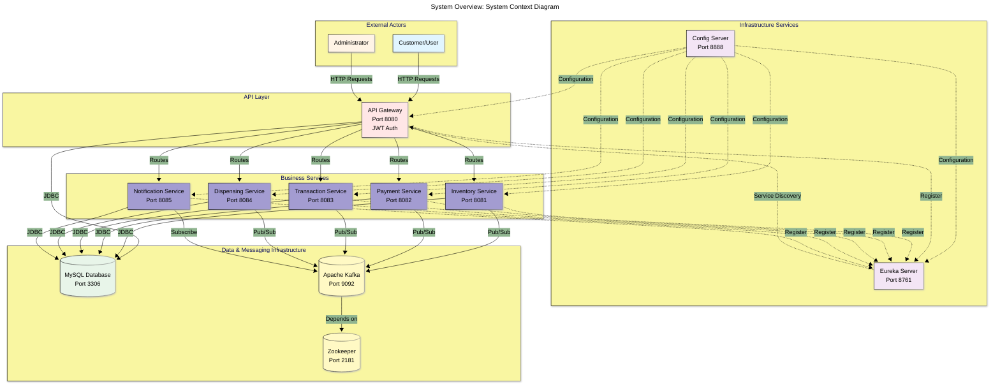

**Reference**: For detailed architecture, see [system-overview.md](diagrams/system-overview.md#system-context-diagram)

---

## 11.2 Service Interaction Sequence Diagrams

**SRS Section**: 11.2  
**Status**: ✅ **IMPLEMENTED**

### 11.2.1 Complete Purchase Flow

**Location**: `Documentation/diagrams/system-overview.md`

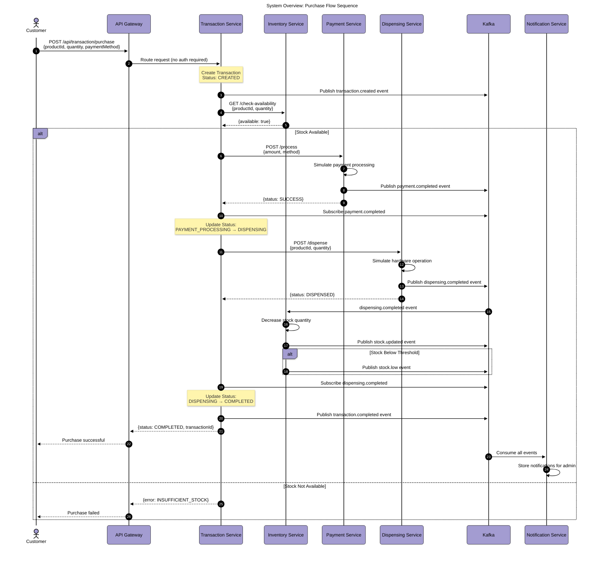

**Reference**: [system-overview.md - Purchase Flow](diagrams/system-overview.md#purchase-flow-sequence-diagram)

---

### 11.2.2 Failed Payment Flow

**SRS Requirement**: "Failed payment flow"  
**Status**: ✅ **IMPLEMENTED**  
**Location**: `Documentation/diagrams/transaction-service.md`

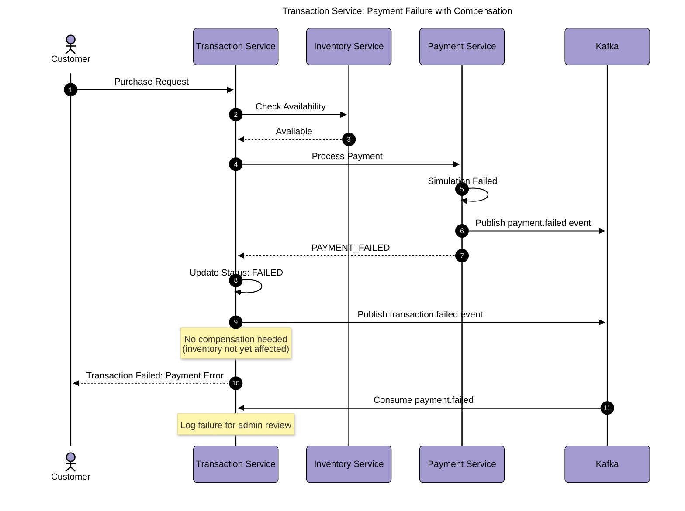

**Reference**: [transaction-service.md - Payment Failure Flow](diagrams/transaction-service.md#payment-failure-flow-with-compensation)

---

### 11.2.3 Failed Dispensing Flow

**SRS Requirement**: "Failed dispensing flow"  
**Status**: ✅ **IMPLEMENTED**  
**Location**: `Documentation/diagrams/transaction-service.md`

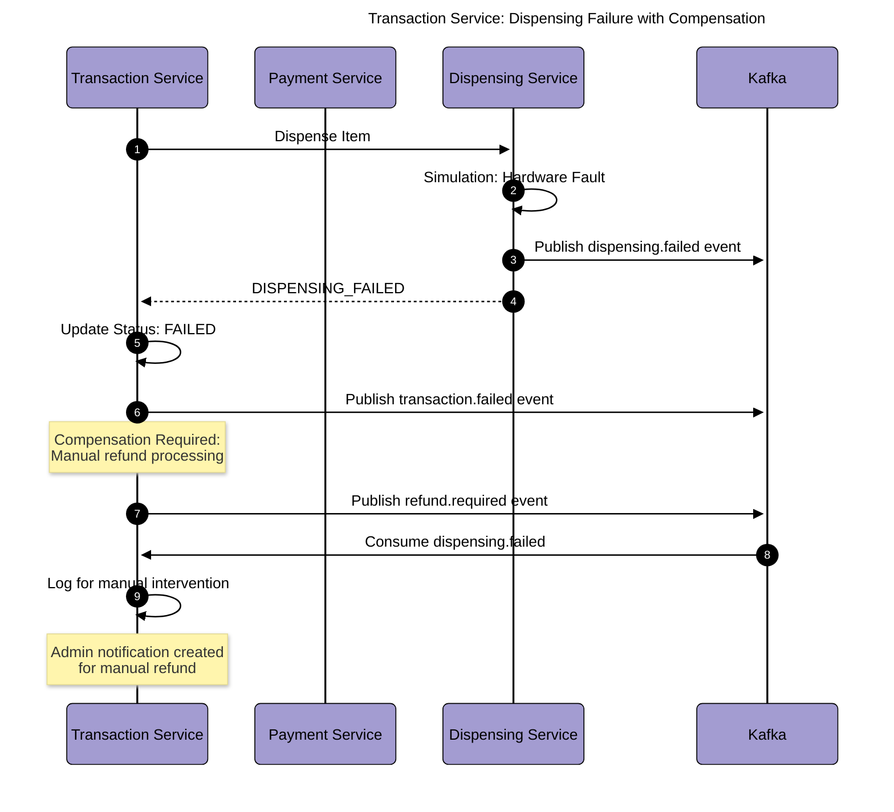

**Reference**: [transaction-service.md - Dispensing Failure Flow](diagrams/transaction-service.md#dispensing-failure-with-compensation)

---

### 11.2.4 Low Stock Alert Flow

**SRS Requirement**: "Low stock alert flow"  
**Status**: ✅ **IMPLEMENTED**  
**Location**: `Documentation/diagrams/inventory-service.md`

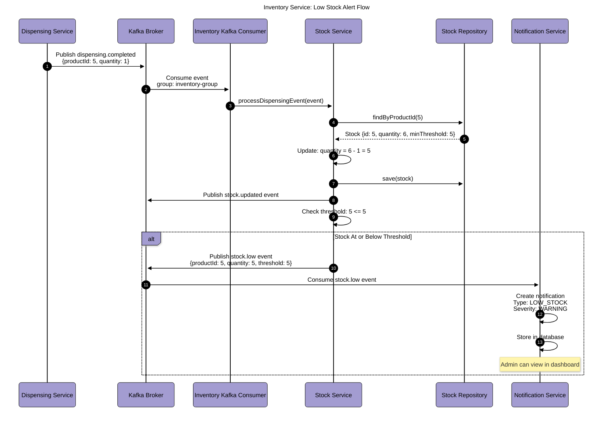

**Reference**: [inventory-service.md - Low Stock Alert Flow](diagrams/inventory-service.md#low-stock-alert-flow)

---

### 11.2.5 Admin Operations Flow

**SRS Requirement**: "Admin operations flow"  
**Status**: ✅ **IMPLEMENTED**  
**Location**: `Documentation/diagrams/api-gateway.md`

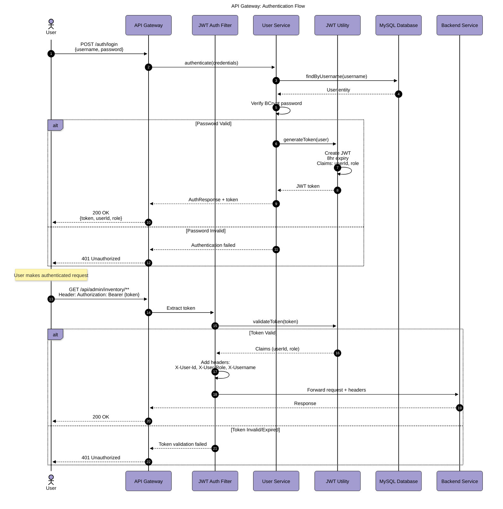

**Reference**: [api-gateway.md - Authentication Flow](diagrams/api-gateway.md#authentication-flow)

---

## 11.3 Kafka Topic Flow Diagram

**SRS Section**: 11.3  
**Status**: ✅ **IMPLEMENTED**  
**Location**: `Documentation/diagrams/system-overview.md`

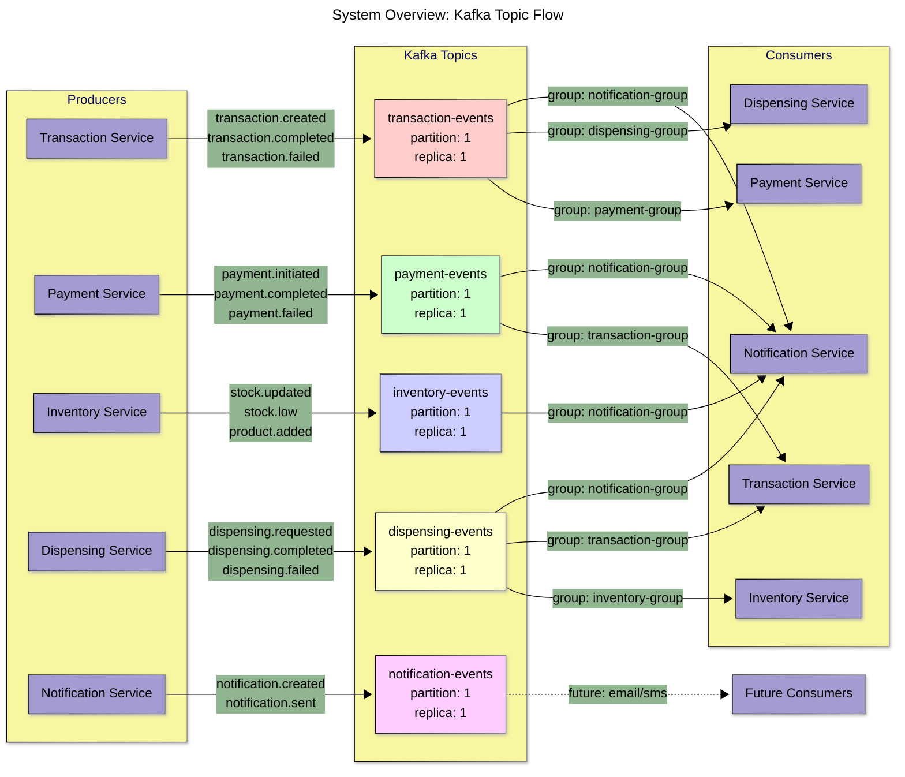

**Reference**: [system-overview.md - Kafka Topic Flow](diagrams/system-overview.md#kafka-topic-flow-diagram)

---

## 11.4 Component Diagram

**SRS Section**: 11.4  
**Status**: ✅ **IMPLEMENTED** (Multiple component diagrams available)

### API Gateway Component Diagram

**Location**: `Documentation/diagrams/api-gateway.md`

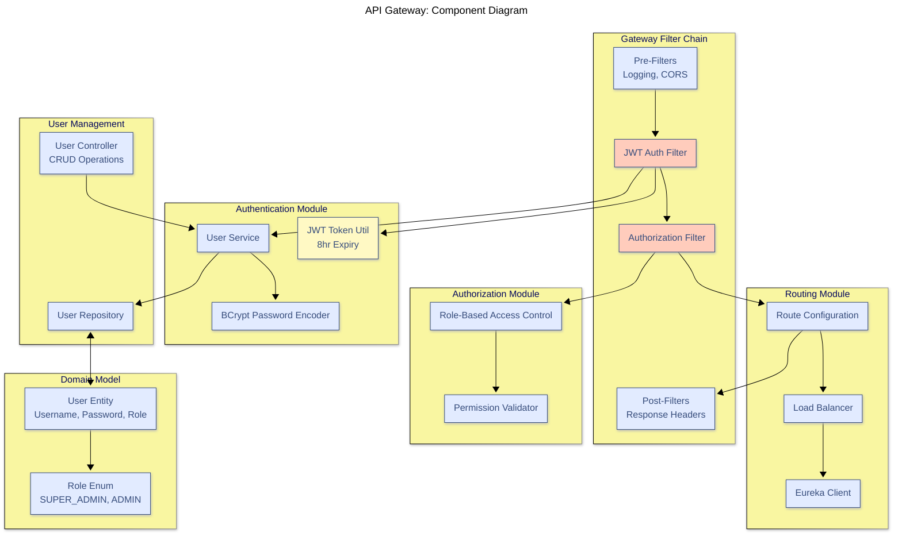

**Additional Component Diagrams Available:**

- [Inventory Service Components](diagrams/inventory-service.md#component-diagram)
- [Payment Service Components](diagrams/payment-service.md#component-diagram)
- [Transaction Service Components](diagrams/transaction-service.md#component-diagram)
- [Dispensing Service Components](diagrams/dispensing-service.md#component-diagram)
- [Notification Service Components](diagrams/notification-service.md#component-diagram)

---

## 11.5 Database Entity Relationship Diagram

**SRS Section**: 11.5  
**Status**: ✅ **IMPLEMENTED** (Per-service ERDs available)

### Consolidated Database Overview

**Database Architecture**: Database-per-service pattern with 6 independent databases

#### 11.5.1 API Gateway Database (vending_auth)

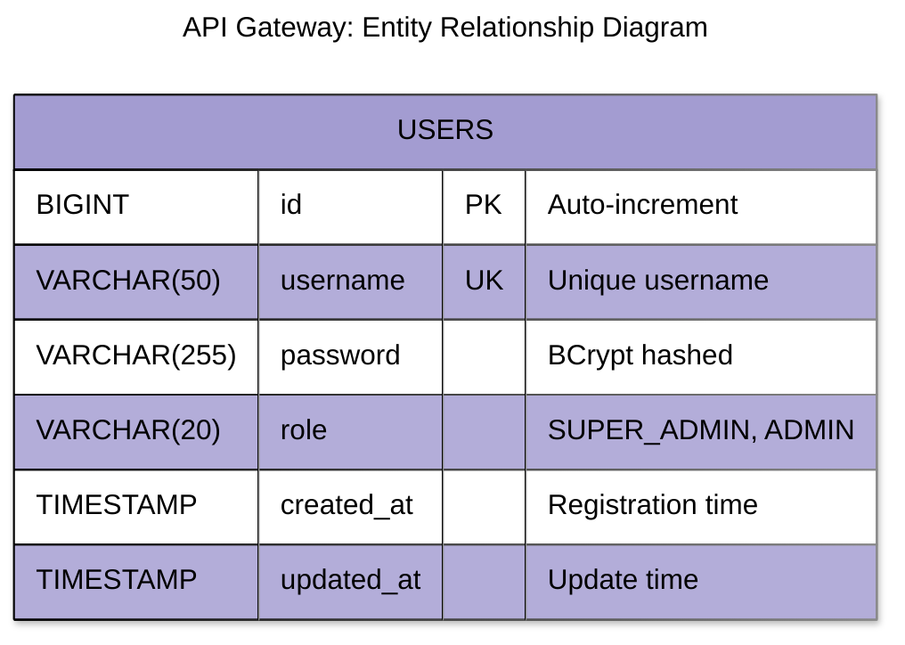

**Reference**: [api-gateway.md - ERD](diagrams/api-gateway.md#entity-relationship-diagram)

---

#### 11.5.2 Inventory Service Database (vending_inventory)

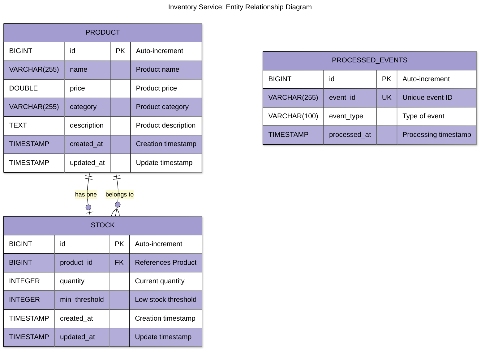

**Reference**: [inventory-service.md - ERD](diagrams/inventory-service.md#entity-relationship-diagram)

---

#### 11.5.3 Payment Service Database (vending_payment)

**Reference**: [payment-service.md - ERD](diagrams/payment-service.md#entity-relationship-diagram)

#### 11.5.4 Transaction Service Database (vending_transaction)

**Reference**: [transaction-service.md - ERD](diagrams/transaction-service.md#entity-relationship-diagram)

#### 11.5.5 Dispensing Service Database (vending_dispensing)

**Reference**: [dispensing-service.md - ERD](diagrams/dispensing-service.md#entity-relationship-diagram)

#### 11.5.6 Notification Service Database (vending_notification)

**Reference**: [notification-service.md - ERD](diagrams/notification-service.md#entity-relationship-diagram)

---

## 11.6 Deployment Diagram (Local Development)

**SRS Section**: 11.6  
**Status**: ✅ **IMPLEMENTED**  
**Location**: `Documentation/diagrams/system-overview.md`

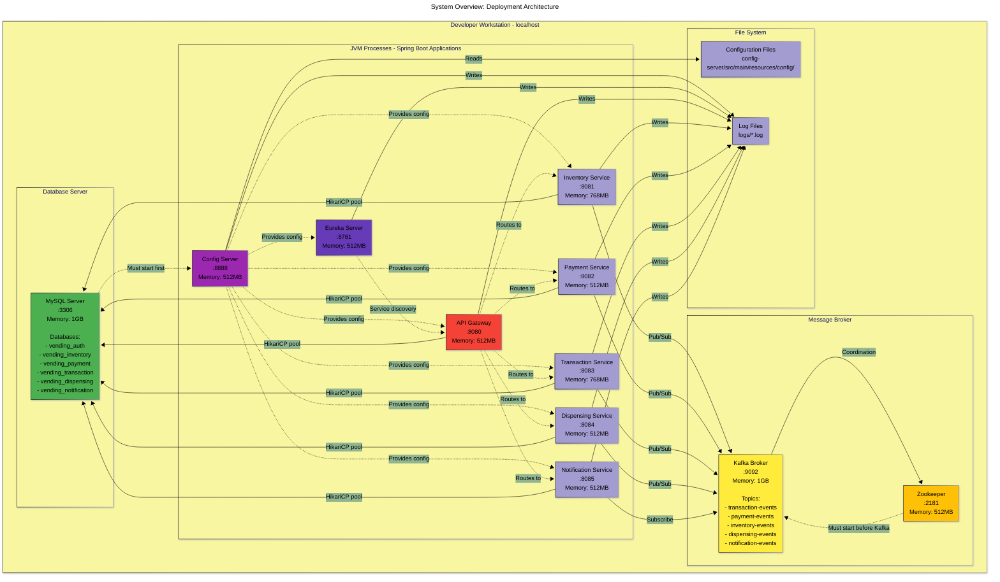

### System Requirements

| Component            | Memory   | Disk     | CPU    | Network   |
| -------------------- | -------- | -------- | ------ | --------- |
| Config Server        | 512MB    | 50MB     | Low    | localhost |
| Eureka Server        | 512MB    | 50MB     | Low    | localhost |
| API Gateway          | 512MB    | 100MB    | Medium | localhost |
| Inventory Service    | 768MB    | 200MB    | Medium | localhost |
| Payment Service      | 512MB    | 100MB    | Low    | localhost |
| Transaction Service  | 768MB    | 200MB    | Medium | localhost |
| Dispensing Service   | 512MB    | 100MB    | Low    | localhost |
| Notification Service | 512MB    | 100MB    | Low    | localhost |
| MySQL Server         | 1GB      | 500MB    | Medium | localhost |
| Kafka + Zookeeper    | 1.5GB    | 1GB      | Medium | localhost |
| **Total**            | **~6GB** | **~2GB** | -      | -         |

**Reference**: [system-overview.md - Deployment Diagram](diagrams/system-overview.md#deployment-diagram)

---

## Additional Diagrams (Not in SRS Requirements)

The following diagrams were created beyond SRS requirements for comprehensive documentation:

### Infrastructure Architecture

- **Overall Infrastructure Topology**: [infrastructure-services.md](diagrams/infrastructure-services.md#overall-infrastructure-topology)
- **Config Server Architecture**: [infrastructure-services.md](diagrams/infrastructure-services.md#config-server-architecture)
- **Eureka Server Architecture**: [infrastructure-services.md](diagrams/infrastructure-services.md#eureka-server-architecture)
- **Kafka Architecture**: [infrastructure-services.md](diagrams/infrastructure-services.md#kafka-architecture)
- **Service Startup Sequence**: [infrastructure-services.md](diagrams/infrastructure-services.md#startup-sequence)

### Business Logic Flows

- **SAGA Orchestration Pattern**: [transaction-service.md](diagrams/transaction-service.md#saga-orchestration-pattern)
- **Hardware Simulation Logic**: [dispensing-service.md](diagrams/dispensing-service.md#hardware-simulation-logic)
- **Event Aggregation Flow**: [notification-service.md](diagrams/notification-service.md#event-aggregation-flow)
- **Payment Simulation Logic**: [payment-service.md](diagrams/payment-service.md#payment-simulation-logic)

### Data Flow Diagrams

- **Inventory DFD Level 0 & 1**: [inventory-service.md](diagrams/inventory-service.md#data-flow-diagram)
- **Payment DFD Level 0 & 1**: [payment-service.md](diagrams/payment-service.md#data-flow-diagram)

---

## Diagram Summary

### SRS Requirements Status

| SRS Section | Requirement              | Status | Location                           |
| ----------- | ------------------------ | ------ | ---------------------------------- |
| 11.1        | System Context Diagram   | ✅     | system-overview.md                 |
| 11.2.1      | Complete Purchase Flow   | ✅     | system-overview.md                 |
| 11.2.2      | Failed Payment Flow      | ✅     | transaction-service.md             |
| 11.2.3      | Failed Dispensing Flow   | ✅     | transaction-service.md             |
| 11.2.4      | Low Stock Alert Flow     | ✅     | inventory-service.md               |
| 11.2.5      | Admin Operations Flow    | ✅     | api-gateway.md                     |
| 11.3        | Kafka Topic Flow Diagram | ✅     | system-overview.md                 |
| 11.4        | Component Diagram        | ✅     | All service-specific diagram files |
| 11.5        | Database ERD             | ✅     | All service-specific diagram files |
| 11.6        | Deployment Diagram       | ✅     | system-overview.md                 |

### Total Diagrams Delivered

- **SRS Required Diagrams**: 10 ✅
- **Additional Diagrams**: 40+ (for comprehensive documentation)
- **Total Diagrams**: 50+
- **Documentation Files**: 8 specialized markdown files

---

## Navigation

### Quick Links to Documentation

1. **System Overview**: [system-overview.md](diagrams/system-overview.md)
2. **API Gateway**: [api-gateway.md](diagrams/api-gateway.md)
3. **Inventory Service**: [inventory-service.md](diagrams/inventory-service.md)
4. **Payment Service**: [payment-service.md](diagrams/payment-service.md)
5. **Transaction Service**: [transaction-service.md](diagrams/transaction-service.md)
6. **Dispensing Service**: [dispensing-service.md](diagrams/dispensing-service.md)
7. **Notification Service**: [notification-service.md](diagrams/notification-service.md)
8. **Infrastructure Services**: [infrastructure-services.md](diagrams/infrastructure-services.md)

### Main Documentation Index

For complete diagram catalog and navigation, see: [diagrams/README.md](diagrams/README.md)

---

## Document Revision History

| Version | Date             | Author    | Changes                                    |
| ------- | ---------------- | --------- | ------------------------------------------ |
| 1.0     | October 23, 2025 | Bruno Gil | Initial creation - mapped all SRS diagrams |

---

**Document Status**: ✅ Complete - All SRS Section 11 diagram requirements fulfilled  
**Last Updated**: October 23, 2025  
**Next Review**: As needed for SRS updates
