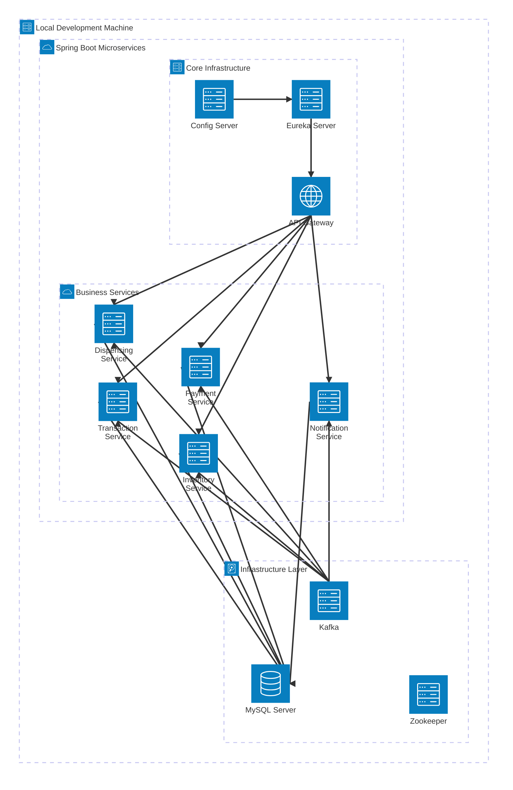

# Software Requirements Specification

Version 0.1

September 24, 2025

**Vending Machine Control System.**

Bruno Gil

Aspire Systems

Latin America

## **Vending Machine Control System**

### **Document Information**

- _Document Version:_ 0.1
- _Creation Date:_ 24-09-2025
- _Last Modified:_ 26-09-2025
- _Project Duration:_ 17 working days
- _Total Effort:_ 102 hours (9 hours/day)
- _Prepared By:_ Bruno Gil
- _Reviewed By:_ \[TO BE FILLED\]
- _Approved By:_ \[TO BE FILLED\]

## **1\. Introduction**

### **1.1 Purpose**

This Software Requirements Specification (SRS) document describes the functional and non-functional requirements for a simplified microservices-based vending machine control system. The system is designed as a learning project to practice microservices architecture using Java 17, Spring Boot, and related technologies.

### **1.2 Scope**

The vending machine control system provides:

- _Inventory Management_: Real-time stock tracking and management
- _Transaction Processing_: Purchase orchestration and payment handling
- _Item Dispensing_: Simulated mechanical dispensing operations
- _Administrative Functions_: User management and system monitoring
- _Event-Driven Architecture_: Kafka-based inter-service communication

### **1.3 Intended Audience**

- _Development Team_: Bruno Gil only
- _System Administrators_: Bruno Gil only
- _Stakeholders_: Suresh Rajendran
- _Future Maintainers_: Bruno Gil

### **1.4 Product Overview**

A microservices-based system consisting of 8 core services communicating through Apache Kafka, with centralized configuration management, service discovery, and API gateway for security and routing.

## **2\. Overall Description**

### **2.1 Product Perspective**

The system operates as a distributed microservices application in a local development environment, simulating a real-world vending machine control system without actual hardware integration.

### **2.2 Product Functions**

_Primary Functions:_

- Real-time inventory management with automatic stock updates
- Multi-payment method support (cash and card simulation)
- Event-driven transaction orchestration
- Administrative user management with role-based access
- System-wide notification and alert handling
- Comprehensive monitoring and observability

### **2.3 User Characteristics**

_Administrator Users:_

- _SUPER_ADMIN_: Full system access and user management
- _ADMIN_: Operational management capabilities
- Technical knowledge: Intermediate to advanced
- Primary interface: REST APIs via Postman or similar tools

_End Customers:_

- Interact through public APIs (simulated customer interface)
- No authentication required for purchase operations
- Primary operations: Product selection and purchase

### **2.4 Operating Environment**

_Development Environment:_

- _Operating System_: Cross-platform (Windows, macOS, Linux)
- _Java Runtime_: Java 17 or higher
- _Database_: MySQL 8.0+
- _Message Broker_: Apache Kafka with Zookeeper
- _Memory Requirements_: 6GB RAM minimum
- _Storage_: 2GB free disk space

### **2.5 Design and Implementation Constraints**

- _Local Development Only_: No production deployment considerations
- _Simulated Hardware_: No real vending machine integration
- _Single Instance Deployment_: No clustering or high availability
- _Manual Database Schema_: No automated migration tools
- _HTTP Communication_: No HTTPS/SSL requirements for local development

### **2.6 Assumptions and Dependencies**

_Assumptions:_

- Stable local development environment
- MySQL and Kafka services available and running
- Network connectivity between services via localhost
- Sufficient system resources for concurrent service operation

_Dependencies:_

- Java 17 SDK
- Maven 3.8+ for build management
- MySQL server for data persistence
- Apache Kafka and Zookeeper for messaging

## **3\. System Features**

### **3.1 Inventory Management Service**

#### **3.1.1 Description**

Manages product catalog and stock levels with real-time updates through event-driven architecture.

#### **3.1.2 Functional Requirements**

_REQ-INV-001_: Product Management

- _Priority_: High
- _Description_: System shall provide CRUD operations for product management
- _Inputs_: Product details (name, description, price)
- _Outputs_: Product information and confirmation
- _Acceptance Criteria_: Products can be created, read, updated, and deleted via REST APIs

_REQ-INV-002_: Stock Tracking

- _Priority_: High
- _Description_: System shall track real-time stock quantities for all products
- _Inputs_: Stock updates from dispensing operations
- _Outputs_: Current stock levels and availability status
- _Acceptance Criteria_: Stock levels accurate within 1 second of any transaction

_REQ-INV-003_: Low Stock Alerts

- _Priority_: Medium
- _Description_: System shall generate alerts when stock falls below configurable threshold
- _Inputs_: Current stock level and minimum threshold
- _Outputs_: Notification event to notification service
- _Acceptance Criteria_: Alerts triggered when quantity ≤ minimum threshold

_REQ-INV-004_: Event-Driven Updates

- _Priority_: High
- _Description_: System shall publish inventory events to Kafka topics
- _Inputs_: Stock level changes and product modifications
- _Outputs_: Kafka events for downstream consumption
- _Acceptance Criteria_: All inventory changes published as events within 100ms

#### **3.1.3 API Endpoints**

GET /api/inventory/products - Retrieve all products (Public) GET /api/inventory/availability/{productId} - Check product availability (Public) POST /api/admin/inventory/products - Create new product (Admin) PUT /api/admin/inventory/stock/{productId} - Update stock level (Admin) GET /api/admin/inventory/reports - Generate inventory reports (Admin)

### **3.2 Payment Processing Service**

#### **3.2.1 Description**

Handles payment processing simulation for cash and card transactions with comprehensive logging.

#### **3.2.2 Functional Requirements**

_REQ-PAY-001_: Payment Method Support

- _Priority_: High
- _Description_: System shall support cash and card payment simulation
- _Inputs_: Payment amount and method selection
- _Outputs_: Payment confirmation or failure notification
- _Acceptance Criteria_: Support for CASH, CREDIT_CARD, and DEBIT_CARD methods

_REQ-PAY-002_: Payment Simulation

- _Priority_: High
- _Description_: System shall simulate payment processing with configurable success rates
- _Inputs_: Payment transaction details
- _Outputs_: Payment status (PENDING, COMPLETED, FAILED)
- _Acceptance Criteria_: Configurable success/failure rates for testing scenarios

_REQ-PAY-003_: Transaction Logging

- _Priority_: Medium
- _Description_: System shall log all payment transactions for audit purposes
- _Inputs_: Payment transaction data
- _Outputs_: Persistent transaction records
- _Acceptance Criteria_: Complete audit trail maintained in database

_REQ-PAY-004_: Event Publishing

- _Priority_: High
- _Description_: System shall publish payment events to Kafka topics
- _Inputs_: Payment status changes
- _Outputs_: Payment events for transaction coordination
- _Acceptance Criteria_: Payment events published within 100ms of status change

#### **3.2.3 API Endpoints**

POST /api/payment/process - Process payment transaction (Public) GET /api/admin/payment/transactions - Retrieve payment history (Admin) GET /api/admin/payment/statistics - Payment processing statistics (Admin)

### **3.3 Transaction Orchestration Service**

#### **3.3.1 Description**

Coordinates the complete purchase flow from inventory check through payment processing to item dispensing.

#### **3.3.2 Functional Requirements**

_REQ-TXN-001_: Purchase Orchestration

- _Priority_: High
- _Description_: System shall orchestrate complete purchase transactions
- _Inputs_: Product selection, payment method, customer session
- _Outputs_: Transaction status and completion confirmation
- _Acceptance Criteria_: Complete purchase flow coordination within 5 seconds

_REQ-TXN-002_: Inventory Validation

- _Priority_: High
- _Description_: System shall validate product availability before processing payment
- _Inputs_: Product ID and requested quantity
- _Outputs_: Availability confirmation or rejection
- _Acceptance Criteria_: Real-time inventory check with accurate availability status

_REQ-TXN-003_: Event-Driven Coordination

- _Priority_: High
- _Description_: System shall coordinate services through Kafka event consumption
- _Inputs_: Payment and dispensing events
- _Outputs_: Transaction status updates
- _Acceptance Criteria_: Proper transaction state management based on service events

_REQ-TXN-004_: Failure Handling

- _Priority_: Low
- _Description_: System shall implement basic compensation for failed transactions
- _Inputs_: Failure notifications from payment or dispensing services
- _Outputs_: Transaction rollback and user notification
- _Acceptance Criteria_: Failed transactions properly handled with user feedback

#### **3.3.3 API Endpoints**

POST /api/transaction/purchase - Initiate purchase transaction (Public) GET /api/admin/transaction/history - Retrieve transaction history (Admin) GET /api/admin/transaction/statistics - Transaction processing statistics (Admin)

### **3.4 Dispensing Simulation Service**

#### **3.4.1 Description**

Simulates mechanical dispensing operations with configurable success/failure scenarios for testing.

#### **3.4.2 Functional Requirements**

_REQ-DISP-001_: Dispensing Simulation

- _Priority_: High
- _Description_: System shall simulate item dispensing with configurable parameters
- _Inputs_: Dispensing request from transaction service
- _Outputs_: Dispensing success or failure notification
- _Acceptance Criteria_: Configurable success/failure rates for different scenarios

_REQ-DISP-002_: Hardware Status Simulation

- _Priority_: Medium
- _Description_: System shall simulate hardware operational status and failures
- _Inputs_: Dispensing operation requests
- _Outputs_: Hardware status reports and failure notifications
- _Acceptance Criteria_: Realistic hardware failure simulation for testing

_REQ-DISP-003_: Event Processing

- _Priority_: High
- _Description_: System shall consume dispensing requests and publish results via Kafka
- _Inputs_: Kafka events from transaction service
- _Outputs_: Dispensing result events and inventory updates
- _Acceptance Criteria_: Event processing within 100ms with proper result publication

#### **3.4.3 API Endpoints**

GET /api/admin/dispensing/status - Hardware status information (Admin) GET /api/admin/dispensing/history - Dispensing operation history (Admin) PUT /api/admin/dispensing/configuration - Update simulation parameters (Admin)

### **3.5 Notification Management Service**

#### **3.5.1 Description**

Centralizes system notifications and alerts from all services for comprehensive monitoring.

#### **3.5.2 Functional Requirements**

_REQ-NOT-001_: Event Aggregation

- _Priority_: Medium
- _Description_: System shall consume notification events from all services
- _Inputs_: Kafka events from inventory, payment, transaction, and dispensing services
- _Outputs_: Stored notifications for administrative review
- _Acceptance Criteria_: All notification events properly consumed and stored

_REQ-NOT-002_: Alert Classification

- _Priority_: Medium
- _Description_: System shall classify notifications by type and severity
- _Inputs_: Notification event data
- _Outputs_: Categorized notification records
- _Acceptance Criteria_: Proper notification categorization (LOW_STOCK, TRANSACTION_FAILED, etc.)

_REQ-NOT-003_: Administrative Interface

- _Priority_: Medium
- _Description_: System shall provide administrative access to notification history
- _Inputs_: Administrative requests for notification data
- _Outputs_: Filtered notification lists and statistics
- _Acceptance Criteria_: Comprehensive notification management interface

#### **3.5.3 API Endpoints**

GET /api/admin/notifications - Retrieve notification history (Admin) GET /api/admin/notifications/statistics - Notification statistics (Admin) PUT /api/admin/notifications/{id}/acknowledge - Acknowledge notification (Admin)

### **3.6 Authentication and Authorization**

#### **3.6.1 Description**

Provides JWT-based authentication and role-based authorization at the API Gateway level.

#### **3.6.2 Functional Requirements**

_REQ-AUTH-001_: JWT Authentication

- _Priority_: High
- _Description_: System shall provide JWT-based authentication for administrative operations
- _Inputs_: Username and password credentials
- _Outputs_: JWT token with 8-hour expiry
- _Acceptance Criteria_: Secure token generation and validation

_REQ-AUTH-002_: Role-Based Authorization

- _Priority_: High
- _Description_: System shall enforce role-based access control
- _Inputs_: JWT token with role information
- _Outputs_: Access granted or denied based on role permissions
- _Acceptance Criteria_: SUPER_ADMIN and ADMIN roles properly enforced

_REQ-AUTH-003_: User Management

- _Priority_: Medium
- _Description_: System shall provide user management capabilities
- _Inputs_: User creation/modification requests
- _Outputs_: User account status and confirmation
- _Acceptance Criteria_: Complete user lifecycle management

#### **3.6.3 API Endpoints**

POST /api/auth/login - User authentication (Public) POST /api/admin/users - Create new user (Super Admin) GET /api/admin/users - List all users (Admin) PUT /api/admin/users/{id} - Update user information (Super Admin) DELETE /api/admin/users/{id} - Delete user (Super Admin)

## **4\. External Interface Requirements**

### **4.1 User Interfaces**

_Administrative Interface:_

- RESTful API endpoints accessible via HTTP clients (Postman, curl)
- JSON-based request/response format
- Standard HTTP status codes for operation results
- Correlation ID headers for request tracing

_Customer Interface:_

- Public API endpoints for product browsing and purchase initiation
- No authentication required for basic operations
- Simplified request/response format for ease of use

### **4.2 Hardware Interfaces**

_Simulated Hardware:_

- No actual hardware interfaces required
- Dispensing operations simulated through software
- Hardware status simulation for testing failure scenarios
- Configurable parameters for different hardware behaviors

### **4.3 Software Interfaces**

_Database Interfaces:_

- MySQL database connections via JDBC
- HikariCP connection pooling
- Service-specific database schemas
- Standard SQL operations for data persistence

_Message Broker Interfaces:_

- Apache Kafka for event publishing and consumption
- JSON-serialized message format
- Topic-based message routing
- At-least-once delivery semantics

_External Service Interfaces:_

- Service discovery via Eureka Server
- Configuration retrieval from Config Server
- Health check endpoints via Spring Boot Actuator
- RESTful inter-service communication where needed

### **4.4 Communication Interfaces**

_Network Protocols:_

- HTTP/1.1 for REST API communication
- TCP for Kafka message transport
- Standard localhost networking for local development
- Port-based service identification

_Data Formats:_

- JSON for REST API payloads
- JSON for Kafka message content
- UTF-8 character encoding throughout
- ISO 8601 date/time format standardization

## **5\. System Architecture**

### **5.1 Architectural Overview**

The system follows a microservices architecture pattern with the following key components:

_Infrastructure Layer:_

- Config Server (Port 8888): Centralized configuration management
- Eureka Server (Port 8761): Service discovery and registration
- API Gateway (Port 8080): Authentication and routing
- Apache Kafka (Port 9092): Event streaming platform
- MySQL Database (Port 3306): Data persistence layer

_Business Services Layer:_

- Inventory Service (Port 8081): Product and stock management
- Payment Service (Port 8082): Payment processing simulation
- Transaction Service (Port 8083): Purchase orchestration
- Dispensing Service (Port 8084): Item dispensing simulation
- Notification Service (Port 8085): System alert management

### **5.2 Service Interaction Patterns**

#### **5.2.1 Synchronous Communication**

Client → API Gateway → Business Services

- JWT authentication at gateway level
- Service discovery via Eureka
- Direct HTTP calls for immediate responses
- Timeout and retry mechanisms

#### **5.2.2 Asynchronous Communication**

Service A → Kafka Topic → Service B

- Event-driven architecture for loose coupling
- Publish-subscribe messaging pattern
- Eventual consistency through event propagation
- Idempotent event processing

### **5.3 Kafka Topic Architecture**

#### **5.3.1 Topic Configuration**

transaction-events: partitions: 3 replication-factor: 1 events: \[transaction.created, transaction.completed, transaction.failed\]

payment-events: partitions: 3 replication-factor: 1 events: \[payment.initiated, payment.completed, payment.failed\]

inventory-events: partitions: 3 replication-factor: 1 events: \[stock.updated, stock.low, product.added\]

dispensing-events: partitions: 3 replication-factor: 1 events: \[dispensing.requested, dispensing.completed, dispensing.failed\]

notification-events: partitions: 3 replication-factor: 1 events: \[notification.created, notification.sent\]

#### **5.3.2 Event Schema Standards**

json { "eventId": "uuid", "eventType": "string", "timestamp": "ISO 8601 datetime", "source": "service name", "correlationId": "uuid", "payload": "event-specific data" }

### **5.4 Data Flow Architecture**

#### **5.4.1 Purchase Transaction Flow**

- Customer Request → API Gateway → Transaction Service
- Transaction Service → Inventory Service (availability check)
- Transaction Service → Payment Service (payment processing)
- Payment Service → Kafka (payment.completed event)
- Transaction Service → Dispensing Service (dispensing request)
- Dispensing Service → Kafka (dispensing.completed event)
- Inventory Service → Kafka (stock.updated event)
- Transaction Service → Customer Response

#### **5.4.2 Administrative Operation Flow**

- Admin Request → API Gateway (JWT validation)
- API Gateway → Target Service (with user context)
- Service → Database (data operation)
- Service → Kafka (event publication if applicable)
- Service → Admin Response

## **6\. Non-Functional Requirements**

### **6.1 Performance Requirements**

#### **6.1.1 Response Time Requirements**

- _API Response Time_: All REST API endpoints shall respond within 2000ms under normal load
- _Event Processing Time_: Kafka events shall be processed within 100ms of receipt
- _Database Query Time_: Database operations shall complete within 500ms
- _Service Startup Time_: All services shall start and be ready within 120 seconds

#### **6.1.2 Throughput Requirements**

- _Concurrent Users_: System shall support 10-50 concurrent transactions
- _Event Throughput_: Kafka shall handle 1000+ events per minute
- _Database Connections_: Connection pool shall support 20+ concurrent connections per service
- _API Request Rate_: System shall handle 100+ API requests per minute

#### **6.1.3 Resource Requirements**

- _Memory Usage_: Total system memory consumption shall not exceed 6GB
- _CPU Utilization_: Normal operations shall not exceed 70% CPU utilization
- _Disk Space_: System shall require maximum 2GB disk space
- _Network Bandwidth_: Local network communication sufficient for localhost deployment

### **6.2 Scalability Requirements**

- _Service Instances_: Single instance deployment for local development
- _Database Scaling_: Single MySQL server with service-specific databases
- _Kafka Partitions_: Configurable partition counts for topic scaling
- _Connection Pooling_: Scalable connection pool configurations

### **6.3 Reliability Requirements**

- _Service Availability_: Services shall maintain 95%+ uptime during development
- _Data Consistency_: Eventually consistent data through event-driven updates
- _Error Recovery_: Automatic retry mechanisms for transient failures
- _Event Delivery_: At-least-once delivery guarantee for Kafka events

### **6.4 Usability Requirements**

- _API Design_: RESTful APIs following standard conventions
- _Error Messages_: Clear, descriptive error messages with correlation IDs
- _Documentation_: Comprehensive API documentation with examples
- _Testing Tools_: Complete Postman collection for all endpoints

### **6.5 Maintainability Requirements**

- _Code Structure_: Clean architecture with separation of concerns
- _Configuration Management_: Externalized configuration via Config Server
- _Logging Standards_: Structured logging with correlation ID tracking
- _Monitoring Capabilities_: Health checks and metrics via Actuator endpoints

## **7\. Database Design**

### **7.1 Database Architecture**

- _Database Server_: Single MySQL 8.0+ instance
- _Schema Strategy_: Separate database per service (database-per-service pattern)
- _Connection Management_: HikariCP connection pooling for each service
- _Transaction Management_: Service-level transaction boundaries

### **7.2 Service Database Schemas**

#### **7.2.1 Authentication Service (vending_auth)**

sql -- Admin users table CREATE TABLE admin_users ( id BIGINT AUTO_INCREMENT PRIMARY KEY, username VARCHAR(255) UNIQUE NOT NULL, password_hash VARCHAR(255) NOT NULL, role ENUM('SUPER_ADMIN', 'ADMIN') NOT NULL, active BOOLEAN DEFAULT TRUE, created_at TIMESTAMP DEFAULT CURRENT_TIMESTAMP, updated_at TIMESTAMP DEFAULT CURRENT_TIMESTAMP ON UPDATE CURRENT_TIMESTAMP );

\-- Create indexes CREATE INDEX idx_username ON admin_users(username); CREATE INDEX idx_active ON admin_users(active);

#### **7.2.2 Inventory Service (vending_inventory)**

sql -- Products table CREATE TABLE products ( id BIGINT AUTO_INCREMENT PRIMARY KEY, name VARCHAR(255) NOT NULL, description TEXT, price DECIMAL(10,2) NOT NULL, active BOOLEAN DEFAULT TRUE, created_at TIMESTAMP DEFAULT CURRENT_TIMESTAMP, updated_at TIMESTAMP DEFAULT CURRENT_TIMESTAMP ON UPDATE CURRENT_TIMESTAMP );

\-- Stock table CREATE TABLE stock ( id BIGINT AUTO_INCREMENT PRIMARY KEY, product_id BIGINT NOT NULL, quantity INT NOT NULL DEFAULT 0, min_threshold INT NOT NULL DEFAULT 5, created_at TIMESTAMP DEFAULT CURRENT_TIMESTAMP, updated_at TIMESTAMP DEFAULT CURRENT_TIMESTAMP ON UPDATE CURRENT_TIMESTAMP, FOREIGN KEY (product_id) REFERENCES products(id), UNIQUE KEY unique_product_stock (product_id) );

\-- Create indexes CREATE INDEX idx_product_active ON products(active); CREATE INDEX idx_stock_quantity ON stock(quantity);

#### **7.2.3 Payment Service (vending_payment)**

sql -- Payment transactions table CREATE TABLE payment_transactions ( id BIGINT AUTO_INCREMENT PRIMARY KEY, transaction_id VARCHAR(255) UNIQUE NOT NULL, amount DECIMAL(10,2) NOT NULL, payment_method ENUM('CASH', 'CREDIT_CARD', 'DEBIT_CARD') NOT NULL, status ENUM('PENDING', 'COMPLETED', 'FAILED') NOT NULL, created_at TIMESTAMP DEFAULT CURRENT_TIMESTAMP, updated_at TIMESTAMP DEFAULT CURRENT_TIMESTAMP ON UPDATE CURRENT_TIMESTAMP );

\-- Create indexes CREATE INDEX idx_transaction_id ON payment_transactions(transaction_id); CREATE INDEX idx_payment_status ON payment_transactions(status); CREATE INDEX idx_payment_created ON payment_transactions(created_at);

#### **7.2.4 Transaction Service (vending_transaction)**

sql -- Transactions table CREATE TABLE transactions ( id BIGINT AUTO_INCREMENT PRIMARY KEY, customer_session VARCHAR(255), total_amount DECIMAL(10,2) NOT NULL, status ENUM('CREATED', 'PAYMENT_PROCESSING', 'DISPENSING', 'COMPLETED', 'FAILED') NOT NULL, created_at TIMESTAMP DEFAULT CURRENT_TIMESTAMP, updated_at TIMESTAMP DEFAULT CURRENT_TIMESTAMP ON UPDATE CURRENT_TIMESTAMP );

\-- Transaction items table CREATE TABLE transaction_items ( id BIGINT AUTO_INCREMENT PRIMARY KEY, transaction_id BIGINT NOT NULL, product_id BIGINT NOT NULL, quantity INT NOT NULL, unit_price DECIMAL(10,2) NOT NULL, created_at TIMESTAMP DEFAULT CURRENT_TIMESTAMP, FOREIGN KEY (transaction_id) REFERENCES transactions(id) );

\-- Create indexes CREATE INDEX idx_transaction_status ON transactions(status); CREATE INDEX idx_transaction_created ON transactions(created_at); CREATE INDEX idx_transaction_items_txn ON transaction_items(transaction_id);

#### **7.2.5 Dispensing Service (vending_dispensing)**

sql -- Dispensing operations table CREATE TABLE dispensing_operations ( id BIGINT AUTO_INCREMENT PRIMARY KEY, transaction_id BIGINT NOT NULL, product_id BIGINT NOT NULL, quantity INT NOT NULL, status ENUM('REQUESTED', 'IN_PROGRESS', 'COMPLETED', 'FAILED') NOT NULL, failure_reason VARCHAR(500), created_at TIMESTAMP DEFAULT CURRENT_TIMESTAMP, updated_at TIMESTAMP DEFAULT CURRENT_TIMESTAMP ON UPDATE CURRENT_TIMESTAMP );

\-- Hardware status table CREATE TABLE hardware_status ( id BIGINT AUTO_INCREMENT PRIMARY KEY, component_name VARCHAR(255) NOT NULL, status ENUM('OPERATIONAL', 'MAINTENANCE', 'FAILED') NOT NULL, last_check TIMESTAMP DEFAULT CURRENT_TIMESTAMP, created_at TIMESTAMP DEFAULT CURRENT_TIMESTAMP, updated_at TIMESTAMP DEFAULT CURRENT_TIMESTAMP ON UPDATE CURRENT_TIMESTAMP );

\-- Create indexes CREATE INDEX idx_dispensing_status ON dispensing_operations(status); CREATE INDEX idx_dispensing_transaction ON dispensing_operations(transaction_id);

#### **7.2.6 Notification Service (vending_notification)**

sql -- Notifications table CREATE TABLE notifications ( id BIGINT AUTO_INCREMENT PRIMARY KEY, type ENUM('LOW_STOCK', 'TRANSACTION_FAILED', 'HARDWARE_FAILURE', 'PAYMENT_FAILED') NOT NULL, title VARCHAR(255) NOT NULL, message TEXT NOT NULL, severity ENUM('INFO', 'WARNING', 'ERROR', 'CRITICAL') NOT NULL, source_service VARCHAR(255) NOT NULL, acknowledged BOOLEAN DEFAULT FALSE, created_at TIMESTAMP DEFAULT CURRENT_TIMESTAMP, acknowledged_at TIMESTAMP NULL );

\-- Create indexes CREATE INDEX idx_notification_type ON notifications(type); CREATE INDEX idx_notification_severity ON notifications(severity); CREATE INDEX idx_notification_acknowledged ON notifications(acknowledged); CREATE INDEX idx_notification_created ON notifications(created_at);

### **7.3 Data Integrity Constraints**

- _Primary Keys_: Auto-increment BIGINT for all tables
- _Foreign Keys_: Proper referential integrity where applicable
- _Unique Constraints_: Enforce data uniqueness where required
- _Check Constraints_: Validate enum values and business rules
- _Index Strategy_: Optimize for common query patterns

### **7.4 Database Configuration**

yaml Database Connection Settings:

- Connection Pool Size: 10-20 connections per service
- Connection Timeout: 30 seconds
- Idle Timeout: 600 seconds
- Max Lifetime: 1800 seconds
- Auto Commit: false (explicit transaction management)

## **8\. Security Requirements**

### **8.1 Authentication Requirements**

#### **8.1.1 JWT Authentication**

- _Token Format_: JSON Web Token (JWT) with HS256 signing
- _Token Expiry_: 8 hours for administrative sessions
- _Token Storage_: Client-side storage responsibility
- _Token Validation_: At API Gateway level for all admin endpoints
- _Secret Management_: Configurable JWT signing secret

#### **8.1.2 User Credential Management**

- _Password Hashing_: BCrypt with configurable rounds (default: 10)
- _Username Requirements_: Unique, alphanumeric characters, minimum 4 characters
- _Password Policy_:
  - Minimum length: 8 characters
  - No specific complexity requirements for learning project
  - Stored as BCrypt hash in database
- _Account Lockout_: Not implemented (out of scope for local development learning project)

### **8.2 Authorization Requirements**

#### **8.2.1 Role-Based Access Control**

yaml SUPER_ADMIN:

- All system operations
- User management (create, update, delete users)
- System configuration management
- Access to all administrative endpoints

ADMIN:

- Inventory management operations
- Transaction and payment monitoring
- Notification management
- System status monitoring
- Limited user information access

#### **8.2.2 Endpoint Authorization**

yaml Public Endpoints (No Authentication):

- GET /api/inventory/products
- GET /api/inventory/availability/{productId}
- POST /api/transaction/purchase
- POST /api/payment/process
- POST /api/auth/login

Admin Endpoints (Authentication Required):

- All /api/admin/\* endpoints
- User management operations
- Administrative reporting
- System configuration

### **8.3 Data Security Requirements**

#### **8.3.1 Data Protection**

- _Sensitive Data_: User passwords hashed with BCrypt
- _Data Transmission_: HTTP for local development (HTTPS for production)
- _Database Security_: Standard MySQL user authentication
- _Audit Logging_: Complete logging of administrative operations

#### **8.3.2 Input Validation**

- _SQL Injection Prevention_: Prepared statements and parameterized queries
- _Input Sanitization_: Validation and sanitization of all user inputs
- _Request Size Limits_: Configurable limits on request payload sizes
- _Rate Limiting_: Basic request rate limiting at gateway level

### **8.4 API Security**

#### **8.4.1 Request Security**

- _CORS Configuration_: Configurable cross-origin request policies
- _Security Headers_: Standard security headers (X-Frame-Options, etc.)
- _Request Validation_: Comprehensive input validation at API boundaries
- _Error Handling_: Secure error messages without sensitive information exposure

#### **8.4.2 Session Management**

- _Stateless Design_: JWT-based stateless authentication
- _Token Refresh_: Not implemented (out of scope for current learning project - tokens have 8-hour expiry, user must re-login after expiration)
- _Session Timeout_: Token expiry-based session termination (8 hours)
- _Concurrent Sessions_: Multiple concurrent sessions allowed (stateless tokens - no session limit enforcement)

## **9\. Quality Assurance**

### **9.1 Testing Requirements**

#### **9.1.1 Unit Testing**

- _Coverage Target_: 80%+ coverage for business logic
- _Testing Framework_: JUnit 5 with Mockito for mocking
- _Test Categories_: Service layer, repository layer, utility classes
- _Continuous Testing_: Automated test execution on build

#### **9.1.2 Integration Testing**

- _Database Integration_: Tests with embedded or containerized databases
- _Kafka Integration_: Tests with embedded Kafka for event processing
- _Service Integration_: Tests for inter-service communication
- _API Integration_: Complete endpoint testing with authentication

#### **9.1.3 System Testing**

- _End-to-End Testing_: Complete transaction flow validation
- _Load Testing_: Performance testing under expected load
- _Failure Testing_: Error handling and recovery testing
- _Security Testing_: Authentication and authorization validation

### **9.2 Code Quality Standards**

#### **9.2.1 Coding Standards**

- _Java Standards_: Oracle Java coding conventions
- _Spring Standards_: Spring Boot best practices and patterns
- _Documentation_: Comprehensive JavaDoc for public APIs
- _Code Review_: Self-review process for single developer (Bruno Gil), with focus on:
  - Adherence to SOLID principles
  - Proper error handling
  - Code readability and maintainability
  - Consistency with established patterns

#### **9.2.2 Static Analysis**

- _Code Analysis Tools_: Not implemented for learning project (optional future enhancement: SonarQube, SpotBugs, Checkstyle)
- _Quality Gates_: Manual quality verification through testing
- _Dependency Scanning_: Maven dependency plugin for basic dependency checking
- _License Compliance_: All dependencies use permissive licenses (Apache 2.0, MIT) - no specific compliance tracking required for learning project

## **10\. Design Patterns & Principles**

### **10.1 Architectural Patterns**

#### **10.1.1 Microservices Architecture**

**Pattern Description:** The system follows microservices architecture with service decomposition based on business capabilities. Each service owns its data and communicates through well-defined interfaces.

**Implementation:**

- **Service Boundaries:** Each service represents a bounded context (Inventory, Payment, Transaction, Dispensing, Notification)
- **Data Ownership:** Database-per-service pattern ensures loose coupling
- **Communication:** Synchronous (REST) for queries, asynchronous (Kafka) for state changes
- **Service Discovery:** Eureka Server enables dynamic service location

**Benefits:**

- Independent deployment and scaling
- Technology flexibility per service
- Fault isolation
- Team autonomy (single developer in this case)

#### **10.1.2 Event-Driven Architecture (EDA)**

**Pattern Description:** Services communicate through domain events published to Kafka topics, enabling loose coupling and eventual consistency.

**Implementation:**

- **Event Types:** Domain Events, Integration Events, Notification Events
- **Event Schema:** Standardized JSON format with correlation ID
- **Event Flow:** Producer → Kafka Topic → Consumer(s)
- **Idempotency:** Event handlers designed for at-least-once delivery

**Benefits:**

- Loose coupling between services
- Asynchronous processing for better performance
- Event replay capability for debugging
- Scalable message processing

#### **10.1.3 SAGA Pattern for Distributed Transactions**

**Pattern Description:** Orchestration-based SAGA pattern manages distributed transactions across services without requiring distributed locks.

**Implementation:**

- **Orchestrator:** Transaction Service coordinates the purchase flow
- **Saga Steps:**
  - Validate inventory availability
  - Process payment
  - Request dispensing
  - Update inventory
  - Complete transaction
- **Compensation Logic:** Basic rollback for payment failures (simplified for learning)
- **State Management:** Transaction status tracking (CREATED → PAYMENT_PROCESSING → DISPENSING → COMPLETED/FAILED)

**Limitations (Acknowledged for Learning Project):**

- Simplified compensation logic
- No advanced retry mechanisms
- Manual rollback procedures for complex failures

#### **10.1.4 API Gateway Pattern**

**Pattern Description:** Single entry point for all client requests, providing authentication, routing, and cross-cutting concerns.

**Implementation:**

- **Authentication:** JWT validation before routing
- **Routing:** Dynamic routing based on service discovery
- **Request Enhancement:** Inject user context headers
- **Security:** CORS, rate limiting, security headers
- **Load Balancing:** Client-side load balancing via Eureka

### **10.2 Design Principles**

#### **10.2.1 SOLID Principles**

**Single Responsibility Principle (SRP):**

- Each service has a single business capability
- Classes and methods have focused responsibilities
- Example: PaymentService only handles payment processing, not inventory

**Open/Closed Principle (OCP):**

- Services extensible through configuration
- Payment methods extendable without modifying core logic
- Strategy pattern for dispensing simulation configurations

**Liskov Substitution Principle (LSP):**

- Interface-based service contracts
- Repository pattern allows database implementation swapping
- Event handlers implement common interfaces

**Interface Segregation Principle (ISP):**

- Focused service interfaces
- Clients depend only on required methods
- REST endpoints grouped by functionality

**Dependency Inversion Principle (DIP):**

- Services depend on abstractions (interfaces)
- Spring dependency injection for loose coupling
- Repository pattern abstracts data access

#### **10.2.2 Domain-Driven Design (DDD) Concepts**

**Bounded Contexts:**

- **Inventory Context:** Products, Stock, Availability
- **Payment Context:** Transactions, Payment Methods, Processing
- **Transaction Context:** Orders, Purchase Flow, Orchestration
- **Dispensing Context:** Hardware Operations, Dispensing Status
- **Notification Context:** Alerts, Notifications, Event Aggregation

**Aggregate Roots:**

- **Product Aggregate** (Inventory Service):

  - Root: Product entity
  - Contains: Stock (one-to-one relationship)
  - Repository: ProductRepository
  - Invariants: Product must have associated stock record

- **Transaction Aggregate** (Transaction Service):

  - Root: Transaction entity
  - Contains: TransactionItems collection
  - Repository: TransactionRepository
  - Invariants: Transaction must have at least one item, total amount must match sum of items

- **Payment Aggregate** (Payment Service):
  - Root: PaymentTransaction entity
  - Repository: PaymentTransactionRepository
  - Invariants: Payment amount must be positive, payment method must be valid

**Value Objects:**

- Price (embedded in Product)
- Quantity (embedded in Stock and TransactionItem)
- PaymentMethod (enum)
- TransactionStatus (enum)
- DispensingStatus (enum)

**Domain Services:**

- TransactionOrchestrationService: Coordinates multi-step purchase flow across aggregates
- InventoryAvailabilityService: Checks product availability and reserves stock
- PaymentProcessingService: Simulates payment processing logic
- DispensingSimulationService: Simulates hardware dispensing operations

#### **10.2.3 Microservices Design Principles**

**Service Independence:**

- Each service can be developed, deployed, and scaled independently
- No direct database sharing between services
- Asynchronous communication for non-blocking operations

**Smart Endpoints, Dumb Pipes:**

- Business logic in services, not in middleware
- Kafka used as simple message transport
- No complex ESB-style transformations

**Decentralized Data Management:**

- Each service owns its data
- No distributed transactions
- Eventual consistency through events

**Design for Failure:**

- Graceful degradation when services unavailable
- Timeout configurations for external calls (RestTemplate with 5-second timeout)
- **Circuit Breaker**: Not implemented in current version (acknowledged limitation for learning project)
  - Future enhancement: Spring Cloud Circuit Breaker with Resilience4j
  - Would provide: Automatic service failure detection, fallback mechanisms, half-open state for recovery testing
- Comprehensive error logging with correlation IDs

**Infrastructure Automation:**

- Spring Boot Actuator for health checks
- Automated service registration with Eureka
- Centralized configuration management
- Container-ready design (future Docker deployment)

### **10.3 Design Patterns Implementation**

#### **10.3.1 Creational Patterns**

**Factory Pattern:**

- **Event Factory**: Standardized creation of Kafka event objects
  - Implementation: EventFactory utility class in common-library
  - Purpose: Ensure consistent event structure with eventId, timestamp, correlationId
  - Example: `EventFactory.createStockUpdateEvent(productId, quantity, correlationId)`

**Builder Pattern:**

- **DTO Builders**: Complex request/response DTOs use Lombok @Builder
  - Example: `PurchaseRequest.builder().productId(1).quantity(2).paymentMethod(CASH).build()`
- **Entity Builders**: JPA entities use @Builder for test data creation
  - Purpose: Readable and maintainable test setup

**Singleton Pattern:**

- **Spring-Managed Beans**: All services, repositories, and components are singletons managed by Spring IoC container
  - @Service, @Repository, @Component annotations ensure single instance per application context
  - No manual singleton implementation required

#### **10.3.2 Structural Patterns**

**Repository Pattern:**

- Data access abstraction layer
- Spring Data JPA repositories
- Separation of domain logic from persistence

**Adapter Pattern:**

- **Kafka Event Adapters**: Convert internal domain events to Kafka message format
  - Implementation: @KafkaListener methods adapt incoming messages to domain objects
  - Example: PaymentEventAdapter converts Kafka PaymentEvent to internal PaymentTransaction

**Facade Pattern:**

- **Service Facades**: Transaction Service provides simplified interface to complex purchase orchestration
  - Hides complexity of inventory check → payment processing → dispensing coordination
  - Single `purchaseProduct()` method orchestrates multi-service interaction

**Proxy Pattern:**

- **API Gateway as Proxy**: Routes and enhances requests before forwarding to services
  - Adds authentication context (user ID, role, username headers)
  - Implements cross-cutting concerns (logging, security)

#### **10.3.3 Behavioral Patterns**

**Observer Pattern:**

- Kafka event pub/sub mechanism
- Service event listeners
- Notification aggregation from multiple sources

**Strategy Pattern:**

- **Payment Method Strategy**: Different payment processing logic for CASH, CREDIT_CARD, DEBIT_CARD

  - Implementation: PaymentMethod enum with method-specific validation
  - Extensible for future payment types

- **Dispensing Simulation Strategy**: Configurable success/failure rates for testing
  - Configuration-driven behavior changes without code modification

**Template Method Pattern:**

- **Base Event Consumer**: Abstract Kafka event processing template
  - Template steps: validate event → check for duplicates → process → publish result event
  - Concrete implementations override specific processing logic

**Chain of Responsibility Pattern:**

- **Request Filter Chain**: API Gateway applies sequential filters
  - Authentication filter → Authorization filter → Logging filter → Route to service
  - Spring Security filter chain implementation

### **10.4 Anti-Patterns Avoided**

**Distributed Monolith:**

- Services avoid tight coupling through shared databases
- No synchronous chains of service calls
- Event-driven architecture prevents cascading dependencies

**Chatty Services:**

- Minimize synchronous inter-service calls - only for critical real-time operations
- Use event-driven communication for updates and notifications
- Batch operations where appropriate (e.g., bulk inventory updates)

**God Service:**

- Each service has single, well-defined responsibility
- Transaction Service orchestrates but doesn't implement business logic of other services
- No service contains all business logic

**Shared Database:**

- Strict database-per-service pattern enforcement
- No foreign keys across service databases
- Data duplication accepted for service autonomy

**Anemic Domain Model:**

- Avoided by encapsulating business logic within domain entities where appropriate
- Rich domain services handle complex orchestration
- Entities have behavior, not just data (e.g., Transaction.complete(), Stock.reserve())

**Synchronous Communication Overuse:**

- Asynchronous Kafka events for non-critical operations
- Eventual consistency accepted for performance
- Synchronous calls only for immediate consistency requirements (inventory availability checks)

## **11\. System Design Diagrams**

### **11.1 System Context Diagram**

Refer to `Documentation/diagrams/system-overview.md` for complete system context diagram showing:

- External actors (Admin Users, Customers)
- System boundary
- Infrastructure services (Config Server, Eureka, API Gateway, Kafka, MySQL)
- Business services (Inventory, Payment, Transaction, Dispensing, Notification)
- Communication protocols and ports

### **11.2 Service Interaction Sequence Diagram**

#### **11.2.1 Complete Purchase Flow**

Refer to `Documentation/project_flow_guide.md` for detailed purchase flow sequence diagram.

**Additional Sequence Diagrams:**

**Failed Payment Flow:**

- Customer initiates purchase → Transaction Service
- Transaction Service validates inventory → Success
- Transaction Service requests payment → Payment Service
- Payment Service returns FAILED status → Transaction Service
- Transaction Service updates transaction status to FAILED
- Transaction Service publishes transaction.failed event → Notification Service
- Transaction Service returns error response to customer

**Failed Dispensing Flow:**

- Payment completed successfully
- Transaction Service requests dispensing → Dispensing Service
- Dispensing Service simulates hardware failure
- Dispensing Service publishes dispensing.failed event → Transaction Service
- Transaction Service marks transaction as FAILED
- Transaction Service triggers compensation (payment refund notification)
- Notification Service receives failure alerts

**Low Stock Alert Flow:**

- Dispensing Service publishes stock.updated event after successful dispensing
- Inventory Service consumes event and updates stock quantity
- Inventory Service detects quantity ≤ min_threshold
- Inventory Service publishes stock.low event → Kafka
- Notification Service consumes stock.low event
- Notification Service creates LOW_STOCK notification with WARNING severity
- Admin can query notifications via GET /api/admin/notifications

**Admin Operations Flow:**

- Admin sends request with JWT token → API Gateway
- API Gateway validates JWT signature and expiry
- API Gateway extracts user info (userId, role, username) from token
- API Gateway adds user context headers (X-User-Id, X-User-Role, X-Username)
- API Gateway routes request to target service
- Service receives request with user context
- Service performs authorization check (if needed)
- Service executes operation and logs admin action with user context
- Service returns response → API Gateway → Admin

### **11.3 Kafka Topic Flow Diagram**

Refer to `Documentation/Vending Machine Messaging Architecture.md` for complete Kafka topic flow diagram showing:

- Topic structure and partitioning configuration
- Event producers and consumers per service
- Event flow for purchase transaction lifecycle
- Event schema standards

### **11.4 Component Diagram**

Refer to individual service diagrams in `Documentation/diagrams/`:

- `api-gateway.md` - API Gateway component structure
- `inventory-service.md` - Inventory Service components
- `payment-service.md` - Payment Service components
- `transaction-service.md` - Transaction Service components
- `dispensing-service.md` - Dispensing Service components
- `notification-service.md` - Notification Service components
- `infrastructure-services.md` - Config Server and Eureka Server components

### **11.5 Database Entity Relationship Diagram**

Refer to `Documentation/diagrams/APi Gateway-Entity Relationship Diagram.mmd` for complete ERD.

Each service has its own database with the following entity relationships:

- **vending_auth**: admin_users table
- **vending_inventory**: products ↔ stock (one-to-one)
- **vending_payment**: payment_transactions table
- **vending_transaction**: transactions ↔ transaction_items (one-to-many)
- **vending_dispensing**: dispensing_operations, hardware_status tables
- **vending_notification**: notifications table

No cross-database foreign keys - referential integrity maintained through event correlation.

### **11.6 Deployment Diagram (Local Development)**

**Local Development Deployment Architecture:**



**Deployment Characteristics:**

- **Config Server**: Port 8888 - Centralized configuration management
- **Eureka Server**: Port 8761 - Service discovery and registration
- **API Gateway**: Port 8080 - Authentication and routing
- **Inventory Service**: Port 8081 - Product and stock management
- **Payment Service**: Port 8082 - Payment processing simulation
- **Transaction Service**: Port 8083 - Purchase orchestration
- **Dispensing Service**: Port 8084 - Item dispensing simulation
- **Notification Service**: Port 8085 - System alert management
- **MySQL**: Port 3306 - Data persistence layer
- **Zookeeper**: Port 2181 - Kafka coordination
- **Kafka**: Port 9092 - Event streaming platform

**Deployment Characteristics:**

- Single machine deployment (Windows/macOS/Linux)
- Each microservice runs as independent Java process (JAR execution)
- All communication via localhost
- No containerization (plain JAR deployment)
- Manual startup using shell scripts (start-services.sh, stop-services.sh)
- No load balancers or reverse proxies
- Direct database connections (no connection poolers)

**Production Deployment Considerations (Future Enhancement - Out of Current Scope):**

- **Containerization**: Docker containers for each service
- **Orchestration**: Kubernetes or Docker Swarm for container management
- **Cloud Platform**: AWS ECS, Azure Container Apps, or Google Cloud Run
- **Load Balancing**: Cloud load balancers or Nginx/HAProxy
- **Database**: Cloud-managed MySQL (AWS RDS, Azure Database for MySQL)
- **Kafka**: Managed Kafka service (AWS MSK, Confluent Cloud)
- **Service Mesh**: Istio or Linkerd for advanced networking
- **Monitoring**: Prometheus + Grafana deployment
- **Security**: HTTPS/TLS termination, API Gateway with OAuth2

## **12\. API Design Standards**

### **12.1 RESTful API Conventions**

#### **12.1.1 Resource Naming**

**Guidelines:**

- Use plural nouns for collections: /api/products, /api/transactions
- Use hierarchical structure for relationships: /api/inventory/products/{id}/stock
- Use hyphens for multi-word resources (if needed)
- Keep URLs lowercase
- Avoid verbs in URLs (use HTTP methods instead)

**Examples from SRS:**

✓ GET /api/inventory/products  
✓ GET /api/inventory/availability/{productId}  
✓ POST /api/admin/inventory/products  
✓ PUT /api/admin/inventory/stock/{productId}  
✓ POST /api/transaction/purchase  
✓ POST /api/payment/process

#### **12.1.2 HTTP Method Usage**

**Standard HTTP Methods:**

- **GET:** Retrieve resources (read-only operations)
  - Idempotent and safe
  - No request body
  - Cacheable
- **POST:** Create new resources
  - Not idempotent
  - Request body contains resource data
  - Returns 201 Created with Location header for new resources
- **PUT:** Update/Replace entire resource
  - Idempotent
  - Request body contains complete resource representation
  - Returns 200 OK
- **DELETE:** Remove resources
  - Idempotent
  - Returns 200 OK or 204 No Content

**Idempotency Requirements:**

- GET, PUT, DELETE must be idempotent (multiple identical requests produce same result)
- POST is not idempotent (multiple requests create multiple resources)
- Use idempotency keys for critical POST operations if needed (future enhancement)

**Safe Method Guidelines:**

- GET requests must not modify server state
- HEAD requests supported where appropriate
- OPTIONS for CORS preflight (handled by Spring Security)

#### **12.1.3 HTTP Status Code Standards**

**Success Codes:**

- 200 OK - Successful GET, PUT, DELETE
- 201 Created - Successful POST (resource created)
- 204 No Content - Successful DELETE with no response body

**Client Error Codes:**

- 400 Bad Request - Invalid request syntax or parameters
- 401 Unauthorized - Missing or invalid authentication
- 403 Forbidden - Authenticated but not authorized
- 404 Not Found - Resource does not exist
- 409 Conflict - Resource conflict (e.g., duplicate username)
- 422 Unprocessable Entity - Validation errors

**Server Error Codes:**

- 500 Internal Server Error - Unexpected server error
- 503 Service Unavailable - Service temporarily unavailable

**Status Code Usage Matrix:**

| **Endpoint Type**     | **Success**  | **Not Found**        | **Validation Error** | **Auth Error** |
| --------------------- | ------------ | -------------------- | -------------------- | -------------- |
| GET /resource/{id}    | 200 OK       | 404 Not Found        | N/A                  | 401/403        |
| GET /resources        | 200 OK       | 200 OK (empty array) | N/A                  | 401/403        |
| POST /resource        | 201 Created  | N/A                  | 400/422              | 401/403        |
| PUT /resource/{id}    | 200 OK       | 404 Not Found        | 400/422              | 401/403        |
| DELETE /resource/{id} | 200 OK / 204 | 404 Not Found        | N/A                  | 401/403        |

**Custom Status Code Policies:**

- No custom status codes defined
- Adhere strictly to RFC 7231 HTTP status code standards
- Use standard codes for all scenarios

### **12.2 Request/Response Format Standards**

#### **12.2.1 Standard Response Format**

**Success Response Structure:**

```json
{
  "id": 1,
  "name": "Product Name",
  "price": 2.5,
  "active": true,
  "createdAt": "2025-10-27T10:30:00Z"
}
```

**Collection Response Structure:**

```json
[
  {
    "id": 1,
    "name": "Product 1",
    "price": 2.5
  },
  {
    "id": 2,
    "name": "Product 2",
    "price": 3.0
  }
]
```

**Response Format Specifications:**

- Direct object/array responses (no wrapper object)
- JSON content type: `application/json`
- UTF-8 character encoding
- ISO 8601 date/time format for timestamps
- Decimal numbers for monetary values (2 decimal places)
- Boolean values as `true`/`false`
- Null values represented as `null` (not omitted)

**Metadata Inclusion:**

- No pagination metadata in current implementation (future enhancement)
- Response timing headers optional
- Correlation ID in response headers for tracing

**Requirements Compliance:**

- All REST API endpoints respond within 2000ms under normal load
- JSON-based request/response format
- Standard HTTP status codes for operation results
- Correlation ID headers for request tracing

#### **12.2.2 Error Response Standards**

**Standard Error Response Format:**

```json
{
  "timestamp": "2025-10-27T10:30:00Z",
  "status": 400,
  "error": "Bad Request",
  "message": "Product not found with id: 123",
  "path": "/api/inventory/products/123"
}
```

**Validation Error Response:**

```json
{
  "timestamp": "2025-10-27T10:30:00Z",
  "status": 422,
  "error": "Unprocessable Entity",
  "message": "Validation failed",
  "path": "/api/admin/inventory/products",
  "errors": [
    {
      "field": "price",
      "message": "Price must be greater than 0"
    },
    {
      "field": "name",
      "message": "Name is required"
    }
  ]
}
```

**Error Response Structure:**

- **timestamp**: ISO 8601 datetime when error occurred
- **status**: HTTP status code (integer)
- **error**: HTTP status reason phrase
- **message**: Human-readable error description
- **path**: Request URI that caused the error
- **correlationId**: Request correlation ID for tracing (in header)
- **errors**: Array of field-specific validation errors (for validation failures)

**Error Message Guidelines:**

- Clear, descriptive messages with correlation IDs
- No sensitive information exposure (stack traces, database details)
- User-friendly language for client errors
- Technical details logged server-side, not in response
- Consistent message format across all services

### **12.3 API Versioning Strategy**

**Current Versioning Approach:**

- No explicit API versioning in current implementation (v1 implicit)
- All endpoints use base paths: `/api/` (public) and `/api/admin/` (protected)
- Version not included in URL path

**Future Versioning Strategy (when needed):**

- **Versioning Approach**: URL path versioning
  - Example: `/api/v1/inventory/products`, `/api/v2/inventory/products`
  - Chosen for simplicity and clarity
- **Version Deprecation Policy**:
  - Deprecated versions supported for minimum 6 months
  - Deprecation notices in response headers: `X-API-Deprecated: true`
  - Migration guide provided in documentation
- **Backward Compatibility**:
  - Additive changes (new fields, endpoints) do not require version bump
  - Breaking changes (removed fields, changed behavior) require new version
  - Version increments: major version only (v1, v2, v3)
- **Version Migration Strategy**:
  - Both old and new versions run simultaneously during transition
  - Gradual migration of clients to new version
  - Old version retired after migration period

### **12.4 Query Parameters Standards**

**Current Implementation:**

- Limited query parameter support in current version
- Basic filtering on status fields where applicable

**Query Parameter Specifications (for future enhancement):**

**Filtering Syntax:**

- Field-based filtering: `?status=ACTIVE&price_min=1.00&price_max=5.00`
- Multiple values: `?status=ACTIVE,PENDING` (comma-separated)
- Date ranges: `?created_after=2025-01-01&created_before=2025-12-31`

**Sorting Syntax:**

- Single field: `?sort=name` (ascending)
- Descending: `?sort=-name` (minus prefix)
- Multiple fields: `?sort=price,-created_at`

**Pagination Parameters:**

- Page-based: `?page=1&size=20` (page number and page size)
- Default page size: 20
- Maximum page size: 100
- Response includes pagination metadata in headers

**Field Selection:**

- Select specific fields: `?fields=id,name,price`
- Reduces response payload size
- Improves performance for large objects

**Example Combined Query:**

```http
GET /api/inventory/products?status=ACTIVE&sort=-created_at&page=1&size=20&fields=id,name,price
```

### **12.5 Security Headers**

#### **12.5.1 Request Headers**

**Required for Admin Endpoints:**

- Authorization: Bearer {JWT_TOKEN} - JWT authentication token (8-hour expiry)
- Content-Type: application/json

**Optional Request Headers:**

- X-Correlation-ID: Client-provided correlation ID for request tracing (if not provided, server generates UUID)
- Accept: application/json (default, optional)
- Accept-Language: en-US (not currently used, future i18n support)

**Custom Header Definitions:**

- X-Correlation-ID: UUID format for request tracing across services
- Propagated through all inter-service calls
- Included in logs and error responses

**Header Validation Rules:**

- Authorization header required for all `/api/admin/*` endpoints
- Bearer token must follow JWT format
- Content-Type must be `application/json` for POST/PUT requests
- Invalid headers result in 400 Bad Request or 401 Unauthorized

#### **12.5.2 Response Headers**

**Standard Response Headers:**

- Content-Type: application/json
- X-Correlation-ID: Request correlation ID for tracing

**Security Headers (API Gateway):**

- **CORS Headers**:

  - Access-Control-Allow-Origin: \* (permissive for local development)
  - Access-Control-Allow-Methods: GET, POST, PUT, DELETE, OPTIONS
  - Access-Control-Allow-Headers: Authorization, Content-Type, X-Correlation-ID
  - Access-Control-Max-Age: 3600

- **Security Headers**:
  - X-Content-Type-Options: nosniff (prevent MIME sniffing)
  - X-Frame-Options: DENY (prevent clickjacking)
  - X-XSS-Protection: 1; mode=block (XSS protection)
  - Cache-Control: no-cache, no-store, must-revalidate (for sensitive endpoints)

**Rate Limiting Headers (future enhancement):**

- X-RateLimit-Limit: Maximum requests per time window
- X-RateLimit-Remaining: Remaining requests in current window
- X-RateLimit-Reset: Time when rate limit resets (Unix timestamp)

**Response Timing Headers (optional):**

- X-Response-Time: Server processing time in milliseconds

### **12.6 Rate Limiting**

**Current Implementation:**

- Basic request rate limiting at gateway level (configured in application.properties)
- No specific rate limit enforcement in current learning project version

**Rate Limiting Specifications (for production deployment):**

**Rate Limit Thresholds:**

| **Endpoint Type**                | **Requests per Minute** | **Requests per Hour** |
| -------------------------------- | ----------------------- | --------------------- |
| Public Endpoints                 | 100                     | 1000                  |
| Admin Endpoints                  | 200                     | 2000                  |
| Authentication (/api/auth/login) | 10                      | 50                    |

**Rate Limit Exceeded Response:**

```json
{
  "timestamp": "2025-10-27T10:30:00Z",
  "status": 429,
  "error": "Too Many Requests",
  "message": "Rate limit exceeded. Please try again later.",
  "retryAfter": 60
}
```

**Rate Limit Headers:**

- X-RateLimit-Limit: 100
- X-RateLimit-Remaining: 45
- X-RateLimit-Reset: 1730034600
- Retry-After: 60 (seconds to wait before retrying)

**Rate Limiting Algorithm:**

- Token Bucket algorithm (recommended for future implementation)
- Per-IP address tracking for public endpoints
- Per-user tracking for authenticated endpoints (via JWT subject)
- Sliding window for more accurate rate limiting

### **12.7 API Documentation Standards**

**Current Documentation:**

- Comprehensive API documentation in README.md
- Postman collection: `api-gateway/postman_collection.md`
- Service-specific endpoint documentation in individual service READMEs

**API Documentation Format:**

- **Primary**: Markdown documentation with examples
- **Future Enhancement**: Swagger/OpenAPI 3.0 specification
  - SpringDoc OpenAPI library integration
  - Interactive API documentation at `/swagger-ui.html`
  - OpenAPI JSON/YAML specification at `/v3/api-docs`

**Endpoint Documentation Template:**

For each endpoint, documentation must include:

- **Method and Path**: HTTP method and endpoint URL
- **Description**: What the endpoint does
- **Authentication**: Whether authentication is required
- **Request Headers**: Required and optional headers
- **Request Body**: JSON schema with example (for POST/PUT)
- **Success Response**: HTTP status and example response body
- **Error Responses**: Common error codes with descriptions
- **Example cURL**: Complete command-line example

**Example Request/Response Requirements:**

- Every endpoint documented with example request
- Success response example (200/201)
- Common error response examples (400, 401, 404, 500)
- cURL command examples
- Postman collection kept in sync with implementation

**Testing Collection Requirements:**

- Complete Postman collection for all endpoints
- Environment variables for base URLs and tokens
- Pre-request scripts for authentication
- Test scripts for response validation
- Organized by service and functionality

## **13\. Error Handling, Logging & Monitoring**

### **13.1 Error Handling Strategy**

#### **13.1.1 Error Classification**

**Known Error Categories:**

- Transient errors (network timeouts, service unavailability)
- Validation errors (input validation failures)
- Business logic errors (insufficient stock, payment failures)
- Authorization errors (access denied)
- System errors (unexpected failures)

**Complete Error Taxonomy:**

| **Error Category**   | **Severity** | **HTTP Status** | **Retry** | **Example**              |
| -------------------- | ------------ | --------------- | --------- | ------------------------ |
| Validation Error     | Low          | 400/422         | No        | Invalid input format     |
| Authentication Error | Medium       | 401             | No        | Missing/invalid JWT      |
| Authorization Error  | Medium       | 403             | No        | Insufficient permissions |
| Not Found Error      | Low          | 404             | No        | Resource doesn't exist   |
| Business Logic Error | Medium       | 400/409         | No        | Insufficient stock       |
| Transient Error      | Medium       | 503             | Yes       | Service unavailable      |
| System Error         | High         | 500             | Maybe     | Unexpected exception     |

**Error Handling Procedures:**

- **Validation Errors**: Return immediately with field-level error details
- **Business Logic Errors**: Log warning, return user-friendly message
- **Transient Errors**: Implement retry with exponential backoff (up to 3 attempts)
- **System Errors**: Log full stack trace, return generic error message to client
- **Authorization Errors**: Log security event, return 403 without details

**Recovery Strategies:**

- Automatic retry for network timeouts (RestTemplate configured with retry)
- Kafka consumer retry via Spring Kafka error handlers
- Transaction rollback for database errors
- Circuit breaker for repeated service failures (future enhancement)

#### **13.1.2 Exception Handling Hierarchy**

**Base Exception Classes:**

```java
// Base exception for all application exceptions
public abstract class VendingMachineException extends RuntimeException {
    private final String correlationId;
    private final ErrorCode errorCode;
}

// Business logic exceptions
public class BusinessException extends VendingMachineException {
    // Examples: InsufficientStockException, PaymentFailedException
}

// Technical exceptions
public class TechnicalException extends VendingMachineException {
    // Examples: ServiceUnavailableException, DatabaseException
}

// Validation exceptions
public class ValidationException extends VendingMachineException {
    private final List<FieldError> fieldErrors;
}
```

**HTTP Status Code Mappings:**

| **Exception Type**                | **HTTP Status** | **Example**              |
| --------------------------------- | --------------- | ------------------------ |
| ValidationException               | 422             | Invalid product price    |
| ResourceNotFoundException         | 404             | Product not found        |
| DuplicateResourceException        | 409             | Username already exists  |
| InsufficientStockException        | 400             | Product out of stock     |
| PaymentFailedException            | 400             | Payment declined         |
| UnauthorizedException             | 401             | Invalid JWT token        |
| ForbiddenException                | 403             | Insufficient permissions |
| ServiceUnavailableException       | 503             | Downstream service down  |
| VendingMachineException (generic) | 500             | Unexpected error         |

**Exception Propagation Rules:**

- Service layer throws business exceptions
- Repository layer throws data access exceptions (wrapped to TechnicalException)
- Controller layer catches all exceptions via @ControllerAdvice
- Kafka listeners catch and log exceptions, prevent message loss
- Inter-service calls wrapped in try-catch with timeout handling

#### **13.1.3 Global Exception Handler**

**Implementation Pattern:**

```java
@RestControllerAdvice
public class GlobalExceptionHandler {

    @ExceptionHandler(ValidationException.class)
    public ResponseEntity<ErrorResponse> handleValidation(ValidationException ex) {
        // Return 422 with field errors
    }

    @ExceptionHandler(ResourceNotFoundException.class)
    public ResponseEntity<ErrorResponse> handleNotFound(ResourceNotFoundException ex) {
        // Return 404
    }

    @ExceptionHandler(BusinessException.class)
    public ResponseEntity<ErrorResponse> handleBusiness(BusinessException ex) {
        // Return 400 with business error message
    }

    @ExceptionHandler(Exception.class)
    public ResponseEntity<ErrorResponse> handleGeneric(Exception ex) {
        // Log full stack trace, return generic 500 error
    }
}
```

**Exception to HTTP Status Mapping:**

- Handled via @ExceptionHandler methods in @RestControllerAdvice
- Each exception type mapped to specific HTTP status
- Correlation ID extracted from MDC and included in error response

**Error Response Generation:**

- ErrorResponse DTO created with timestamp, status, error, message, path
- Field errors included for validation exceptions
- Correlation ID added from MDC or exception
- Stack traces never exposed to client (logged server-side only)

**Logging Integration:**

- All exceptions logged with appropriate level (WARN for business, ERROR for system)
- Full stack trace logged for system errors
- Correlation ID included in all error logs
- Business context (user ID, transaction ID) included when available

#### **13.1.4 Retry Mechanisms**

**Known Requirements:**

- Automatic retry mechanisms for transient failures
- Timeout and retry mechanisms for service communication

**Retry Configuration:**

**Maximum Retry Attempts:**

- HTTP calls: 3 attempts
- Kafka message consumption: Unlimited (with exponential backoff)
- Database operations: No automatic retry (transaction rollback)

**Backoff Strategy:**

- **Exponential Backoff**: 1s, 2s, 4s for HTTP retries
- **Fixed Backoff**: 5s for Kafka consumer retries
- **Maximum Backoff**: 30 seconds cap for any retry

**Retry-Eligible Scenarios:**

| **Scenario**                   | **Retry** | **Max Attempts** | **Backoff**              |
| ------------------------------ | --------- | ---------------- | ------------------------ |
| HTTP timeout                   | Yes       | 3                | Exponential (1s, 2s, 4s) |
| HTTP 503 Service Unavailable   | Yes       | 3                | Exponential              |
| HTTP 500 Internal Server Error | No        | 0                | N/A                      |
| Kafka message processing error | Yes       | Unlimited        | Fixed 5s                 |
| Database connection error      | Yes       | 3                | Exponential              |
| Database constraint violation  | No        | 0                | N/A                      |
| Validation error               | No        | 0                | N/A                      |

**Circuit Breaker Integration:**

- Not implemented in current version (acknowledged limitation)
- Future enhancement: Resilience4j circuit breaker
- Would prevent retry storms to failing services
- Would open circuit after threshold of failures, close after recovery period

### **13.2 Correlation ID Tracking**

#### **13.2.1 Correlation ID Strategy**

**Known Requirements:**

- Correlation ID headers for request tracing
- Correlation IDs in error messages
- Request tracing across services

**Correlation ID Implementation:**

**ID Generation Strategy:**

- UUID v4 format (e.g., `550e8400-e29b-41d4-a716-446655440000`)
- Generated at API Gateway if not provided by client
- Client can provide via `X-Correlation-ID` header (optional)

**Header Name Convention:**

- Request Header: `X-Correlation-ID`
- Response Header: `X-Correlation-ID` (echoed back)
- Kafka Event Field: `correlationId`

**Propagation Mechanism:**

- API Gateway generates or extracts correlation ID
- Added to MDC (Mapped Diagnostic Context) for logging
- Propagated in HTTP headers to downstream services via RestTemplate
- Included in all Kafka events in event payload
- Each service extracts and adds to its own MDC

**Storage in Database Records:**

- Not stored in current implementation (logging only)
- Future enhancement: Add correlation_id column to transaction tables for auditing

**Integration with Kafka Events:**

- Every Kafka event includes `correlationId` field in JSON payload
- Consumers extract correlationId and add to MDC before processing
- Enables end-to-end tracing of event-driven flows

#### **13.2.2 MDC (Mapped Diagnostic Context) Usage**

**MDC Key Definitions:**

- `correlationId`: Request correlation ID (UUID)
- `userId`: Authenticated user ID (for admin requests)
- `username`: Authenticated username
- `serviceName`: Current service name (e.g., "inventory-service")
- `transactionId`: Business transaction ID (when applicable)

**Thread-Local Context Management:**

- MDC values set at request entry point (Filter/Interceptor)
- Automatically included in all log statements within same thread
- Preserved across method calls within same request
- Cleared at request completion to prevent memory leaks

**Filter/Interceptor Implementation:**

```java
@Component
public class MDCFilter implements Filter {
    @Override
    public void doFilter(ServletRequest request, ServletResponse response, FilterChain chain) {
        try {
            // Extract correlation ID from header or generate new
            String correlationId = getOrGenerateCorrelationId(request);
            MDC.put("correlationId", correlationId);

            // Extract user context from JWT (if available)
            extractUserContext(request);

            chain.doFilter(request, response);
        } finally {
            MDC.clear(); // Important: prevent memory leak
        }
    }
}
```

**Cleanup Procedures:**

- MDC.clear() called in finally block of filters
- Async methods explicitly propagate MDC context
- Kafka listeners set up MDC from event correlationId before processing

### **13.3 Logging Standards**

#### **13.3.1 Log Levels**

**Log Level Usage Policy:**

| **Level**      | **Usage**                      | **Examples**                                              | **Enabled in**   |
| -------------- | ------------------------------ | --------------------------------------------------------- | ---------------- |
| TRACE          | Detailed debugging information | Method entry/exit, variable values                        | Development only |
| DEBUG          | Debugging information          | SQL queries, API calls, event processing                  | Development      |
| INFO           | General informational messages | Service startup, successful operations, business events   | All environments |
| WARN           | Warning conditions             | Deprecated API usage, fallback mechanisms, retry attempts | All environments |
| ERROR          | Error conditions               | Exceptions, failed operations, system errors              | All environments |
| FATAL/CRITICAL | Critical failures              | Not used (use ERROR for critical issues)                  | N/A              |

**Specific Usage Guidelines:**

- **TRACE**: Not used in current implementation (reserved for deep debugging)
- **DEBUG**: Kafka event consumption, HTTP request/response details, database queries
- **INFO**: Service started, transaction completed, payment processed, stock updated
- **WARN**: Payment retry attempt, service temporarily unavailable, low stock detected
- **ERROR**: Payment failed, dispensing failed, database connection error, unexpected exceptions

#### **13.3.2 Structured Logging Format**

**Known Requirements:**

- Structured logging with correlation ID tracking
- Comprehensive logging for all operations

**Log Message Format/Pattern:**

```text
%d{yyyy-MM-DD HH:mm:ss.SSS} [%thread] %-5level [%X{correlationId}] [%X{userId}] %logger{36} - %msg%n
```

**Example Log Output:**

```text
2025-10-27 10:30:15.123 [http-nio-8081-exec-1] INFO  [550e8400-e29b-41d4-a716-446655440000] [admin-123] c.v.inventory.ProductController - Creating new product: Coca Cola
```

**Structured Logging Schema:**

- **timestamp**: ISO 8601 format with milliseconds
- **thread**: Thread name (identifies request thread)
- **level**: Log level (INFO, WARN, ERROR)
- **correlationId**: From MDC (enables request tracing)
- **userId**: From MDC (for admin operations)
- **logger**: Fully qualified class name (shortened to 36 chars)
- **message**: Human-readable log message

**Required Fields per Log Entry:**

- All log entries must include timestamp, level, correlationId (if available), logger, and message
- userId and username optional (only for authenticated requests)
- Exception stack traces included for ERROR level

**Optional Contextual Fields:**

- transactionId: Business transaction identifier
- productId: Product being operated on
- serviceName: Originating service
- duration: Operation duration in milliseconds

#### **13.3.3 Logging Best Practices**

**What to Log:**

- **Business Events**: Transaction created, payment processed, item dispensed, stock updated
- **Technical Events**: Service started/stopped, configuration loaded, database connection established
- **Security Events**: Login attempts, authentication failures, authorization denials
- **Integration Events**: Kafka events published/consumed, HTTP calls to other services
- **Error Events**: Exceptions, failed operations, validation errors

**What NOT to Log:**

- **Passwords**: Never log plain-text or hashed passwords
- **JWT Tokens**: Never log complete JWT tokens (log user ID instead)
- **Credit Card Numbers**: Not applicable (simulated payments only)
- **Personal Identifiable Information (PII)**: Minimize logging of sensitive user data
- **Large Payloads**: Avoid logging entire request/response bodies (log summaries)

**Log Message Construction Guidelines:**

- Use clear, descriptive messages: "Product created successfully: productId={}" not "Operation complete"
- Include relevant context: entity IDs, operation names, status codes
- Use structured format with placeholders: logger.info("User {} logged in", username)
- Avoid string concatenation: Use SLF4J parameterized messages
- Include correlation ID via MDC (automatic)

**Performance Considerations:**

- Use appropriate log levels (DEBUG for verbose, INFO for important events)
- Avoid logging in tight loops (aggregate instead)
- Use asynchronous logging for high-throughput services
- Rotate log files daily to prevent disk space issues (configured in logback.xml)

**Data Masking Requirements:**

- Passwords: Never logged
- Tokens: Log token type and expiry, not actual value
- User data: Log user ID, not sensitive personal details
- Payment info: Log transaction ID and amount, not card details

### **13.4 Monitoring & Observability**

#### **13.4.1 Health Checks**

**Known Implementation:**

- Health check endpoints via Spring Boot Actuator
- Service availability monitoring

**Health Check Endpoint Definitions:**

- **Primary Endpoint**: `/actuator/health`
- **Detailed Endpoint**: `/actuator/health/` (with authentication)
- **Liveness Probe**: `/actuator/health/liveness` (Kubernetes-ready)
- **Readiness Probe**: `/actuator/health/readiness` (Kubernetes-ready)

**Health Check Response Format:**

```json
{
  "status": "UP",
  "components": {
    "db": {
      "status": "UP",
      "details": {
        "database": "MySQL",
        "validationQuery": "isValid()"
      }
    },
    "diskSpace": {
      "status": "UP",
      "details": {
        "total": 500GB,
        "free": 250GB,
        "threshold": 10GB
      }
    },
    "ping": {
      "status": "UP"
    }
  }
}
```

**Component Health Check Details:**

- **Database**: Connection pool status, active connections, query execution test
- **Kafka**: Producer/consumer connectivity, topic accessibility
- **Disk Space**: Available disk space vs. threshold
- **Custom**: Service-specific health indicators (e.g., external service availability)

**Health Check Intervals:**

- Actuator health endpoint polled every 30 seconds (configurable)
- Database connection validated on checkout from pool
- Kafka producer/consumer health checked on message send/receive

**Failure Thresholds:**

- Database: Mark DOWN if connection pool exhausted or query fails
- Disk Space: Mark DOWN if free space < 10GB
- Kafka: Mark DOWN if unable to connect to broker
- Overall: Service marked DOWN if any critical component is DOWN

#### **13.4.2 Custom Metrics**

**Known Requirements:**

- Health checks and metrics via Actuator endpoints

**Metrics Definition:**

**Business Metrics:**

- `transactions.total`: Total number of transactions processed
- `transactions.completed`: Successfully completed transactions
- `transactions.failed`: Failed transactions
- `payments.total`: Total payments processed
- `payments.success_rate`: Percentage of successful payments
- `inventory.stock_updates`: Number of stock updates
- `inventory.low_stock_alerts`: Number of low stock alerts generated
- `dispensing.success_rate`: Percentage of successful dispensing operations

**Technical Metrics:**

- `http.server.requests`: HTTP request count by endpoint, method, status
- `http.server.requests.duration`: Request processing time (histogram)
- `jvm.memory.used`: JVM memory usage
- `jvm.threads.live`: Active thread count
- `logback.events`: Log events by level

**Infrastructure Metrics:**

- `jvm.memory.max`: Maximum JVM memory
- `jvm.gc.pause`: Garbage collection pause duration
- `system.cpu.usage`: CPU usage percentage
- `hikaricp.connections.active`: Active database connections
- `kafka.consumer.lag`: Kafka consumer lag

**Metric Naming Conventions:**

- Lowercase with dots as separators: `service.operation.metric`
- Include units in name where applicable: `.duration`, `.count`, `.rate`
- Prefix with service name: `inventory.stock.count`, `payment.processing.duration`

**Metric Collection Frequency:**

- Real-time for request metrics (per request)
- Every 60 seconds for JVM and system metrics
- On-demand for business metrics (updated with each operation)

#### **13.4.3 Alerting Strategy**

**Known Requirements from SRS:**

- Low stock alerts when quantity ≤ minimum threshold
- Notification events from all services

**Alerting Specifications:**

**Alert Levels and Severity:**

| **Level** | **Severity** | **Response Time**  | **Notification**  | **Example**        |
| --------- | ------------ | ------------------ | ----------------- | ------------------ |
| INFO      | Low          | No action required | Log only          | Product created    |
| WARNING   | Medium       | Review within 24h  | Admin dashboard   | Low stock detected |
| ERROR     | High         | Review within 4h   | Email (future)    | Payment failed     |
| CRITICAL  | Critical     | Immediate          | SMS/Page (future) | Service down       |

**Alert Conditions and Thresholds:**

- **Low Stock**: Quantity ≤ min_threshold (default: 5 units)
- **Transaction Failure Rate**: > 10% in last hour
- **Payment Failure Rate**: > 5% in last hour
- **Service Unavailable**: Health check DOWN for > 2 minutes
- **Database Connection Pool**: > 90% utilization
- **Disk Space**: < 10GB free space
- **Response Time**: > 2000ms for > 5% of requests

**Alert Response Time Requirements:**

- INFO: No specific response time (informational only)
- WARNING: Review and acknowledge within 24 hours
- ERROR: Investigate and respond within 4 hours
- CRITICAL: Immediate investigation and escalation

**Notification Delivery Methods:**

- **Current**: Database storage in notifications table, admin API access
- **Future Enhancement**: Email notifications, SMS alerts, Slack integration, PagerDuty escalation

**Alert Escalation Procedures:**

- Level 1 (WARNING): Admin dashboard notification
- Level 2 (ERROR): Email to admin (future)
- Level 3 (CRITICAL): SMS + Email + escalation to on-call (future)
- Auto-escalate if not acknowledged within SLA time

#### **13.4.4 Performance Monitoring**

**Known Requirements from SRS Section 6.1:**

- API Response Time: All REST API endpoints shall respond within 2000ms
- Event Processing Time: Kafka events shall be processed within 100ms
- Database Query Time: Database operations shall complete within 500ms
- Service Startup Time: All services shall start within 120 seconds
- Concurrent Users: System shall support 10-50 concurrent transactions
- Event Throughput: Kafka shall handle 1000+ events per minute

**Performance Monitoring Implementation:**

**Performance Metric Collection Methods:**

- **Spring Boot Actuator Metrics**: Automatic collection via Micrometer
  - HTTP request duration histograms
  - JVM memory and GC metrics
  - Thread pool metrics
  - Database connection pool metrics
- **Custom Metrics**: Business operation timing via @Timed annotations
- **Log-Based Metrics**: Parse logs for operation durations

**Performance Threshold Alerting:**

| **Metric**        | **Threshold** | **Alert Level** | **Action**                |
| ----------------- | ------------- | --------------- | ------------------------- |
| API Response Time | > 2000ms      | WARNING         | Log slow requests         |
| API Response Time | > 5000ms      | ERROR           | Investigate performance   |
| Event Processing  | > 100ms       | WARNING         | Review consumer logic     |
| Database Query    | > 500ms       | WARNING         | Analyze query performance |
| JVM Memory        | > 90%         | ERROR           | Check for memory leaks    |
| Thread Pool       | 100% utilized | CRITICAL        | Scale or optimize         |

**Slow Query Detection:**

- Database query logging enabled for queries > 500ms
- Logged with full SQL, parameters, and execution time
- Analyzed for missing indexes or optimization opportunities
- HikariCP connection pool metrics monitored

**Performance Dashboards (Future Enhancement):**

- Grafana dashboards for real-time metrics visualization
- Prometheus for metrics aggregation and storage
- Pre-built dashboards for each service
- Custom business metrics tracking

**Load Testing Procedures:**

- Apache JMeter or Gatling for load testing
- Test scenarios: 50 concurrent users, 100 requests/minute
- Performance baseline established before changes
- Load tests run before major releases

### **13.5 Distributed Tracing**

**Distributed Tracing Strategy (Future Enhancement - Not Currently Implemented):**

**Tracing Framework Selection:**

- **Recommended**: Spring Cloud Sleuth + Zipkin
- **Alternative**: Jaeger for advanced features
- **Why Sleuth**: Native Spring Boot integration, minimal configuration
- **Why Zipkin**: Simple UI, proven technology, easy setup

**Trace Context Propagation:**

- Trace ID and Span ID automatically propagated via HTTP headers
- Baggage items for business context (userId, transactionId)
- Kafka message headers include trace context
- MDC integration for correlation with logs

**Span Creation and Management:**

- Automatic spans for HTTP requests (incoming and outgoing)
- Automatic spans for Kafka message production and consumption
- Custom spans for critical business operations:
  - @NewSpan annotation for transaction orchestration
  - @ContinueSpan for inventory availability checks
  - Manual span creation for complex workflows

**Trace Visualization:**

- Zipkin UI for trace visualization and analysis
- Searchable by trace ID, service, operation, tags
- Dependency graph showing service interactions
- Performance waterfall view for request flow

**Implementation Plan (when prioritized):**

1. Add Spring Cloud Sleuth dependency to all services
2. Deploy Zipkin server (Docker container)
3. Configure trace sampling rate (10% for production)
4. Add custom spans for business-critical operations
5. Configure Kafka headers propagation

## **14\. Requirements Traceability Matrix**

### **14.1 Functional Requirements to Services Mapping**

| **Requirement ID** | **Requirement Name**                          | **Implemented In**                      |
| ------------------ | --------------------------------------------- | --------------------------------------- |
| REQ-INV-001        | Product Management - CRUD operations          | Inventory Service                       |
| REQ-INV-002        | Stock Tracking - Real-time updates            | Inventory Service                       |
| REQ-INV-003        | Low Stock Alerts                              | Inventory Service, Notification Service |
| REQ-INV-004        | Event-Driven Updates - Publish within 100ms   | Inventory Service                       |
| REQ-PAY-001        | Payment Method Support (Cash, Card)           | Payment Service                         |
| REQ-PAY-002        | Payment Simulation                            | Payment Service                         |
| REQ-PAY-003        | Transaction Logging                           | Payment Service                         |
| REQ-PAY-004        | Event Publishing within 100ms                 | Payment Service                         |
| REQ-TXN-001        | Purchase Orchestration within 5 seconds       | Transaction Service                     |
| REQ-TXN-002        | Inventory Validation                          | Transaction Service, Inventory Service  |
| REQ-TXN-003        | Event-Driven Coordination                     | Transaction Service                     |
| REQ-TXN-004        | Basic Failure Handling                        | Transaction Service                     |
| REQ-DISP-001       | Dispensing Simulation                         | Dispensing Service                      |
| REQ-DISP-002       | Hardware Status Simulation                    | Dispensing Service                      |
| REQ-DISP-003       | Event Processing within 100ms                 | Dispensing Service                      |
| REQ-NOT-001        | Event Aggregation from all services           | Notification Service                    |
| REQ-NOT-002        | Alert Classification by type and severity     | Notification Service                    |
| REQ-NOT-003        | Administrative Interface                      | Notification Service                    |
| REQ-AUTH-001       | JWT Authentication with 8-hour expiry         | API Gateway                             |
| REQ-AUTH-002       | Role-Based Authorization (SUPER_ADMIN, ADMIN) | API Gateway                             |
| REQ-AUTH-003       | User Management (create/update/delete)        | API Gateway, Auth Service               |

### **14.2 Non-Functional Requirements to Design Decisions**

| **NFR ID**    | **Requirement**             | **Design Decision**                             | **Validation Method**                   |
| ------------- | --------------------------- | ----------------------------------------------- | --------------------------------------- |
| NFR-PERF-001  | API Response Time <2000ms   | Asynchronous processing, connection pooling     | Performance testing                     |
| NFR-PERF-002  | Event Processing <100ms     | Kafka configuration optimization                | Load testing                            |
| NFR-PERF-003  | Database Query <500ms       | Indexed columns, connection pooling (HikariCP)  | Database profiling                      |
| NFR-PERF-004  | Service Startup <120s       | Lazy initialization, minimal dependencies       | Startup monitoring                      |
| NFR-SCALE-001 | 50+ Concurrent Users        | Connection pooling, async processing            | Load testing                            |
| NFR-SCALE-002 | 1000+ Events/Minute         | Kafka partitioning (3 partitions per topic)     | Performance testing                     |
| NFR-SCALE-003 | Database Connections        | Connection pool: 20+ concurrent per service     | Connection pool monitoring, JMX metrics |
| NFR-REL-001   | 95%+ Service Uptime         | Health checks, retry mechanisms                 | Uptime monitoring                       |
| NFR-REL-002   | Eventual Consistency        | Event-driven architecture via Kafka             | Integration testing                     |
| NFR-REL-003   | At-Least-Once Delivery      | Kafka configuration                             | Integration testing                     |
| NFR-USE-001   | RESTful API Design          | Standard HTTP methods and status codes          | API documentation review                |
| NFR-USE-002   | Clear Error Messages        | Structured error responses with correlation IDs | Error scenario testing                  |
| NFR-USE-003   | Comprehensive Documentation | API documentation with examples                 | Documentation review                    |
| NFR-USE-004   | Testing Tools               | Complete Postman collection                     | Manual testing, collection validation   |
| NFR-MAINT-001 | Clean Architecture          | Separation of concerns, SOLID principles        | Code review                             |
| NFR-MAINT-002 | Externalized Configuration  | Config Server (file-based)                      | Configuration testing                   |
| NFR-MAINT-003 | Structured Logging          | Correlation IDs, structured format              | Log analysis                            |
| NFR-SEC-001   | JWT Authentication          | Token-based stateless auth, 8-hour expiry       | Security testing                        |
| NFR-SEC-002   | Password Hashing            | BCrypt with configurable rounds                 | Security audit                          |
| NFR-SEC-003   | Input Validation            | Validation and sanitization                     | Validation testing                      |
| NFR-SEC-004   | Audit Logging               | Admin operation logging with correlation IDs    | Log review, audit trail verification    |

### **14.3 Gap Analysis**

**Implemented Features (from SRS and Plan):** ✓ All core functional requirements (21 requirements) ✓ Microservices architecture with 8 services ✓ Event-driven communication via Kafka ✓ JWT-based authentication and RBAC ✓ Database-per-service pattern ✓ Service discovery (Eureka) and centralized configuration ✓ Basic health checks via Actuator ✓ Correlation ID tracking capability

**Acknowledged Limitations (from SRS Section 2.5):**

- Local Development Only: No production deployment considerations
- Simulated Hardware: No real vending machine integration
- Single Instance Deployment: No clustering or high availability
- Manual Database Schema: No automated migration tools
- HTTP Communication: No HTTPS/SSL for local development

**Future Enhancements (Out of Scope - from Plan):**

- Real payment gateway integration
- Advanced caching with Redis
- Container orchestration (Docker/Kubernetes)
- Advanced monitoring (Prometheus/Grafana)
- Message persistence and replay capabilities
- Advanced security (OAuth2, refresh tokens)
- Multi-channel notification delivery
- Real hardware integration
- Advanced analytics and reporting

**Detailed Gap Analysis:**

**Missing Features (Acknowledged Limitations):**

| **Feature**          | **Current State**   | **Priority** | **Effort** | **Implementation Roadmap**   |
| -------------------- | ------------------- | ------------ | ---------- | ---------------------------- |
| Circuit Breaker      | Not implemented     | Medium       | 2 days     | Phase 3 (future)             |
| Token Refresh        | Not implemented     | Low          | 3 days     | Phase 4 (future)             |
| API Versioning       | Not implemented     | Low          | 2 days     | When breaking changes needed |
| Pagination           | Not implemented     | Medium       | 2 days     | Phase 3                      |
| Distributed Tracing  | Not implemented     | Medium       | 3 days     | Phase 3                      |
| Advanced Monitoring  | Basic Actuator only | High         | 5 days     | Phase 2 (priority)           |
| Real Payment Gateway | Simulated only      | Low          | 10 days    | Out of scope                 |
| HTTPS/TLS            | HTTP only           | Medium       | 1 day      | Production deployment        |
| Rate Limiting        | Basic only          | Medium       | 2 days     | Production deployment        |
| Account Lockout      | Not implemented     | Low          | 2 days     | Security hardening phase     |
| Password Complexity  | Basic only          | Low          | 1 day      | Security hardening phase     |
| Caching Layer        | Not implemented     | Medium       | 3 days     | Performance optimization     |
| Database Migrations  | Manual only         | Medium       | 3 days     | Flyway/Liquibase integration |
| Static Code Analysis | Not implemented     | Low          | 1 day      | CI/CD integration            |

**Priority Ranking of Gaps:**

1. **High Priority** (Performance & Monitoring):

   - Advanced monitoring with Prometheus/Grafana
   - Caching layer for frequently accessed data
   - Database query optimization

2. **Medium Priority** (Scalability & Reliability):

   - Circuit breaker pattern
   - Distributed tracing
   - Pagination for large datasets
   - Rate limiting enhancement

3. **Low Priority** (Nice-to-have):
   - Token refresh mechanism
   - API versioning (when needed)
   - Advanced security features
   - Static code analysis

**Risk Assessment:**

- **Performance Risk**: Without caching, high load may cause slow responses → Mitigated by current connection pooling
- **Reliability Risk**: No circuit breaker may cause cascading failures → Mitigated by timeouts and retry logic
- **Security Risk**: No account lockout may allow brute force → Acceptable for learning project, not production
- **Operational Risk**: Limited monitoring may delay issue detection → Mitigated by comprehensive logging

## **15\. Database Design Enhancements**

### **15.1 Data Integrity Constraints**

#### **15.1.1 Referential Integrity**

**Foreign Key Constraints (from SRS Section 7.2):**

```sql
-- Inventory Service
ALTER TABLE stock
ADD CONSTRAINT fk_stock_product
FOREIGN KEY (product_id) REFERENCES products(id);

-- Transaction Service
ALTER TABLE transaction_items
ADD CONSTRAINT fk_transaction_items_transaction
FOREIGN KEY (transaction_id) REFERENCES transactions(id);
```

**Additional Constraint Specifications:**

**ON DELETE Policies:**

- `stock.product_id`: ON DELETE RESTRICT (cannot delete product with existing stock)
- `transaction_items.transaction_id`: ON DELETE CASCADE (delete items when transaction deleted)

**ON UPDATE Policies:**

- All foreign keys: ON UPDATE CASCADE (propagate ID changes)

**Constraint Naming Conventions:**

- Foreign keys: `fk_<table>_<referenced_table>`
- Unique constraints: `uk_<table>_<column(s)>`
- Check constraints: `ck_<table>_<column>_<condition>`

**Deferred Constraint Evaluation:**

- Not used in current implementation (MySQL limitations)
- All constraints evaluated immediately
- Future: PostgreSQL would support deferred constraints

#### **15.1.2 Check Constraints**

**Check Constraint Specifications:**

```sql
-- Price validation (must be positive)
ALTER TABLE products
ADD CONSTRAINT ck_products_price CHECK (price > 0);

-- Quantity validation (non-negative)
ALTER TABLE stock
ADD CONSTRAINT ck_stock_quantity CHECK (quantity >= 0);

ALTER TABLE stock
ADD CONSTRAINT ck_stock_min_threshold CHECK (min_threshold >= 0);

-- Transaction amount validation
ALTER TABLE transactions
ADD CONSTRAINT ck_transactions_total_amount CHECK (total_amount > 0);

ALTER TABLE payment_transactions
ADD CONSTRAINT ck_payment_amount CHECK (amount > 0);

-- Transaction item validation
ALTER TABLE transaction_items
ADD CONSTRAINT ck_transaction_items_quantity CHECK (quantity > 0);

ALTER TABLE transaction_items
ADD CONSTRAINT ck_transaction_items_unit_price CHECK (unit_price > 0);
```

**Enum Value Validation:**

- Handled by ENUM column type in MySQL
- Database enforces valid enum values
- Application layer validates before insert to provide better error messages

**Business Rule Constraints:**

- Stock quantity must be less than 1000 (vending machine capacity): CHECK (quantity <= 1000)
- Min threshold should be reasonable: CHECK (min_threshold <= 50)
- Payment amount should not exceed reasonable limit: CHECK (amount <= 1000.00)

#### **15.1.3 Unique Constraints**

**Known Unique Constraints (from SRS Section 7.2):**

- admin_users.username - UNIQUE
- payment_transactions.transaction_id - UNIQUE
- stock.product_id - UNIQUE (one stock record per product)

**Complete Unique Constraint List:**

```sql
-- Authentication Service
ALTER TABLE admin_users
ADD CONSTRAINT uk_admin_users_username UNIQUE (username);

-- Payment Service
ALTER TABLE payment_transactions
ADD CONSTRAINT uk_payment_transactions_transaction_id UNIQUE (transaction_id);

-- Inventory Service
ALTER TABLE stock
ADD CONSTRAINT uk_stock_product_id UNIQUE (product_id);

-- Inventory Service (additional)
ALTER TABLE products
ADD CONSTRAINT uk_products_name UNIQUE (name);
```

**Composite Unique Keys:**

- Not extensively used in current design
- Future enhancement: Composite unique on (transaction_id, product_id) for idempotent operations

**Unique Index Strategy:**

- UNIQUE constraints automatically create unique indexes
- Unique indexes used for both constraint enforcement and query optimization
- B-tree index type (MySQL default)

### **15.2 Index Strategy**

**Existing Indexes (from SRS Section 7.2):**

\[Complete list of indexes already documented in Section 7.2\]

**Composite Index Strategy:**

```sql
-- Transaction Service: Search by customer and date range
CREATE INDEX idx_transactions_customer_created ON transactions(customer_session, created_at);

-- Payment Service: Search by status and date
CREATE INDEX idx_payment_status_created ON payment_transactions(status, created_at);

-- Notification Service: Filter by severity and acknowledgment status
CREATE INDEX idx_notification_severity_ack ON notifications(severity, acknowledged, created_at);
```

**Index Maintenance Procedures:**

- Automatic index maintenance by MySQL InnoDB engine
- No manual REBUILD required for InnoDB (online reorganization)
- ANALYZE TABLE run weekly to update statistics

**Index Usage Monitoring:**

- Use EXPLAIN to analyze query execution plans
- Monitor slow query log for missing indexes
- Review index usage via performance_schema (MySQL 5.7+)
- Identify unused indexes for removal

**Index Rebuild Schedule:**

- Not required for InnoDB (continuous optimization)
- OPTIMIZE TABLE run monthly for fragmented tables
- Statistics updated weekly via ANALYZE TABLE

### **15.3 Data Archiving Strategy**

**Archiving Policy (for Production Deployment):**

**Data Retention Periods:**

| **Table**             | **Retention (Active)** | **Archive After** | **Purge After** |
| --------------------- | ---------------------- | ----------------- | --------------- |
| transactions          | 90 days                | 90 days           | 2 years         |
| payment_transactions  | 90 days                | 90 days           | 2 years         |
| dispensing_operations | 30 days                | 30 days           | 1 year          |
| notifications         | 30 days                | 30 days           | 6 months        |
| products              | Indefinite             | N/A               | N/A             |
| stock                 | Indefinite             | N/A               | N/A             |
| admin_users           | Indefinite             | N/A               | N/A             |

**Archive Table Structures:**

- Same structure as active tables with `_archive` suffix
- Add `archived_at` timestamp column
- No foreign key constraints (static archived data)
- Indexes on date fields only (for archive queries)

**Archiving Procedures:**

```sql
-- Example monthly archiving job
INSERT INTO transactions_archive
SELECT *, NOW() as archived_at
FROM transactions
WHERE created_at < DATE_SUB(NOW(), INTERVAL 90 DAY);

DELETE FROM transactions
WHERE created_at < DATE_SUB(NOW(), INTERVAL 90 DAY);
```

**Archive Access Methods:**

- Read-only access via archive database or schema
- Separate connection pool for archive queries
- Reporting tools can join active and archive tables (via UNION)

**Purge Policies:**

- Automated purge jobs run quarterly
- Soft delete (mark as purged) before hard delete
- Compliance with data retention regulations
- Audit log of purged records

### **15.4 Database Performance Optimization**

#### **15.4.1 Query Optimization Guidelines**

**Query Best Practices:**

- Use prepared statements (JPA/Hibernate default)
- Fetch only required columns (avoid SELECT \*)
- Use pagination for large result sets (LIMIT/OFFSET)
- Avoid N+1 query problem (use JOIN FETCH in JPA)
- Use batch operations for bulk inserts/updates
- Leverage database indexes for WHERE, ORDER BY, JOIN columns

**Query Anti-Patterns to Avoid:**

- SELECT \* (fetch all columns when only few needed)
- Missing indexes on frequently filtered columns
- Implicit type conversion in WHERE clauses
- Using functions on indexed columns (e.g., WHERE YEAR(created_at) = 2025)
- Cartesian products from missing JOIN conditions
- Subqueries in SELECT clause (use JOINs instead)

**Execution Plan Analysis:**

```sql
-- Analyze query execution plan
EXPLAIN SELECT * FROM products WHERE active = true ORDER BY price;

-- Look for:
-- - type: ALL (table scan - BAD)
-- - type: ref, range, index (good)
-- - Extra: Using filesort (may need index on sort column)
-- - rows: number of rows examined
```

**Query Tuning Procedures:**

1. Identify slow queries from slow query log
2. Run EXPLAIN to analyze execution plan
3. Add missing indexes or optimize existing ones
4. Rewrite query if needed (e.g., subquery to JOIN)
5. Test performance before and after changes
6. Monitor query performance in production

#### **15.4.2 Connection Pooling Configuration**

**Known Configuration (from SRS Section 7.4):**

- Connection Pool Size: 10-20 connections per service
- Connection Timeout: 30 seconds
- Idle Timeout: 600 seconds
- Max Lifetime: 1800 seconds
- Auto Commit: false (explicit transaction management)

**HikariCP Complete Configuration:**

```properties
# HikariCP Connection Pool Configuration
spring.datasource.hikari.minimum-idle=10
spring.datasource.hikari.maximum-pool-size=20
spring.datasource.hikari.connection-timeout=30000
spring.datasource.hikari.idle-timeout=600000
spring.datasource.hikari.max-lifetime=1800000
spring.datasource.hikari.auto-commit=false
spring.datasource.hikari.connection-test-query=SELECT 1
spring.datasource.hikari.pool-name=VendingMachineHikariCP
spring.datasource.hikari.leak-detection-threshold=60000
```

**Pool Sizing Strategy:**

- Formula: connections = ((core_count \* 2) + effective_spindle_count)
- For local dev with 4 cores: 10-20 connections appropriate
- Production: Monitor connection usage and adjust
- Each service has independent pool

**Connection Validation:**

- Test query: SELECT 1 (lightweight validation)
- Validate on borrow: Disabled (performance)
- Validate periodically: Every 30 seconds for idle connections
- Maximum validation time: 5 seconds

**Leak Detection Configuration:**

- Leak detection threshold: 60 seconds
- Logs warning if connection held longer than threshold
- Helps identify connection leaks in application code

#### **15.4.3 Database Caching Strategy**

**Caching Strategy (Future Enhancement):**

**Query Result Caching Approach:**

- **Level 1 (L1) Cache**: Hibernate session cache (already enabled)
  - Entity-level caching within single transaction
  - Automatic by Hibernate
- **Level 2 (L2) Cache**: Second-level entity cache (future - requires Redis/Ehcache)
  - Shared across sessions
  - Cache frequently read, rarely updated entities (products, admin_users)
- **Query Cache**: Cache query result sets (future)
  - Cache expensive queries (reports, statistics)
  - Invalidate on data changes

**Cache Invalidation Strategy:**

- **Write-through**: Update cache immediately on write
- **Time-based**: TTL (Time To Live) for cache entries
  - Products: 5 minutes TTL
  - Stock: 30 seconds TTL (changes frequently)
  - Admin users: 30 minutes TTL
- **Event-based**: Invalidate via Kafka events
  - stock.updated event → invalidate product cache
  - product.updated event → invalidate inventory cache

**Cache Configuration (when implemented):**

```properties
# Hibernate Second-Level Cache (future)
spring.jpa.properties.hibernate.cache.use_second_level_cache=true
spring.jpa.properties.hibernate.cache.region.factory_class=org.hibernate.cache.jcache.JCacheRegionFactory
spring.jpa.properties.hibernate.cache.use_query_cache=true
```

**Cache Monitoring:**

- Cache hit/miss ratio
- Cache memory usage
- Cache eviction rate
- Monitor via JMX or cache provider dashboard

### **15.5 Database Backup and Recovery**

**Backup and Recovery Procedures (for Production):**

**Backup Schedule:**

- **Full Backup**: Daily at 2:00 AM (off-peak hours)
- **Incremental Backup**: Every 6 hours
- **Binary Log Backup**: Continuous (for point-in-time recovery)

**Backup Types:**

| **Type**     | **Frequency** | **Retention** | **Purpose**               |
| ------------ | ------------- | ------------- | ------------------------- |
| Full         | Daily         | 30 days       | Complete database restore |
| Incremental  | 6 hours       | 7 days        | Reduce backup time/space  |
| Differential | Weekly        | 4 weeks       | Weekly recovery point     |
| Binary Logs  | Continuous    | 7 days        | Point-in-time recovery    |

**Backup Retention Policy:**

- Daily backups: 30 days
- Weekly backups: 3 months
- Monthly backups: 1 year
- Yearly backups: 7 years (compliance)

**Backup Verification Procedures:**

- Automated restore test weekly on separate server
- Checksum verification of backup files
- Backup completion notification/alert
- Monthly disaster recovery drill

**Point-in-Time Recovery Procedures:**

```bash
# Restore full backup
mysql < full_backup_2025-10-27.sql

# Apply binary logs for point-in-time recovery
mysqlbinlog --start-datetime="2025-10-27 10:00:00" \
            --stop-datetime="2025-10-27 14:00:00" \
            binlog.000001 | mysql

# Verify data integrity
mysql -e "SELECT COUNT(*) FROM transactions;"
```

**Disaster Recovery Plan:**

1. **Detect**: Monitor alerts indicate database failure
2. **Assess**: Determine failure type (corruption, hardware, deletion)
3. **Decide**: Choose recovery method (full restore vs. point-in-time)
4. **Execute**: Restore from latest backup
5. **Verify**: Validate data integrity and application functionality
6. **Communicate**: Notify stakeholders of recovery status

**Recovery Time Objective (RTO):** 4 hours  
**Recovery Point Objective (RPO):** 6 hours (maximum acceptable data loss)

## **16\. Security Enhancements**

### **16.1 Security Testing Requirements**

**Security Test Specifications:**

**Authentication Testing Scenarios:**

- Valid login with correct credentials
- Login failure with incorrect password
- Login failure with non-existent username
- JWT token validation with valid token
- JWT token rejection with expired token
- JWT token rejection with invalid signature
- JWT token rejection with tampered payload

**Authorization Testing Scenarios:**

- SUPER_ADMIN access to all endpoints
- ADMIN access to permitted endpoints only
- ADMIN denial to SUPER_ADMIN-only endpoints (user management)
- Unauthenticated access to public endpoints
- Unauthenticated denial to protected endpoints

**Input Validation Testing:**

- SQL injection attempts in all input fields
- XSS (Cross-Site Scripting) attempts in text fields
- Request size limit enforcement
- Invalid data type handling
- Boundary value testing (min/max values)
- Special character handling

**Session Management Testing:**

- Token expiration after 8 hours
- Token remains valid before expiration
- Multiple concurrent sessions allowed
- Token invalidation (manual logout - if implemented)

**Security Vulnerability Scanning:**

- OWASP Top 10 vulnerability testing
- Dependency vulnerability scanning (Maven dependency check)
- Known CVE (Common Vulnerabilities and Exposures) checks

### **16.2 Secrets Management**

#### **16.2.1 Environment-Specific Configuration**

**Known Requirements (from SRS Section 8.1):**

- JWT signing secret: Configurable
- Password hashing: BCrypt with configurable rounds
- User credentials: MySQL authentication

**Secrets Management Strategy:**

**Secret Storage Mechanism:**

- **Development**: Environment variables or application.properties
- **Production**: Environment variables (Docker secrets, Kubernetes secrets)
- **Future Enhancement**: HashiCorp Vault or AWS Secrets Manager

**Current Implementation:**

```properties
# application.properties (dev environment)
jwt.secret=${JWT_SECRET:default-secret-change-in-production}
spring.datasource.password=${DB_PASSWORD:root}
```

**Secret Rotation Policy:**

- **JWT Secret**: Rotate every 90 days (production)
- **Database Password**: Rotate every 180 days
- **API Keys**: Rotate every 90 days (if external integrations added)

**Secret Distribution:**

- Environment variables set before service startup
- Secrets injected at container startup (Docker/Kubernetes)
- No secrets committed to Git repository
- .gitignore includes .env files and credentials

**Development vs. Production:**

- **Development**: Weak secrets acceptable (jwt.secret=dev-secret)
- **Production**: Strong secrets required (256-bit random for JWT)
- Separate configuration profiles (dev, prod)
- Production secrets never in source code

#### **16.2.2 Secrets Rotation Policy**

**Rotation Procedures:**

**JWT Secret Rotation:**

1. Generate new secret key (256-bit random)
2. Update secret in environment variables/vault
3. Rolling restart of services (zero downtime)
4. Old tokens remain valid until expiry (8 hours)
5. New tokens signed with new secret

**Database Password Rotation:**

1. Create new database user with new password
2. Grant same privileges as old user
3. Update application configuration with new credentials
4. Rolling restart of services
5. Verify connectivity with new credentials
6. Revoke old user privileges
7. Drop old user after confirmation

**Service Restart Strategy:**

- **Rolling Restart**: One instance at a time (production)
- **Blue-Green Deployment**: Switch traffic after verification (production)
- **Immediate Restart**: All services simultaneously (development)

**Token/Credential Invalidation:**

- JWT tokens: Cannot be invalidated (stateless), wait for expiry
- Future enhancement: Token blacklist with Redis
- Database connections: Closed and reopened with new password
- Active sessions: Continue until token expiry or re-authentication required

### **16.3 Security Monitoring and Audit**

#### **16.3.1 Audit Logging**

**Auditable Events List:**

- **User Management**: User created, updated, deleted, password changed
- **Authentication**: Login success, login failure, logout
- **Authorization**: Access denied (403 errors)
- **Inventory**: Product created, updated, deleted, stock updated
- **Transactions**: Transaction created, completed, failed
- **Payments**: Payment processed, payment failed
- **Configuration**: Configuration changed, service restarted
- **Data Access**: Admin queries on sensitive data

**Audit Log Structure:**

```json
{
  "timestamp": "2025-10-27T10:30:00Z",
  "eventType": "USER_CREATED",
  "userId": "admin-123",
  "username": "super.admin",
  "action": "Created new user",
  "resourceType": "AdminUser",
  "resourceId": "user-456",
  "details": {
    "newUsername": "new.admin",
    "role": "ADMIN"
  },
  "ipAddress": "192.168.1.100",
  "correlationId": "550e8400-e29b-41d4-a716-446655440000",
  "result": "SUCCESS"
}
```

**Audit Log Retention:**

- Active audit logs: 90 days
- Archived audit logs: 7 years (compliance)
- Immutable storage (append-only)

**Audit Log Analysis Procedures:**

- Daily automated analysis for suspicious patterns
- Monthly manual review of high-risk operations
- Alerts for multiple failed login attempts
- Reports for compliance audits

**Known Requirements:**

- Complete logging of administrative operations (from SRS Section 8.3)

#### **16.3.2 Security Event Monitoring**

**Monitored Security Events:**

- **Failed Authentication**: Multiple failed login attempts from same IP
- **Authorization Failures**: Repeated 403 errors from same user
- **Suspicious Patterns**: Unusual access patterns, after-hours access
- **Token Anomalies**: Multiple concurrent sessions from different IPs
- **Input Validation Failures**: SQL injection attempts, XSS attempts
- **Rate Limit Violations**: Excessive requests from single source

**Alert Triggers and Thresholds:**

| **Event**              | **Threshold**             | **Alert Level** | **Action**                     |
| ---------------------- | ------------------------- | --------------- | ------------------------------ |
| Failed Logins          | 5 in 10 min from same IP  | WARNING         | Log event                      |
| Failed Logins          | 10 in 10 min from same IP | ERROR           | Block IP temporarily           |
| Authorization Failures | 10 in 1 hour              | WARNING         | Review access logs             |
| SQL Injection Attempt  | 1 attempt                 | CRITICAL        | Block immediately, alert admin |
| Token Tampering        | 1 attempt                 | CRITICAL        | Invalidate token, alert admin  |
| Unusual Access Time    | Admin login at 3 AM       | WARNING         | Log for review                 |

**Security Incident Response Procedures:**

1. **Detection**: Security event triggers alert
2. **Assessment**: Automated analysis of event severity
3. **Containment**: Automatic actions (block IP, invalidate token)
4. **Investigation**: Review logs, correlate events
5. **Resolution**: Address vulnerability, update rules
6. **Documentation**: Record incident details and resolution

**Brute Force Protection Mechanisms:**

- **Rate Limiting**: Limit login attempts per IP (5 per 10 minutes)
- **Progressive Delays**: Increase delay after each failed attempt
- **Temporary Lockout**: Block IP after threshold exceeded (10 minutes)
- **Account Lockout**: Disable account after 10 failed attempts (future enhancement)
- **CAPTCHA**: Add CAPTCHA after 3 failed attempts (future enhancement)

## **17\. Deployment Considerations**

### **17.1 Local Development Deployment**

#### **17.1.1 Service Startup Order**

**Recommended Startup Sequence (from Development Plan):**

**Phase 1 - Infrastructure:**

- MySQL Server (Port 3306)
- Zookeeper (Port 2181)
- Kafka Broker (Port 9092)

**Phase 2 - Configuration:** 4. Config Server (Port 8888)

**Phase 3 - Service Discovery:** 5. Eureka Server (Port 8761)

**Phase 4 - Business Services (parallel start):** 6. Inventory Service (Port 8081) 7. Payment Service (Port 8082) 8. Transaction Service (Port 8083) 9. Dispensing Service (Port 8084) 10. Notification Service (Port 8085)

**Phase 5 - Gateway:** 11. API Gateway (Port 8080)

**Startup Automation:**

**Provided Startup Scripts:**

```bash
# Linux/macOS: start-services.sh
#!/bin/bash
./start-config-server.sh
sleep 30
./start-eureka-server.sh
sleep 30
./start-business-services.sh
sleep 30
./start-api-gateway.sh
```

**Health Check Wait Procedures:**

- Check `/actuator/health` endpoint before starting dependent services
- Wait for `"status": "UP"` response
- Timeout after 120 seconds if service doesn't start
- Retry mechanism with exponential backoff

**Dependency Verification:**

```bash
# Verify MySQL is running
mysql -u root -p -e "SELECT 1;"

# Verify Kafka is running
$KAFKA_HOME/bin/kafka-topics.sh --list --bootstrap-server localhost:9092

# Verify Config Server is up
curl http://localhost:8888/actuator/health

# Verify Eureka Server is up
curl http://localhost:8761/actuator/health
```

**Startup Troubleshooting Guide:**

| **Issue**                  | **Symptom**           | **Solution**                       |
| -------------------------- | --------------------- | ---------------------------------- |
| Port already in use        | Bind exception        | Kill process or change port        |
| MySQL not running          | Connection refused    | Start MySQL service                |
| Kafka not running          | Connection timeout    | Start Zookeeper then Kafka         |
| Config Server not ready    | Connection refused    | Wait 30s after Config Server start |
| Eureka registration failed | Service not visible   | Check Eureka URL in config         |
| Out of memory              | Java heap space error | Increase JVM heap size (-Xmx)      |

#### **17.1.2 Environment Configuration**

**Development Environment Requirements (from SRS Section 2.4):**

- Operating System: Cross-platform (Windows, macOS, Linux)
- Java Runtime: Java 17 or higher
- Database: MySQL 8.0+
- Message Broker: Apache Kafka with Zookeeper
- Memory Requirements: 6GB RAM minimum
- Storage: 2GB free disk space

**Environment Configuration Details:**

**Environment Variable Definitions:**

```bash
# Required Environment Variables
export JAVA_HOME=/path/to/jdk-17
export MAVEN_HOME=/path/to/maven
export KAFKA_HOME=/path/to/kafka
export PATH=$JAVA_HOME/bin:$MAVEN_HOME/bin:$PATH

# Database Configuration
export DB_HOST=localhost
export DB_PORT=3306
export DB_USER=root
export DB_PASSWORD=your_password

# JWT Configuration
export JWT_SECRET=your-256-bit-secret-key

# Service Ports (default, can be overridden)
export CONFIG_SERVER_PORT=8888
export EUREKA_SERVER_PORT=8761
export API_GATEWAY_PORT=8080
export INVENTORY_SERVICE_PORT=8081
export PAYMENT_SERVICE_PORT=8082
export TRANSACTION_SERVICE_PORT=8083
export DISPENSING_SERVICE_PORT=8084
export NOTIFICATION_SERVICE_PORT=8085
```

**Configuration File Templates:**

Each service's `application.properties` follows this pattern:

```properties
server.port=${SERVICE_PORT:8081}
spring.application.name=inventory-service
spring.config.import=optional:configserver:http://localhost:8888

spring.datasource.url=jdbc:mysql://${DB_HOST:localhost}:${DB_PORT:3306}/vending_inventory
spring.datasource.username=${DB_USER:root}
spring.datasource.password=${DB_PASSWORD:root}

eureka.client.service-url.defaultZone=http://localhost:8761/eureka/
```

**Service-Specific Configurations:**

- **Config Server**: Points to local config directory
- **Eureka Server**: Standalone mode, no peer replication
- **API Gateway**: JWT secret, CORS configuration
- **Business Services**: Database connection, Kafka broker URL

**Local Development Setup Guide:**

See `README.md` for complete setup instructions including:

1. Install prerequisites (Java 17, Maven, MySQL, Kafka)
2. Create databases using `scripts/create-databases.sql`
3. Build project with `./build.sh`
4. Start services with `./start-services.sh`
5. Verify with health checks
6. Test with Postman collection

### **17.2 Future Deployment Strategies**

#### **17.2.1 Containerization (Docker)**

**Containerization Strategy (Future Enhancement - Not Currently Implemented):**

**Docker Image Definitions:**

Each service would have a Dockerfile:

```dockerfile
FROM openjdk:17-jdk-slim
WORKDIR /app
COPY target/service-name-1.0.0-SNAPSHOT.jar app.jar
EXPOSE 8081
ENTRYPOINT ["java", "-jar", "app.jar"]
```

**Docker Compose Configuration:**

```yaml
version: "3.8"
services:
  config-server:
    build: ./config-server
    ports:
      - "8888:8888"
    environment:
      - SPRING_PROFILES_ACTIVE=docker

  eureka-server:
    build: ./eureka-server
    ports:
      - "8761:8761"
    depends_on:
      - config-server

  mysql:
    image: mysql:8.0
    ports:
      - "3306:3306"
    environment:
      - MYSQL_ROOT_PASSWORD=root
    volumes:
      - mysql-data:/var/lib/mysql
      - ./scripts/create-databases.sql:/docker-entrypoint-initdb.d/init.sql

  zookeeper:
    image: confluentinc/cp-zookeeper:latest
    environment:
      ZOOKEEPER_CLIENT_PORT: 2181

  kafka:
    image: confluentinc/cp-kafka:latest
    ports:
      - "9092:9092"
    environment:
      KAFKA_ZOOKEEPER_CONNECT: zookeeper:2181
      KAFKA_ADVERTISED_LISTENERS: PLAINTEXT://kafka:9092
    depends_on:
      - zookeeper

volumes:
  mysql-data:
```

**Container Networking:**

- Custom bridge network for service communication
- Service discovery via Docker DNS
- Exposed ports for external access only

**Volume Management:**

- MySQL data persisted in named volume
- Configuration files mounted as volumes
- Logs written to stdout/stderr (captured by Docker)

**Container Orchestration:**

- Development: Docker Compose
- Production: Kubernetes or Docker Swarm
- Health checks defined in docker-compose.yml
- Restart policies: always (production), on-failure (development)

**Note:** Container-ready design mentioned in SRS Section 2.6. Implementation deferred to Phase 3 or production deployment.

#### **17.2.2 Cloud Deployment Considerations**

**Cloud Deployment Architecture (Future Enhancement - Not Currently Implemented):**

**Cloud Provider Selection:**

**Recommended: AWS (Amazon Web Services)**

- **Compute**: Amazon ECS (Elastic Container Service) or EKS (Kubernetes)
- **Database**: Amazon RDS for MySQL (managed service)
- **Messaging**: Amazon MSK (Managed Streaming for Apache Kafka)
- **Configuration**: AWS Systems Manager Parameter Store or AWS Secrets Manager
- **Service Discovery**: AWS Cloud Map
- **Load Balancing**: Application Load Balancer (ALB)
- **Monitoring**: CloudWatch for logs and metrics

**Alternative: Azure**

- **Compute**: Azure Container Apps or AKS (Kubernetes)
- **Database**: Azure Database for MySQL
- **Messaging**: Azure Event Hubs (Kafka-compatible)
- **Configuration**: Azure App Configuration + Key Vault
- **Service Discovery**: Built into Container Apps
- **Load Balancing**: Azure Application Gateway
- **Monitoring**: Azure Monitor and Application Insights

**Alternative: Google Cloud Platform**

- **Compute**: Google Cloud Run or GKE (Kubernetes)
- **Database**: Cloud SQL for MySQL
- **Messaging**: Confluent Cloud on GCP
- **Configuration**: Secret Manager
- **Service Discovery**: Cloud Run built-in
- **Load Balancing**: Cloud Load Balancing
- **Monitoring**: Cloud Monitoring and Logging

**Service Deployment Topology:**

```text
                    ┌─────────────────┐
                    │  Load Balancer  │
                    └────────┬────────┘
                             │
                    ┌────────▼────────┐
                    │  API Gateway    │
                    │  (3 instances)  │
                    └────────┬────────┘
                             │
         ┌───────────────────┼───────────────────┐
         │                   │                   │
    ┌────▼────┐         ┌────▼────┐        ┌────▼────┐
    │Inventory│         │Payment  │        │Transaction│
    │Service  │         │Service  │        │Service   │
    │(2 inst) │         │(2 inst) │        │(3 inst)  │
    └────┬────┘         └────┬────┘        └────┬────┘
         │                   │                   │
         └───────────────────┼───────────────────┘
                             │
                    ┌────────▼────────┐
                    │   Managed       │
                    │   Services      │
                    │                 │
                    │ • RDS MySQL     │
                    │ • MSK (Kafka)   │
                    │ • Secrets Mgr   │
                    └─────────────────┘
```

**Managed Services Integration:**

- **Database**: Amazon RDS Multi-AZ for high availability
- **Kafka**: MSK cluster with 3 brokers across AZs
- **Config Management**: AWS Systems Manager Parameter Store
- **Service Mesh**: AWS App Mesh or Istio on EKS
- **API Gateway**: AWS API Gateway (alternative to custom gateway)

**Scalability Configuration:**

- **Auto Scaling**: Horizontal pod autoscaling (HPA) based on CPU/memory
- **Min/Max Instances**: Gateway (2-10), Business services (2-5 each)
- **Database**: Read replicas for scaling reads
- **Kafka**: Partition scaling for increased throughput

**High Availability Design:**

- **Multi-AZ Deployment**: Services distributed across 3 availability zones
- **Health Checks**: Kubernetes liveness and readiness probes
- **Database**: RDS Multi-AZ with automatic failover
- **Kafka**: Multi-broker cluster with replication factor 3
- **Load Balancing**: ALB distributes traffic across healthy instances
- **Disaster Recovery**: Cross-region backup and replication

**Cost Optimization:**

- Use spot instances for non-critical services (development)
- Reserved instances for stable production workloads
- Auto-scaling to match demand
- Managed services reduce operational overhead
- Right-sizing instances based on metrics
