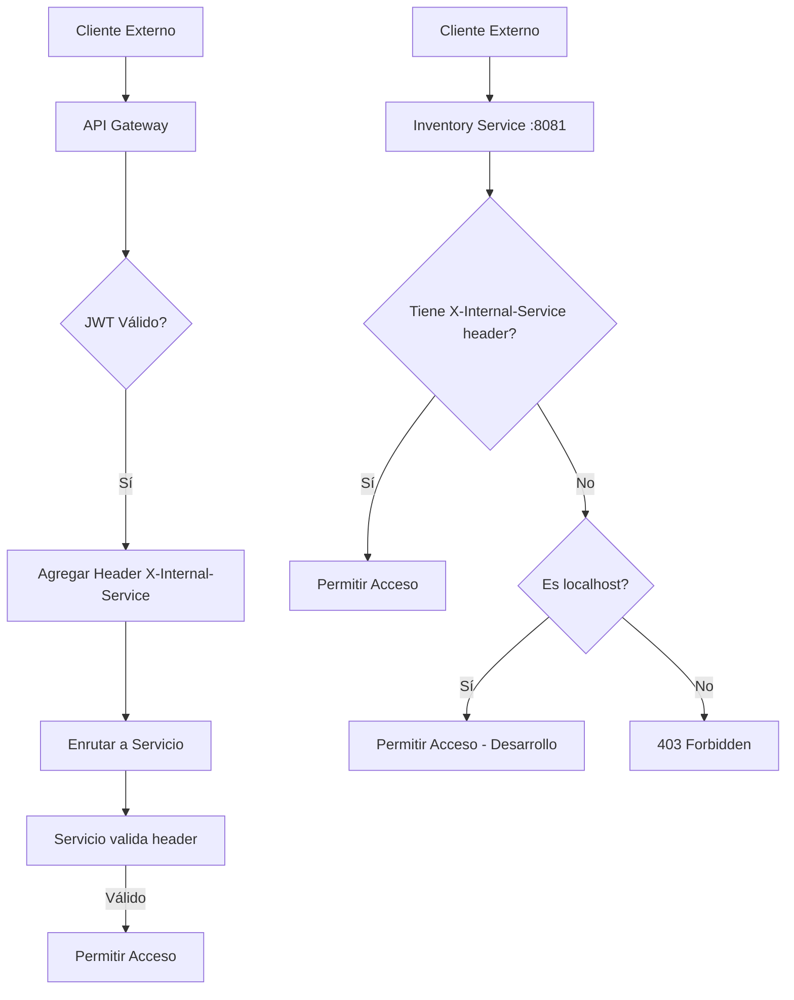

# Configuración de Seguridad - Vending Machine Microservices

## Resumen de la Configuración

Se ha implementado una configuración de seguridad que garantiza que los servicios solo sean accesibles desde el API Gateway y servicios internos autorizados, bloqueando el acceso directo desde clientes externos.

## Arquitectura de Seguridad

### 1. API Gateway (Puerto 8080)

- **Framework**: Spring Cloud Gateway con WebFlux Security
- **Autenticación**: JWT-based con roles (SUPER_ADMIN, ADMIN)
- **Endpoints públicos**: Login, productos de inventario, transacciones de compra
- **Endpoints protegidos**: Administración (requiere JWT)

### 2. Inventory Service (Puerto 8081)

- **Framework**: Spring Security (MVC)
- **Acceso permitido**: Solo desde localhost (127.0.0.1, 0:0:0:0:0:0:0:1, localhost)
- **Acceso denegado**: Desde cualquier IP externa
- **Endpoints**:
  - `GET /api/inventory/products` - Lista productos
  - `GET /api/inventory/availability/{productId}` - Verifica disponibilidad
  - `POST /api/admin/inventory/products` - Agregar producto (requiere JWT via Gateway)
  - `PUT /api/admin/inventory/stock/{productId}` - Actualizar stock (requiere JWT via Gateway)

### 3. Payment Service (Puerto 8082)

- **Framework**: Spring Security (MVC)
- **Acceso permitido**: Solo desde localhost (127.0.0.1, 0:0:0:0:0:0:0:1, localhost)
- **Acceso denegado**: Desde cualquier IP externa
- **Endpoints**:
  - `POST /api/payment/process` - Procesar pago
  - `GET /api/admin/payment/transactions` - Ver transacciones (requiere JWT via Gateway)

### 4. Servicios Internos (Transaction, Dispensing, Notification)

- No tienen endpoints públicos expuestos
- Se comunican vía Kafka events y llamadas HTTP directas entre servicios
- No requieren configuración de seguridad adicional

## Flujo de Seguridad Actualizado



## Configuración Técnica

### SecurityConfig en Servicios

```java
@Configuration
@EnableWebSecurity
public class SecurityConfig {

    @Bean
    public SecurityFilterChain filterChain(HttpSecurity http) throws Exception {
        return http
                .cors(cors -> cors.configurationSource(corsConfigurationSource()))
                .csrf(csrf -> csrf.disable())
                .sessionManagement(session -> session.sessionCreationPolicy(SessionCreationPolicy.STATELESS))
                .authorizeHttpRequests(auth -> auth
                        .requestMatchers("/actuator/health").permitAll()
                        .requestMatchers("/actuator/**").permitAll()
                        .anyRequest().access((authentication, request) -> {
                            // Allow requests with internal service header (from gateway)
                            String internalService = request.getRequest().getHeader("X-Internal-Service");
                            if ("api-gateway".equals(internalService)) {
                                return new AuthorizationDecision(true);
                            }
                            // Allow localhost for development and inter-service communication
                            String remoteAddr = request.getRequest().getRemoteAddr();
                            if ("127.0.0.1".equals(remoteAddr) ||
                                "0:0:0:0:0:0:0:1".equals(remoteAddr) ||
                                "localhost".equals(remoteAddr)) {
                                return new AuthorizationDecision(true);
                            }
                            // Deny external access
                            return new AuthorizationDecision(false);
                        })
                )
                .exceptionHandling(ex -> ex.accessDeniedPage("/access-denied"))
                .build();
    }
}
```

### InternalServiceFilter en API Gateway

```java
@Component
public class InternalServiceFilter implements GlobalFilter, Ordered {

    private static final String INTERNAL_SERVICE_HEADER = "X-Internal-Service";
    private static final String GATEWAY_IDENTIFIER = "api-gateway";

    @Override
    public Mono<Void> filter(ServerWebExchange exchange, GatewayFilterChain chain) {
        // Add internal service header to identify requests from gateway
        ServerWebExchange modifiedExchange = exchange.mutate()
                .request(exchange.getRequest().mutate()
                        .header(INTERNAL_SERVICE_HEADER, GATEWAY_IDENTIFIER)
                        .build())
                .build();

        return chain.filter(modifiedExchange);
    }

    @Override
    public int getOrder() {
        return Ordered.LOWEST_PRECEDENCE;
    }
}
```

### CORS Configuration

```java
@Bean
public CorsConfigurationSource corsConfigurationSource() {
    CorsConfiguration configuration = new CorsConfiguration();
    configuration.setAllowedOriginPatterns(Arrays.asList("http://localhost:*", "http://127.0.0.1:*"));
    configuration.setAllowedMethods(Arrays.asList("GET", "POST", "PUT", "DELETE", "OPTIONS"));
    configuration.setAllowedHeaders(Arrays.asList("*"));
    configuration.setAllowCredentials(true);

    UrlBasedCorsConfigurationSource source = new UrlBasedCorsConfigurationSource();
    source.registerCorsConfiguration("/**", configuration);
    return source;
}
```

## Testing de Seguridad

### 1. Acceso Autorizado (desde Gateway con header)

```bash
# Solicitud desde API Gateway (incluye header X-Internal-Service)
curl -X GET http://localhost:8080/api/inventory/products
# Gateway agrega: X-Internal-Service: api-gateway
# Respuesta: 200 OK con lista de productos

curl -X GET http://localhost:8080/api/admin/payment/transactions \
  -H "Authorization: Bearer <jwt-token>"
# Respuesta: 200 OK con transacciones
```

### 2. Acceso Autorizado (localhost para desarrollo)

```bash
# Acceso directo desde localhost (para testing/development)
curl -X GET http://localhost:8081/api/inventory/products
# Respuesta: 200 OK (permitido por ser localhost)

curl -X GET http://localhost:8082/actuator/health
# Respuesta: 200 OK (health checks siempre permitidos)
```

### 3. Acceso No Autorizado (desde IP externa)

```bash
# Desde IP externa sin header (cliente malicioso)
curl -X GET http://192.168.1.100:8081/api/inventory/products
# Respuesta: 403 Forbidden
# Body: Página de error de acceso denegado

curl -X POST http://192.168.1.100:8082/api/payment/process \
  -H "Content-Type: application/json" \
  -d '{"amount": 100.0, "method": "CARD"}'
# Respuesta: 403 Forbidden
```

## Beneficios de Esta Configuración

### Seguridad

- **Prevención de acceso directo**: Los servicios no pueden ser accedidos directamente desde internet
- **Control centralizado**: Todo el tráfico debe pasar por el API Gateway
- **Autenticación consistente**: JWT tokens validados una sola vez en el Gateway

### Arquitectura

- **Microservicios protegidos**: Cada servicio mantiene su propio control de acceso
- **Comunicación interna segura**: Servicios pueden llamarse entre sí sin restricciones
- **Monitoreo simplificado**: Un solo punto de entrada para logs y métricas

### Mantenibilidad

- **Configuración clara**: Reglas de seguridad explícitas y documentadas
- **Fácil de extender**: Nuevo servicios pueden seguir el mismo patrón
- **Testing sencillo**: Comportamiento predecible para pruebas de seguridad

## Consideraciones Adicionales

### Producción

- Considerar usar un reverse proxy (nginx) para filtrado adicional de IPs
- Implementar rate limiting en el API Gateway
- Configurar HTTPS/TLS para toda la comunicación
- Usar secrets management para JWT keys

### Monitoreo

- Logs de acceso denegado para detectar intentos de intrusión
- Métricas de latencia por servicio
- Alertas cuando se detecten patrones de acceso sospechoso

### Escalabilidad

- La configuración actual funciona bien para deployments en contenedores
- Para Kubernetes, considerar NetworkPolicies adicionales
- Service mesh (Istio) puede proporcionar seguridad adicional a nivel de red
