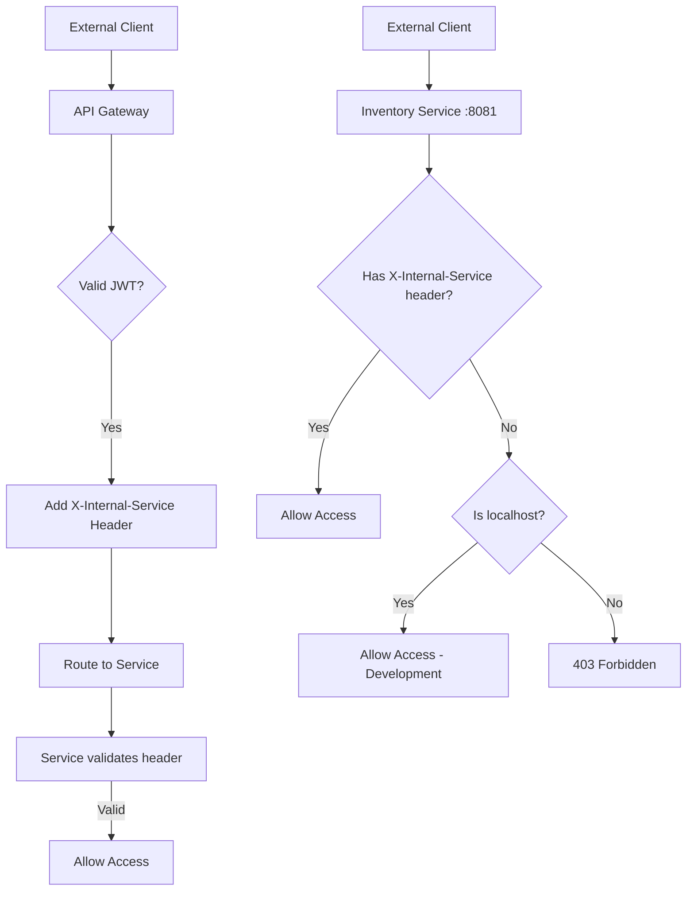

# Security Configuration - Vending Machine Microservices

## Configuration Summary

A security configuration has been implemented that ensures services are only accessible from the API Gateway and authorized internal services, blocking direct access from external clients.

## Security Architecture

### 1. API Gateway (Port 8080)

- **Framework**: Spring Cloud Gateway with WebFlux Security
- **Authentication**: JWT-based with roles (SUPER_ADMIN, ADMIN)
- **Public Endpoints**: Login, inventory products, purchase transactions
- **Protected Endpoints**: Administration (requires JWT)

### 2. Inventory Service (Port 8081)

- **Framework**: Spring Security (MVC)
- **Allowed Access**: Only from localhost (127.0.0.1, 0:0:0:0:0:0:0:1, localhost)
- **Denied Access**: From any external IP
- **Endpoints**:
  - `GET /api/inventory/products` - List products
  - `GET /api/inventory/availability/{productId}` - Check availability
  - `POST /api/admin/inventory/products` - Add product (requires JWT via Gateway)
  - `PUT /api/admin/inventory/stock/{productId}` - Update stock (requires JWT via Gateway)

### 3. Payment Service (Port 8082)

- **Framework**: Spring Security (MVC)
- **Allowed Access**: Only from localhost (127.0.0.1, 0:0:0:0:0:0:0:1, localhost)
- **Denied Access**: From any external IP
- **Endpoints**:
  - `POST /api/payment/process` - Process payment
  - `GET /api/admin/payment/transactions` - View transactions (requires JWT via Gateway)

### 4. Internal Services (Transaction, Dispensing, Notification)

- They do not have exposed public endpoints
- They communicate via Kafka events and direct HTTP calls between services
- They do not require additional security configuration

## Updated Security Flow



## Technical Configuration

### SecurityConfig in Services

```java
@Configuration
@EnableWebSecurity
public class SecurityConfig {

    @Bean
    public SecurityFilterChain filterChain(HttpSecurity http) throws Exception {
        return http
                .cors(cors -> cors.configurationSource(corsConfigurationSource()))
                .csrf(csrf -> csrf.disable())
                .sessionManagement(session -> session.sessionCreationPolicy(SessionCreationPolicy.STATELESS))
                .authorizeHttpRequests(auth -> auth
                        .requestMatchers("/actuator/health").permitAll()
                        .requestMatchers("/actuator/**").permitAll()
                        .anyRequest().access((authentication, request) -> {
                            // Allow requests with internal service header (from gateway)
                            String internalService = request.getRequest().getHeader("X-Internal-Service");
                            if ("api-gateway".equals(internalService)) {
                                return new AuthorizationDecision(true);
                            }
                            // Allow localhost for development and inter-service communication
                            String remoteAddr = request.getRequest().getRemoteAddr();
                            if ("127.0.0.1".equals(remoteAddr) ||
                                "0:0:0:0:0:0:0:1".equals(remoteAddr) ||
                                "localhost".equals(remoteAddr)) {
                                return new AuthorizationDecision(true);
                            }
                            // Deny external access
                            return new AuthorizationDecision(false);
                        })
                )
                .exceptionHandling(ex -> ex.accessDeniedPage("/access-denied"))
                .build();
    }
}
```

### InternalServiceFilter in API Gateway

```java
@Component
public class InternalServiceFilter implements GlobalFilter, Ordered {

    private static final String INTERNAL_SERVICE_HEADER = "X-Internal-Service";
    private static final String GATEWAY_IDENTIFIER = "api-gateway";

    @Override
    public Mono<Void> filter(ServerWebExchange exchange, GatewayFilterChain chain) {
        // Add internal service header to identify requests from gateway
        ServerWebExchange modifiedExchange = exchange.mutate()
                .request(exchange.getRequest().mutate()
                        .header(INTERNAL_SERVICE_HEADER, GATEWAY_IDENTIFIER)
                        .build())
                .build();

        return chain.filter(modifiedExchange);
    }

    @Override
    public int getOrder() {
        return Ordered.LOWEST_PRECEDENCE;
    }
}
```

### CORS Configuration

```java
@Bean
public CorsConfigurationSource corsConfigurationSource() {
    CorsConfiguration configuration = new CorsConfiguration();
    configuration.setAllowedOriginPatterns(Arrays.asList("http://localhost:*", "http://127.0.0.1:*"));
    configuration.setAllowedMethods(Arrays.asList("GET", "POST", "PUT", "DELETE", "OPTIONS"));
    configuration.setAllowedHeaders(Arrays.asList("*"));
    configuration.setAllowCredentials(true);

    UrlBasedCorsConfigurationSource source = new UrlBasedCorsConfigurationSource();
    source.registerCorsConfiguration("/**", configuration);
    return source;
}
```

## Security Testing

### 1. Authorized Access (from Gateway with header)

```bash
# Request from API Gateway (includes X-Internal-Service header)
curl -X GET http://localhost:8080/api/inventory/products
# Gateway adds: X-Internal-Service: api-gateway
# Response: 200 OK with product list

curl -X GET http://localhost:8080/api/admin/payment/transactions \
  -H "Authorization: Bearer <jwt-token>"
# Response: 200 OK with transactions
```

### 2. Authorized Access (localhost for development)

```bash
# Direct access from localhost (for testing/development)
curl -X GET http://localhost:8081/api/inventory/products
# Response: 200 OK (allowed because localhost)

curl -X GET http://localhost:8082/actuator/health
# Response: 200 OK (health checks always allowed)
```

### 3. Unauthorized Access (from external IP)

```bash
# From external IP without header (malicious client)
curl -X GET http://192.168.1.100:8081/api/inventory/products
# Response: 403 Forbidden
# Body: Access denied error page

curl -X POST http://192.168.1.100:8082/api/payment/process \
  -H "Content-Type: application/json" \
  -d '{"amount": 100.0, "method": "CARD"}'
# Response: 403 Forbidden
```

## Benefits of This Configuration

### Security

- **Prevention of direct access**: Services cannot be accessed directly from the internet
- **Centralized control**: All traffic must pass through the API Gateway
- **Consistent authentication**: JWT tokens validated once at the Gateway

### Architecture

- **Protected microservices**: Each service maintains its own access control
- **Secure internal communication**: Services can call each other without restrictions
- **Simplified monitoring**: Single entry point for logs and metrics

### Maintainability

- **Clear configuration**: Explicit and documented security rules
- **Easy to extend**: New services can follow the same pattern
- **Simple testing**: Predictable behavior for security tests

## Additional Considerations

### Production

- Consider using a reverse proxy (nginx) for additional IP filtering
- Implement rate limiting in the API Gateway
- Configure HTTPS/TLS for all communication
- Use secrets management for JWT keys

### Monitoring

- Logs of denied access to detect intrusion attempts
- Latency metrics per service
- Alerts when suspicious access patterns are detected

### Scalability

- The current configuration works well for container deployments
- For Kubernetes, consider additional NetworkPolicies
- Service mesh (Istio) can provide additional network-level security
