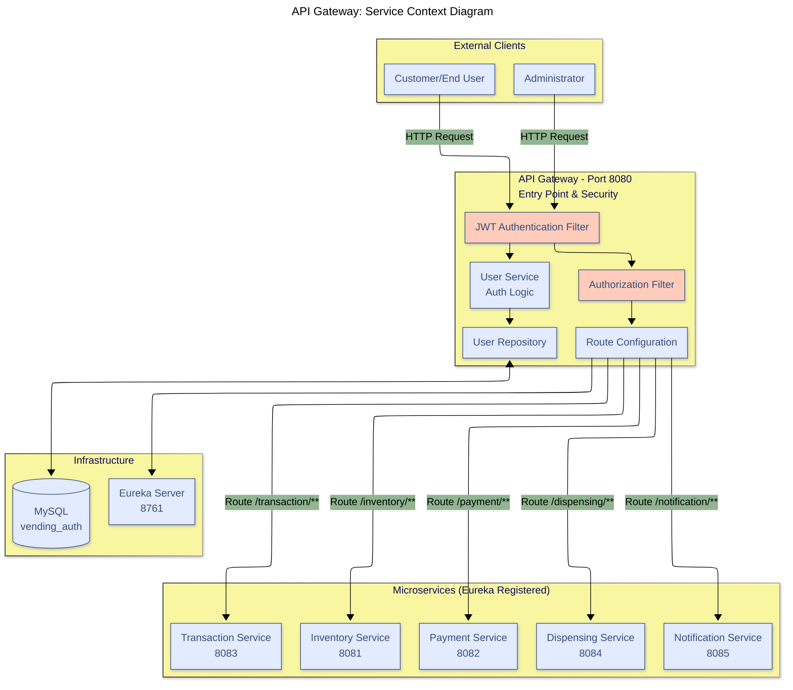
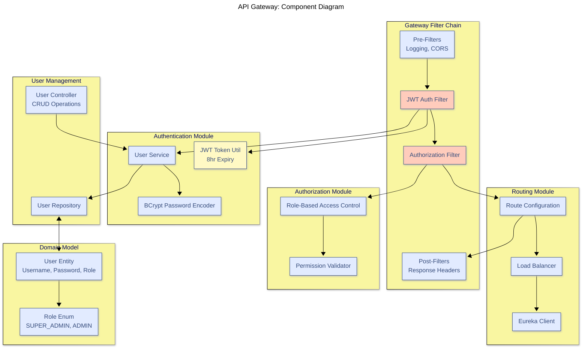
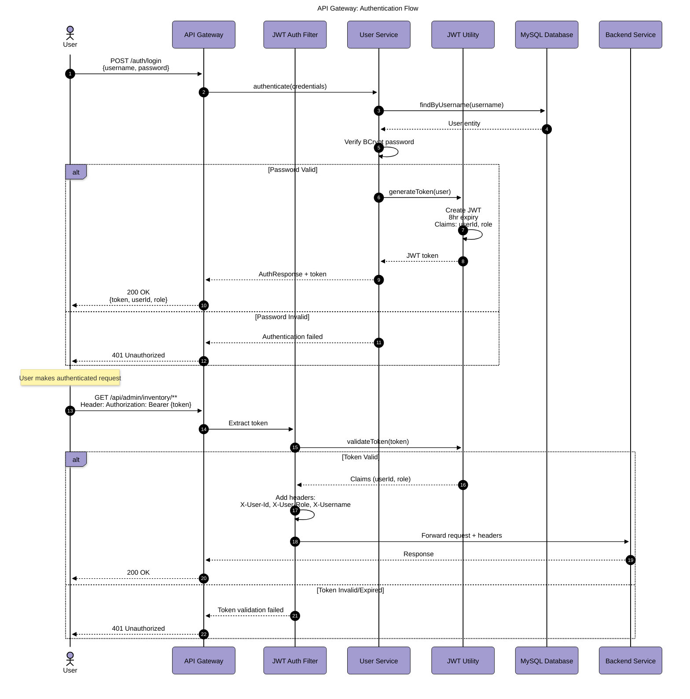
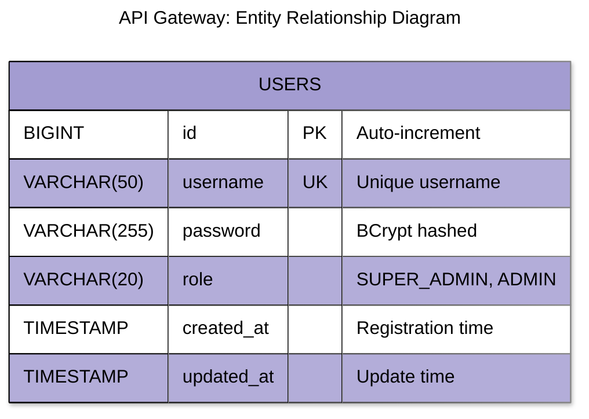
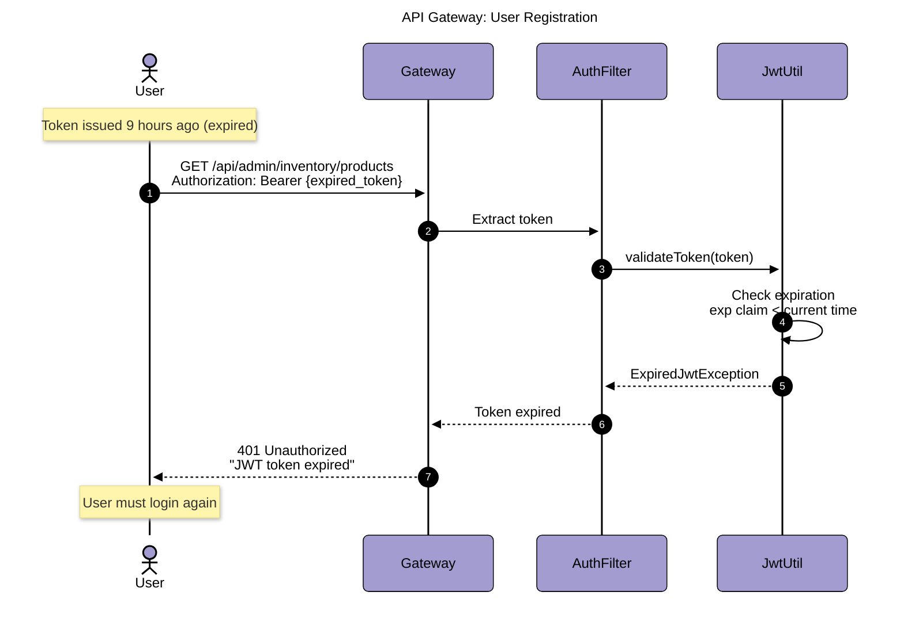
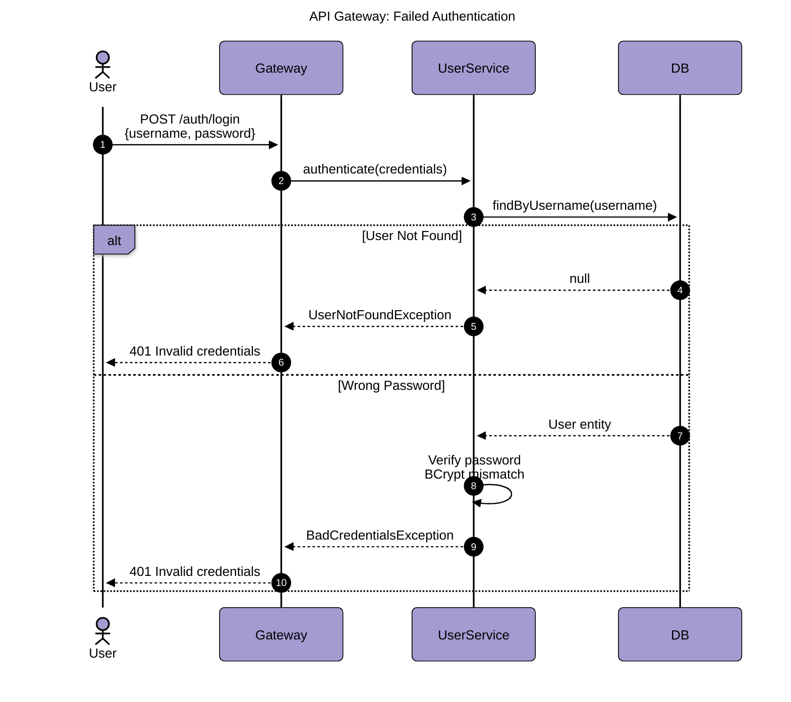
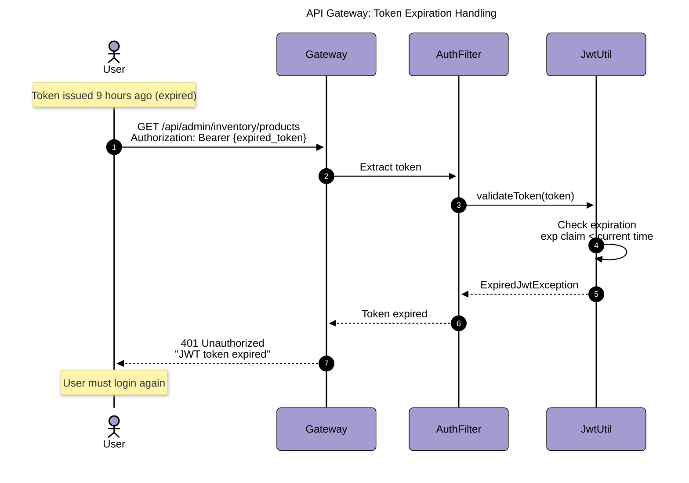

# API Gateway Diagrams

## Table of Contents

- [Service Context Diagram](#service-context-diagram)
- [Component Diagram](#component-diagram)
- [Authentication Flow](#authentication-flow)
- [Authorization Matrix](#authorization-matrix)
- [Entity Relationship Diagram](#entity-relationship-diagram)
- [Sequence Diagrams](#sequence-diagrams)

---

## Service Context Diagram



---

## Component Diagram



---

## Authentication Flow



---

## Authorization Matrix

### Role Permissions

| Endpoint Pattern              | HTTP Method  | SUPER_ADMIN | ADMIN | Public |
| ----------------------------- | ------------ | ----------- | ----- | ------ |
| `/auth/login`                 | POST         | ✅          | ✅    | ✅     |
| `/auth/register`              | POST         | ✅          | ❌    | ❌     |
| `/api/transaction/purchase`   | POST         | ✅          | ✅    | ✅     |
| `/api/inventory/products`     | GET          | ✅          | ✅    | ✅     |
| `/api/admin/inventory/**`     | ALL          | ✅          | ✅    | ❌     |
| `/api/admin/payment/**`       | ALL          | ✅          | ✅    | ❌     |
| `/api/admin/transaction/**`   | ALL          | ✅          | ✅    | ❌     |
| `/api/admin/dispensing/**`    | ALL          | ✅          | ✅    | ❌     |
| `/api/admin/notifications/**` | ALL          | ✅          | ✅    | ❌     |
| `/api/admin/users/**`         | GET, PUT     | ✅          | ✅    | ❌     |
| `/api/admin/users/**`         | POST, DELETE | ✅          | ❌    | ❌     |

### Route Configuration

```yaml
Routes:
  - id: inventory-service
    uri: lb://inventory-service
    predicates: Path=/api/inventory/**, /api/admin/inventory/**
    filters: AuthenticationFilter

  - id: payment-service
    uri: lb://payment-service
    predicates: Path=/api/payment/**, /api/admin/payment/**
    filters: AuthenticationFilter

  - id: transaction-service
    uri: lb://transaction-service
    predicates: Path=/api/transaction/**, /api/admin/transaction/**
    filters: AuthenticationFilter

  - id: dispensing-service
    uri: lb://dispensing-service
    predicates: Path=/api/dispensing/**, /api/admin/dispensing/**
    filters: AuthenticationFilter

  - id: notification-service
    uri: lb://notification-service
    predicates: Path=/api/admin/notifications/**
    filters: AuthenticationFilter
```

---

## Entity Relationship Diagram



### Database Schema

```sql
CREATE DATABASE vending_auth;

CREATE TABLE users (
    id BIGINT AUTO_INCREMENT PRIMARY KEY,
    username VARCHAR(50) UNIQUE NOT NULL,
    password VARCHAR(255) NOT NULL,
    role VARCHAR(20) NOT NULL,
    created_at TIMESTAMP DEFAULT CURRENT_TIMESTAMP,
    updated_at TIMESTAMP DEFAULT CURRENT_TIMESTAMP ON UPDATE CURRENT_TIMESTAMP
);

-- Default admin user
INSERT INTO users (username, password, role)
VALUES ('admin', '$2a$10$...', 'SUPER_ADMIN');
```

---

## Sequence Diagrams

### User Registration (SUPER_ADMIN Only)



### Failed Authentication



### Token Expiration Handling



---

## API Endpoints

### Public Endpoints

#### User Login

- **Endpoint**: `POST /auth/login`
- **Auth**: None
- **Request**:

```json
{
  "username": "admin",
  "password": "admin123"
}
```

- **Response**:

```json
{
  "token": "eyJhbGciOiJIUzI1NiIsInR5cCI6IkpXVCJ9...",
  "userId": 1,
  "username": "admin",
  "role": "SUPER_ADMIN",
  "expiresIn": 28800
}
```

### Admin Endpoints

#### Register New User

- **Endpoint**: `POST /auth/register`
- **Auth**: JWT (SUPER_ADMIN only)
- **Request**:

```json
{
  "username": "manager1",
  "password": "secure123",
  "role": "ADMIN"
}
```

#### Get All Users

- **Endpoint**: `GET /api/admin/users`
- **Auth**: JWT (ADMIN or SUPER_ADMIN)

#### Update User

- **Endpoint**: `PUT /api/admin/users/{id}`
- **Auth**: JWT (ADMIN or SUPER_ADMIN)

#### Delete User

- **Endpoint**: `DELETE /api/admin/users/{id}`
- **Auth**: JWT (SUPER_ADMIN only)

---

## Security Configuration

### JWT Configuration

```properties
jwt.secret=your-256-bit-secret-key
jwt.expiration=28800000  # 8 hours in milliseconds
jwt.header=Authorization
jwt.prefix=Bearer
```

### Password Encoding

- **Algorithm**: BCrypt
- **Strength**: 10 rounds
- **Salt**: Auto-generated per password

### CORS Configuration

```java
@Bean
public CorsWebFilter corsWebFilter() {
    return new CorsWebFilter(exchange -> {
        allowedOrigins: ["http://localhost:3000"]
        allowedMethods: ["GET", "POST", "PUT", "DELETE", "OPTIONS"]
        allowedHeaders: ["*"]
        allowCredentials: true
        maxAge: 3600
    });
}
```

---

## Performance Characteristics

- **JWT Validation**: < 10ms
- **Password Verification**: < 100ms (BCrypt)
- **Route Resolution**: < 5ms
- **Eureka Lookup**: < 20ms
- **Total Gateway Overhead**: < 150ms

---

## Conclusion

API Gateway provides centralized authentication, authorization, and routing for all microservices. It implements JWT-based security with role-based access control and integrates with Eureka for dynamic service discovery.
