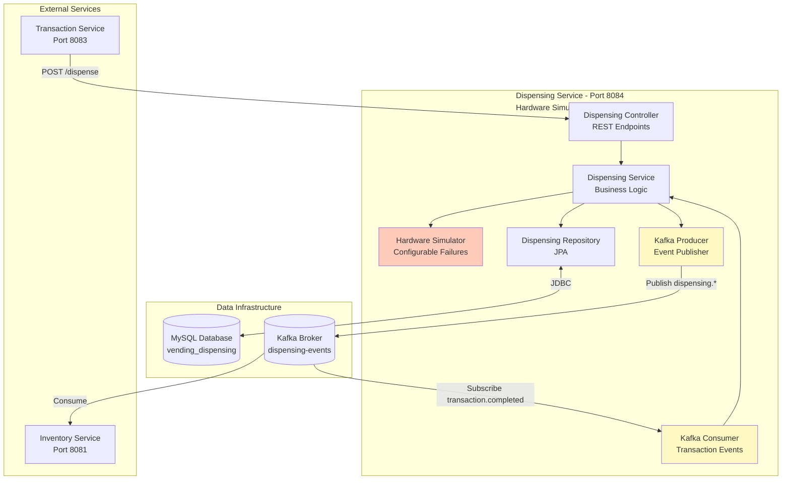
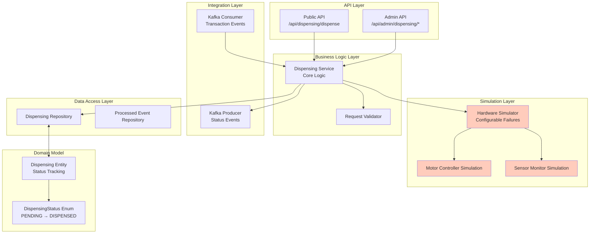
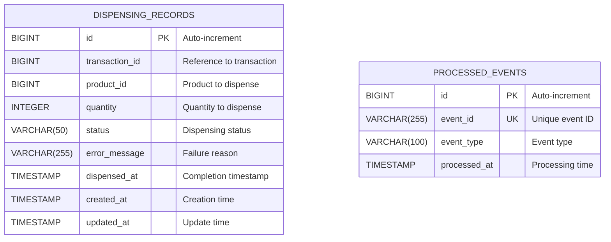
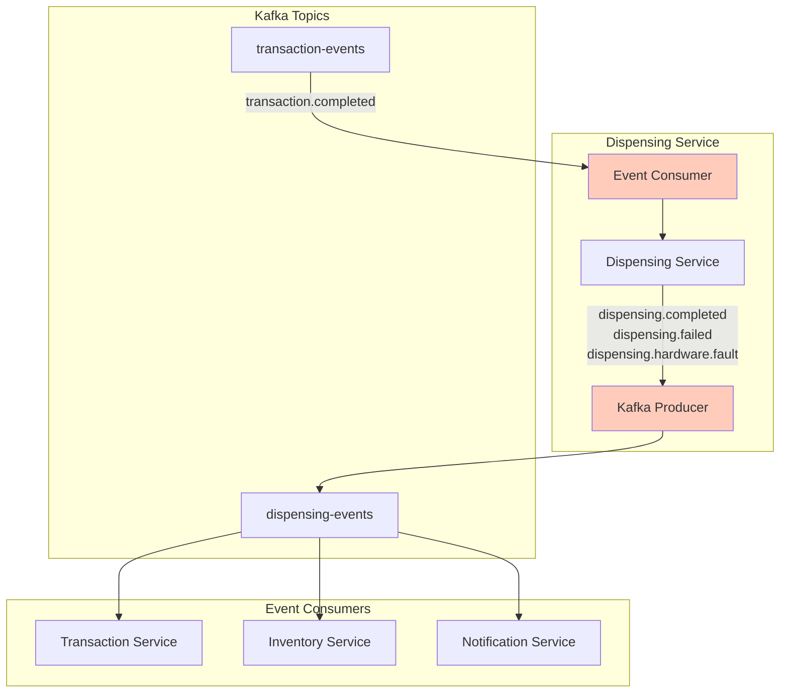
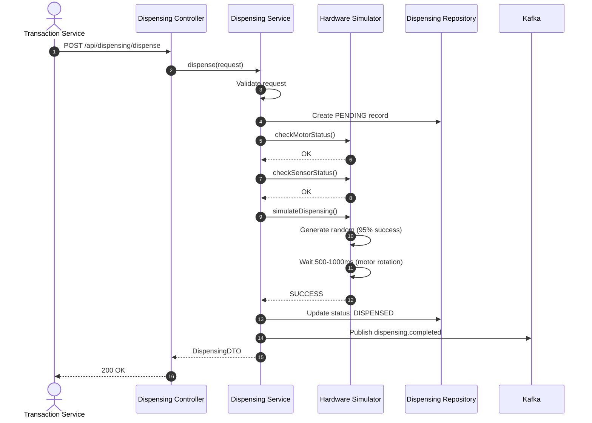
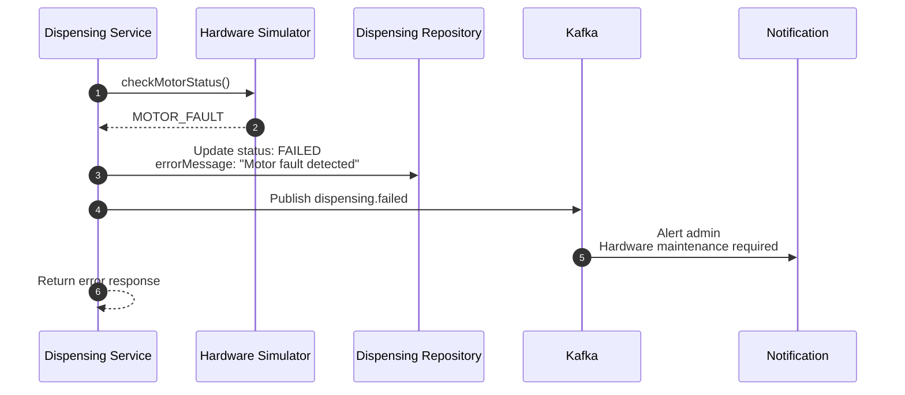
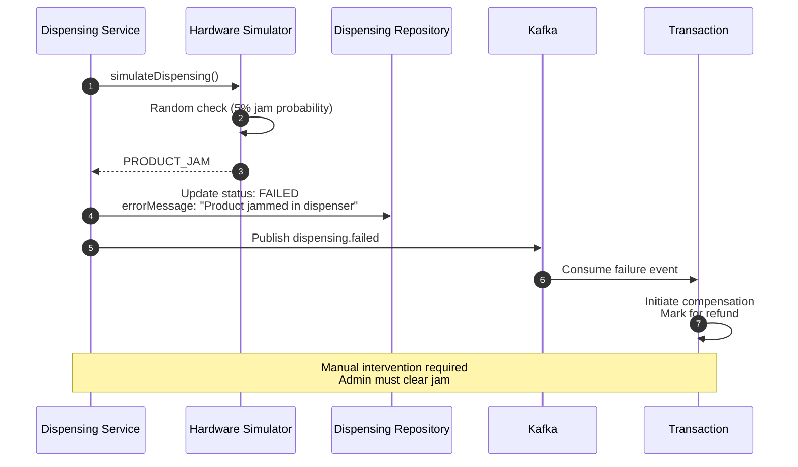

# Dispensing Service Diagrams

## Table of Contents

- [Service Context Diagram](#service-context-diagram)
- [Component Diagram](#component-diagram)
- [Hardware Simulation Logic](#hardware-simulation-logic)
- [Entity Relationship Diagram](#entity-relationship-diagram)
- [Kafka Topic Flow](#kafka-topic-flow)
- [Sequence Diagrams](#sequence-diagrams)

---

## Service Context Diagram



---

## Component Diagram



---

## Hardware Simulation Logic

```mermaid
flowchart TD
    START([Dispense Request]) --> VALIDATE{Valid Request?}
    VALIDATE -->|No| ERROR1[Return Validation Error]
    VALIDATE -->|Yes| CREATE[Create Dispensing Record<br/>Status: PENDING]

    CREATE --> MOTOR_CHECK{Motor Status?}
    MOTOR_CHECK -->|Fault| ERROR2[Update Status: FAILED<br/>Reason: MOTOR_FAULT]
    MOTOR_CHECK -->|OK| SENSOR_CHECK{Sensor Status?}

    SENSOR_CHECK -->|Fault| ERROR3[Update Status: FAILED<br/>Reason: SENSOR_FAULT]
    SENSOR_CHECK -->|OK| JAM_CHECK{Jam Check<br/>95% Success Rate}

    JAM_CHECK -->|Jammed 5%| ERROR4[Update Status: FAILED<br/>Reason: PRODUCT_JAM]
    JAM_CHECK -->|Clear 95%| DISPENSE[Simulate Motor Rotation<br/>Wait 500-1000ms]

    DISPENSE --> VERIFY{Product Dispensed?}
    VERIFY -->|No| ERROR5[Update Status: FAILED<br/>Reason: DISPENSE_VERIFICATION_FAILED]
    VERIFY -->|Yes| SUCCESS[Update Status: DISPENSED<br/>Timestamp: now()]

    SUCCESS --> PUBLISH[Publish dispensing.completed<br/>to Kafka]

    ERROR2 --> PUBLISH_FAIL[Publish dispensing.failed]
    ERROR3 --> PUBLISH_FAIL
    ERROR4 --> PUBLISH_FAIL
    ERROR5 --> PUBLISH_FAIL

    PUBLISH --> END([Return Success])
    PUBLISH_FAIL --> END_FAIL([Return Failure])
    ERROR1 --> END_FAIL

    style JAM_CHECK fill:#ffccbc
    style DISPENSE fill:#c5cae9
    style SUCCESS fill:#c8e6c9
    style ERROR2 fill:#ffcdd2
    style ERROR3 fill:#ffcdd2
    style ERROR4 fill:#ffcdd2
    style ERROR5 fill:#ffcdd2
```

### Failure Scenarios

| Failure Type        | Probability | Detection        | Recovery            |
| ------------------- | ----------- | ---------------- | ------------------- |
| Motor Fault         | 1%          | Pre-check        | Manual intervention |
| Sensor Fault        | 1%          | Pre-check        | Manual intervention |
| Product Jam         | 3%          | During dispense  | Manual clearing     |
| Verification Failed | 0.5%        | Post-dispense    | Manual verification |
| Success             | 94.5%       | Normal operation | N/A                 |

---

## Entity Relationship Diagram



### Dispensing Status Enum

```java
PENDING → IN_PROGRESS → DISPENSED
              ↓
            FAILED (MOTOR_FAULT, SENSOR_FAULT, PRODUCT_JAM, VERIFICATION_FAILED)
```

---

## Kafka Topic Flow



---

## Sequence Diagrams

### Successful Dispensing Flow



### Hardware Fault Flow



### Product Jam Recovery



---

## API Endpoints

### Public Endpoints

#### Dispense Item

- **Endpoint**: `POST /api/dispensing/dispense`
- **Auth**: Called by Transaction Service
- **Request**:

```json
{
  "transactionId": 100,
  "productId": 1,
  "quantity": 1
}
```

- **Response**:

```json
{
  "id": 50,
  "transactionId": 100,
  "productId": 1,
  "quantity": 1,
  "status": "DISPENSED",
  "dispensedAt": "2024-01-15T10:30:05Z"
}
```

### Admin Endpoints

#### Get Dispensing History

- **Endpoint**: `GET /api/admin/dispensing/history`
- **Auth**: JWT (ADMIN or SUPER_ADMIN)

#### Get Hardware Status

- **Endpoint**: `GET /api/admin/dispensing/hardware-status`
- **Auth**: JWT (ADMIN or SUPER_ADMIN)

#### Configure Failure Rate

- **Endpoint**: `POST /api/admin/dispensing/configure-failure-rate`
- **Auth**: JWT (SUPER_ADMIN)

---

## Performance Characteristics

- **Average Dispensing Time**: 750ms (500-1000ms)
- **Success Rate**: 94.5%
- **Motor Check**: < 50ms
- **Sensor Check**: < 50ms
- **Event Publishing**: < 100ms

---

## Conclusion

Dispensing Service simulates hardware operations with configurable failure scenarios for realistic testing and development. It tracks all dispensing attempts and publishes events for downstream processing.
