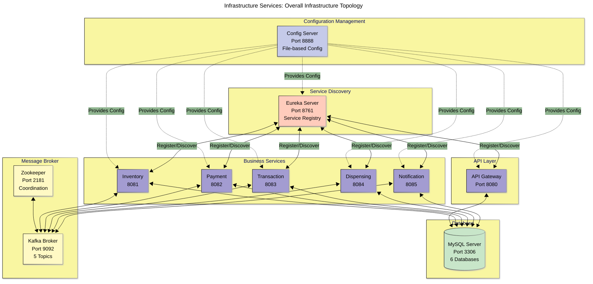
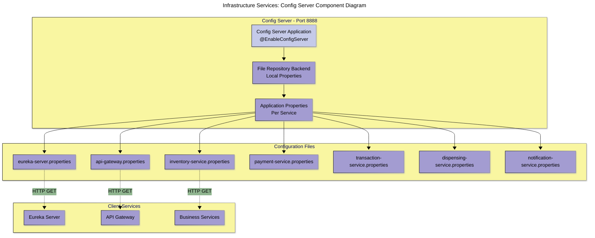
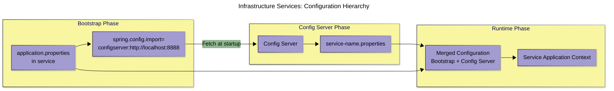
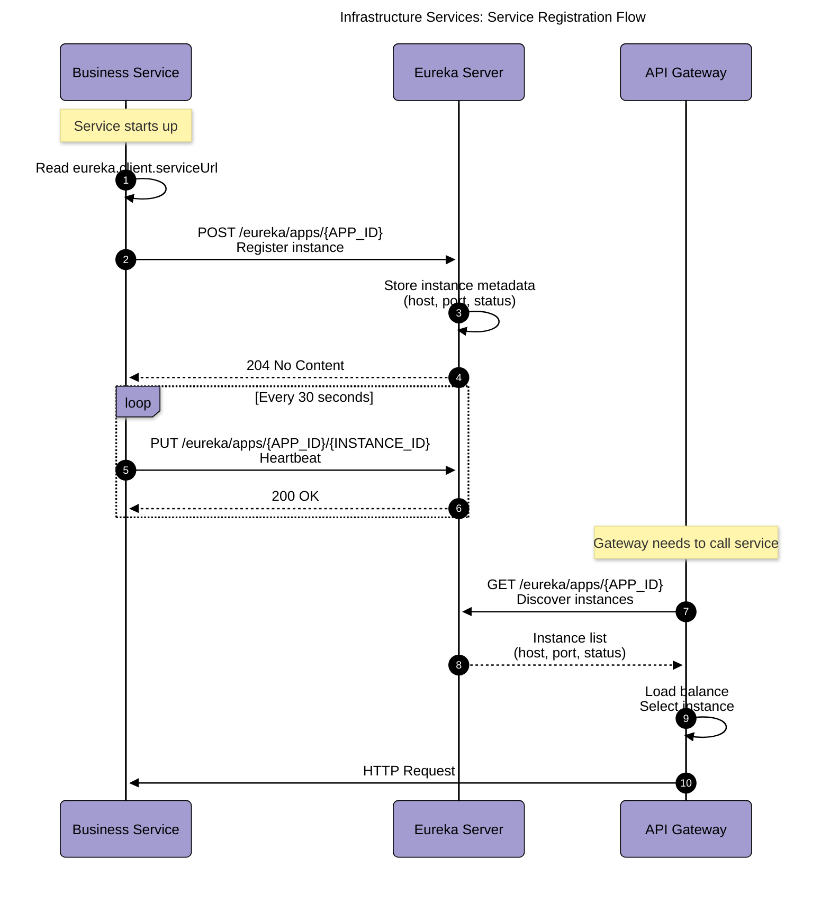
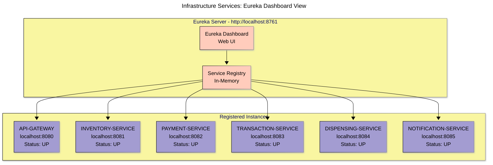
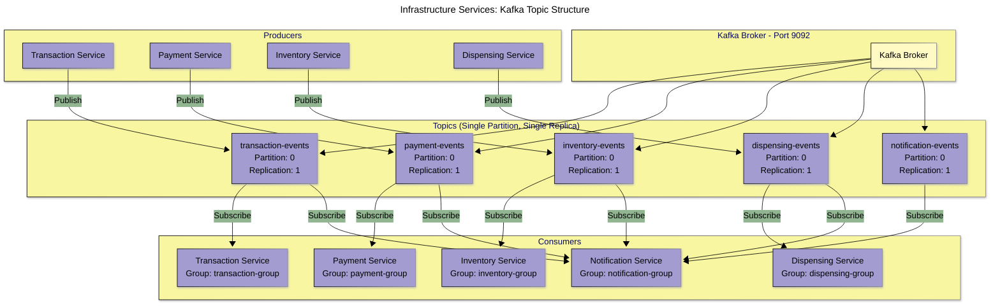
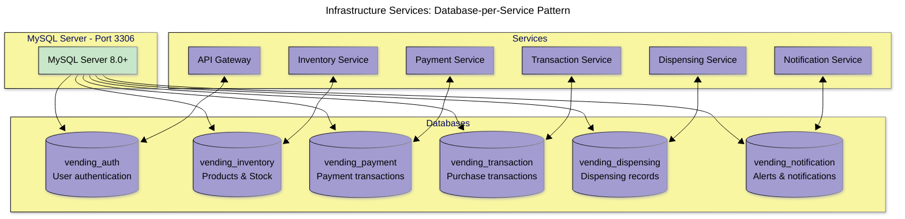
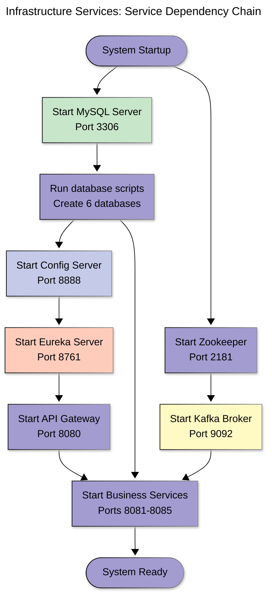

# Infrastructure Services Diagrams

## Table of Contents

- [Overall Infrastructure Topology](#overall-infrastructure-topology)
- [Config Server Architecture](#config-server-architecture)
- [Eureka Server Architecture](#eureka-server-architecture)
- [Kafka Architecture](#kafka-architecture)
- [MySQL Database Architecture](#mysql-database-architecture)

---

## Overall Infrastructure Topology



---

## Config Server Architecture

### Component Diagram



### Configuration Hierarchy



### Stored Configuration Properties

| Service              | Port | Database             | Kafka Topics       | Eureka |
| -------------------- | ---- | -------------------- | ------------------ | ------ |
| eureka-server        | 8761 | None                 | None               | Self   |
| api-gateway          | 8080 | vending_auth         | None               | Client |
| inventory-service    | 8081 | vending_inventory    | inventory-events   | Client |
| payment-service      | 8082 | vending_payment      | payment-events     | Client |
| transaction-service  | 8083 | vending_transaction  | transaction-events | Client |
| dispensing-service   | 8084 | vending_dispensing   | dispensing-events  | Client |
| notification-service | 8085 | vending_notification | All topics         | Client |

---

## Eureka Server Architecture

### Service Registration Flow



### Eureka Dashboard View



### Instance Metadata

```json
{
  "instance": {
    "instanceId": "localhost:inventory-service:8081",
    "app": "INVENTORY-SERVICE",
    "ipAddr": "127.0.0.1",
    "port": {
      "$": 8081,
      "@enabled": true
    },
    "status": "UP",
    "healthCheckUrl": "http://localhost:8081/actuator/health",
    "homePageUrl": "http://localhost:8081/",
    "metadata": {
      "management.port": "8081"
    }
  }
}
```

---

## Kafka Architecture

### Topic Structure



### Kafka Topic Configuration

```java
@Configuration
public class KafkaTopicConfig {

    @Bean
    public NewTopic transactionEvents() {
        return TopicBuilder.name("transaction-events")
            .partitions(1)
            .replicas(1)
            .build();
    }

    @Bean
    public NewTopic paymentEvents() {
        return TopicBuilder.name("payment-events")
            .partitions(1)
            .replicas(1)
            .build();
    }

    // ... other topics
}
```

### Event Flow Summary

| Event Type               | Producer    | Primary Consumers      | Secondary Consumers |
| ------------------------ | ----------- | ---------------------- | ------------------- |
| transaction.created      | Transaction | Payment, Dispensing    | Notification        |
| transaction.completed    | Transaction | Inventory              | Notification        |
| transaction.failed       | Transaction | None                   | Notification        |
| payment.completed        | Payment     | Transaction            | Notification        |
| payment.failed           | Payment     | Transaction            | Notification        |
| inventory.stock.low      | Inventory   | None                   | Notification        |
| inventory.stock.depleted | Inventory   | None                   | Notification        |
| dispensing.completed     | Dispensing  | Transaction, Inventory | Notification        |
| dispensing.failed        | Dispensing  | Transaction            | Notification        |

---

## MySQL Database Architecture

### Database-per-Service Pattern



### Schema Management

| Database             | Schema Management | DDL Mode | Manual Scripts       |
| -------------------- | ----------------- | -------- | -------------------- |
| vending_auth         | Manual            | none     | Required             |
| vending_inventory    | Hibernate         | update   | Optional (test data) |
| vending_payment      | Hibernate         | update   | No                   |
| vending_transaction  | Hibernate         | update   | No                   |
| vending_dispensing   | Hibernate         | update   | No                   |
| vending_notification | Hibernate         | update   | No                   |

### Database Initialization Script

```sql
-- scripts/create-databases.sql
CREATE DATABASE IF NOT EXISTS vending_auth;
CREATE DATABASE IF NOT EXISTS vending_inventory;
CREATE DATABASE IF NOT EXISTS vending_payment;
CREATE DATABASE IF NOT EXISTS vending_transaction;
CREATE DATABASE IF NOT EXISTS vending_dispensing;
CREATE DATABASE IF NOT EXISTS vending_notification;

-- Grant privileges
GRANT ALL PRIVILEGES ON vending_auth.* TO 'vending_user'@'localhost';
GRANT ALL PRIVILEGES ON vending_inventory.* TO 'vending_user'@'localhost';
GRANT ALL PRIVILEGES ON vending_payment.* TO 'vending_user'@'localhost';
GRANT ALL PRIVILEGES ON vending_transaction.* TO 'vending_user'@'localhost';
GRANT ALL PRIVILEGES ON vending_dispensing.* TO 'vending_user'@'localhost';
GRANT ALL PRIVILEGES ON vending_notification.* TO 'vending_user'@'localhost';
FLUSH PRIVILEGES;
```

### Connection Pool Configuration

```properties
# Common database configuration for all services
spring.datasource.driver-class-name=com.mysql.cj.jdbc.Driver
spring.datasource.hikari.maximum-pool-size=10
spring.datasource.hikari.minimum-idle=5
spring.datasource.hikari.connection-timeout=30000
spring.datasource.hikari.idle-timeout=600000
spring.datasource.hikari.max-lifetime=1800000
```

---

## Startup Sequence

### Service Dependency Chain



### Startup Scripts

#### build.sh

```bash
#!/bin/bash
# Build order: common-library first, then all services
cd common-library && mvn clean install
cd ../config-server && mvn clean package
cd ../eureka-server && mvn clean package
cd ../api-gateway && mvn clean package
cd ../inventory-service && mvn clean package
cd ../payment-service && mvn clean package
cd ../transaction-service && mvn clean package
cd ../dispensing-service && mvn clean package
cd ../notification-service && mvn clean package
```

#### start-services.sh

```bash
#!/bin/bash
# Start services in correct order with delays
java -jar config-server/target/*.jar &
sleep 10

java -jar eureka-server/target/*.jar &
sleep 15

java -jar api-gateway/target/*.jar &
sleep 10

# Business services (parallel start)
java -jar inventory-service/target/*.jar &
java -jar payment-service/target/*.jar &
java -jar transaction-service/target/*.jar &
java -jar dispensing-service/target/*.jar &
java -jar notification-service/target/*.jar &
```

---

## Health Monitoring

### Service Health Endpoints

All services expose: `http://localhost:{port}/actuator/health`

```json
{
  "status": "UP",
  "components": {
    "db": {
      "status": "UP",
      "details": {
        "database": "MySQL",
        "validationQuery": "isValid()"
      }
    },
    "diskSpace": {
      "status": "UP"
    },
    "eureka": {
      "status": "UP"
    }
  }
}
```

### Monitoring Dashboard URLs

- **Eureka Dashboard**: <http://localhost:8761>
- **Config Server Health**: <http://localhost:8888/actuator/health>
- **Gateway Health**: <http://localhost:8080/actuator/health>

---

## Conclusion

The infrastructure layer provides essential services for configuration management (Config Server), service discovery (Eureka), asynchronous messaging (Kafka), and data persistence (MySQL). All services follow the database-per-service pattern and communicate via REST and Kafka events.
