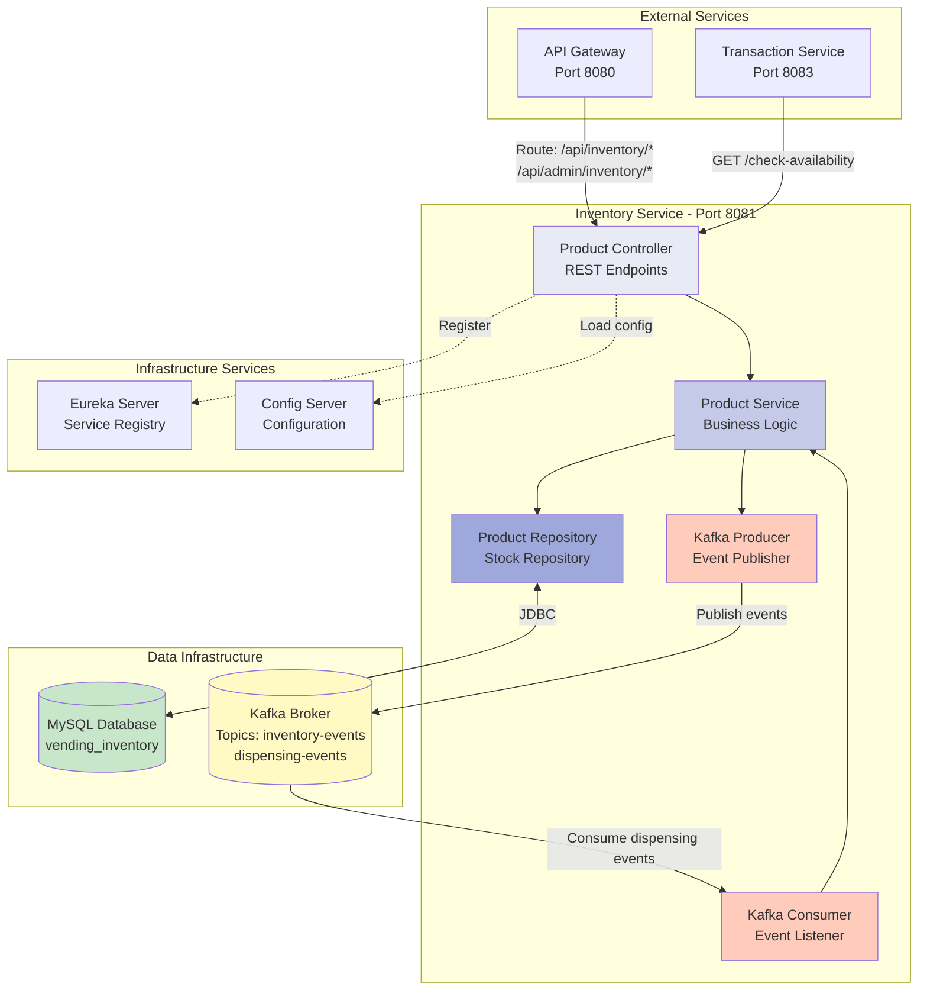
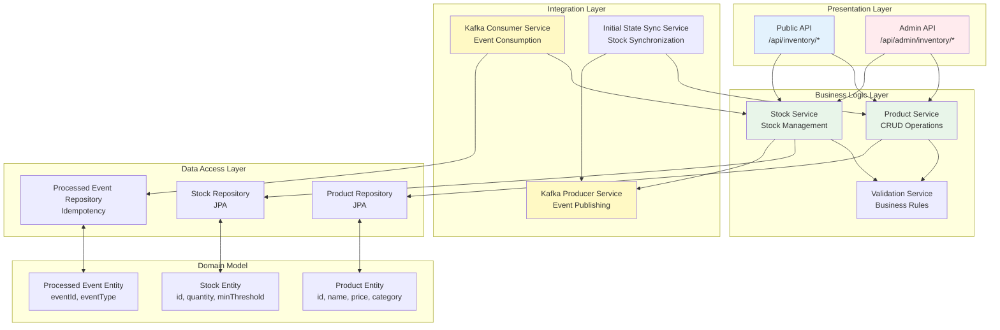
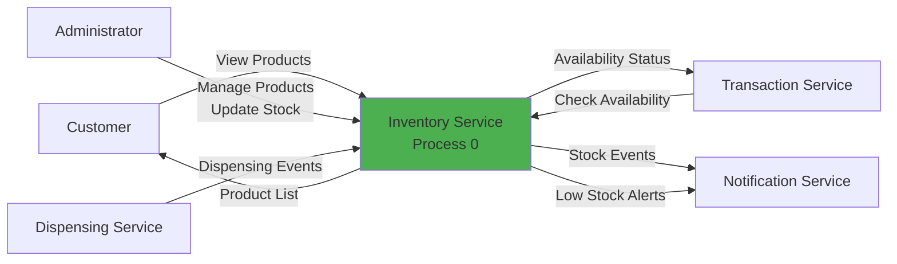
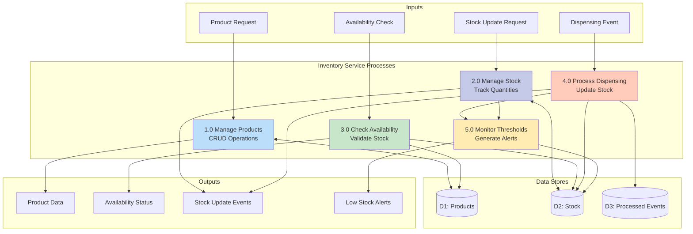
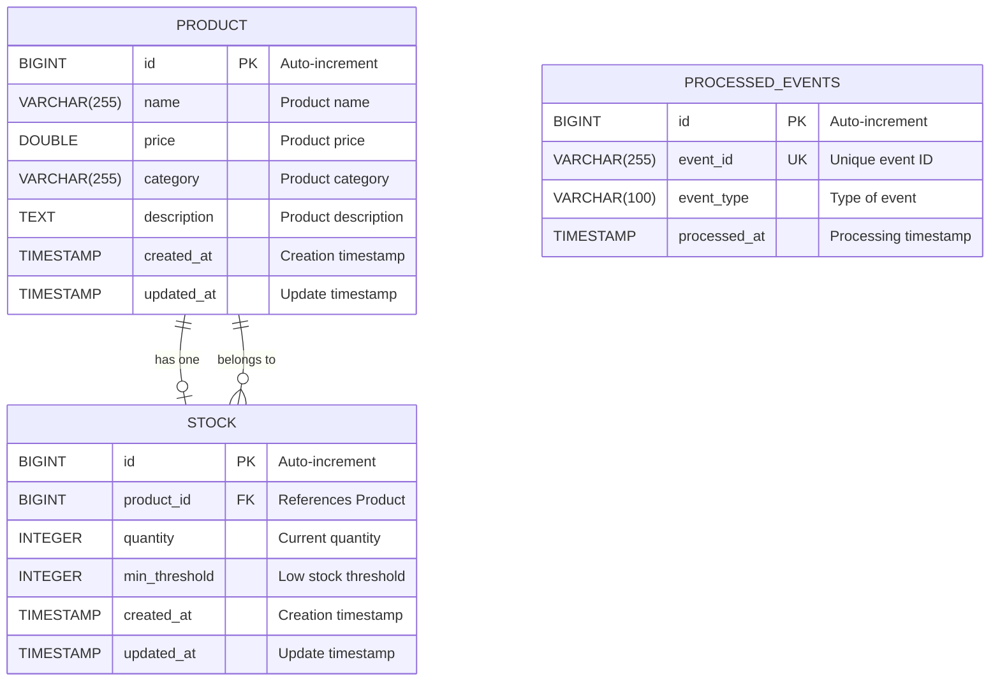
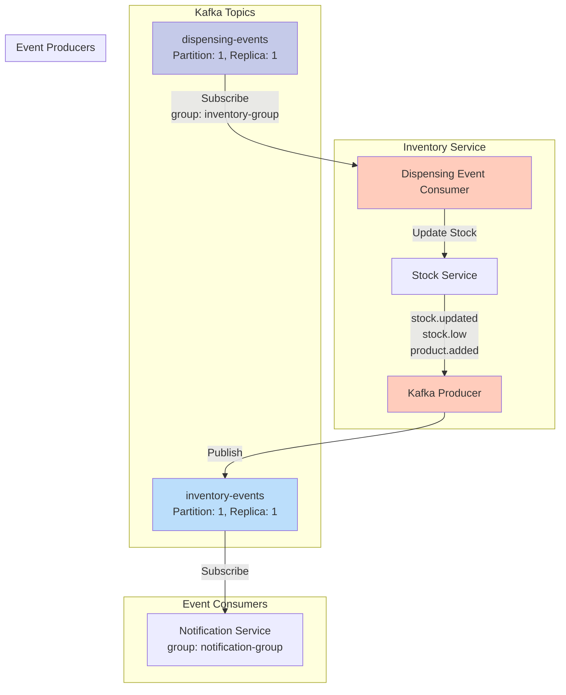
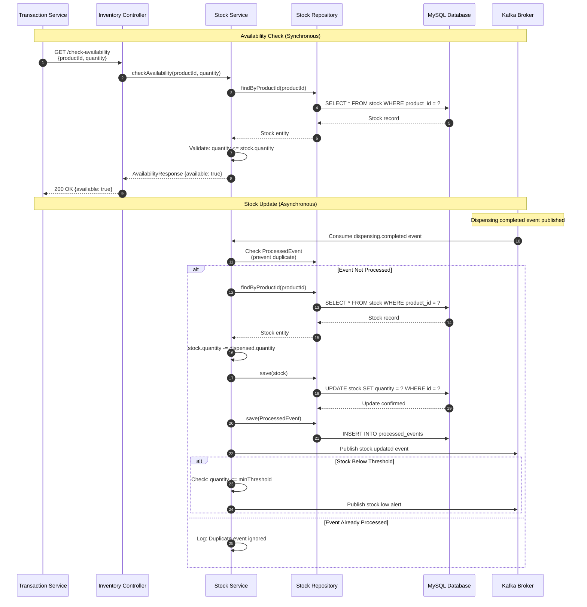
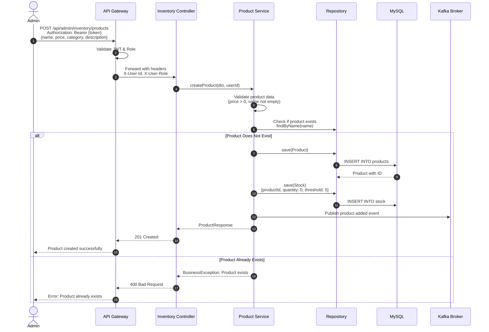
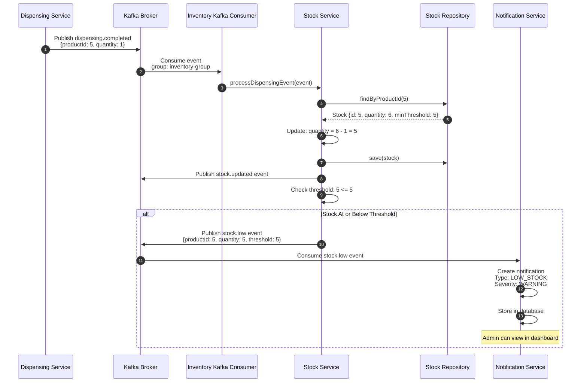

# Inventory Service Diagrams

## Table of Contents

- [Service Context Diagram](#service-context-diagram)
- [Component Diagram](#component-diagram)
- [Data Flow Diagram](#data-flow-diagram)
- [Entity Relationship Diagram](#entity-relationship-diagram)
- [Kafka Topic Flow](#kafka-topic-flow)
- [Sequence Diagrams](#sequence-diagrams)

---

## Service Context Diagram

Shows how Inventory Service interacts with other system components.



---

## Component Diagram

Internal architecture showing all components and their relationships.



---

## Data Flow Diagram

Flow of data through the Inventory Service for key operations.

### DFD Level 0 - Context Level



### DFD Level 1 - Detailed Processes



---

## Entity Relationship Diagram

Database schema for Inventory Service (vending_inventory database).



### Table Details

#### Product Table

- **Primary Key**: `id` (BIGINT, auto-increment)
- **Unique Constraints**: None
- **Indexes**:
  - Primary key index on `id`
  - Index on `category` (for filtering)
- **Relationships**: One-to-One with Stock

#### Stock Table

- **Primary Key**: `id` (BIGINT, auto-increment)
- **Foreign Keys**: `product_id` references `product(id)`
- **Unique Constraints**: `product_id` (one stock record per product)
- **Indexes**:
  - Primary key index on `id`
  - Unique index on `product_id`
  - Index on `quantity` (for low stock queries)
- **Relationships**: One-to-One with Product (owning side)

#### Processed Events Table

- **Primary Key**: `id` (BIGINT, auto-increment)
- **Unique Constraints**: `event_id` (prevent duplicate event processing)
- **Purpose**: Idempotency control for Kafka event consumption
- **Indexes**:
  - Primary key index on `id`
  - Unique index on `event_id`
  - Composite index on `(event_id, event_type)`

---

## Kafka Topic Flow

Inventory Service's interaction with Kafka topics.



### Event Schemas

#### Published Events (inventory-events topic)

**stock.updated event:**

```json
{
  "eventId": "uuid-123",
  "eventType": "STOCK_UPDATED",
  "timestamp": "2024-01-15T10:30:00Z",
  "correlationId": "transaction-uuid",
  "payload": {
    "productId": 1,
    "productName": "Coca Cola 500ml",
    "previousQuantity": 25,
    "currentQuantity": 24,
    "minThreshold": 5
  }
}
```

**stock.low event:**

```json
{
  "eventId": "uuid-456",
  "eventType": "LOW_STOCK_ALERT",
  "timestamp": "2024-01-15T10:30:00Z",
  "correlationId": "inventory-check-uuid",
  "payload": {
    "productId": 1,
    "productName": "Coca Cola 500ml",
    "currentQuantity": 4,
    "minThreshold": 5,
    "alertLevel": "WARNING"
  }
}
```

**product.added event:**

```json
{
  "eventId": "uuid-789",
  "eventType": "PRODUCT_ADDED",
  "timestamp": "2024-01-15T10:30:00Z",
  "correlationId": "admin-operation-uuid",
  "payload": {
    "productId": 10,
    "productName": "Snickers Bar",
    "price": 1.5,
    "category": "Snacks",
    "initialQuantity": 30
  }
}
```

#### Consumed Events (dispensing-events topic)

**dispensing.completed event:**

```json
{
  "eventId": "uuid-321",
  "eventType": "DISPENSING_COMPLETED",
  "timestamp": "2024-01-15T10:29:58Z",
  "correlationId": "transaction-uuid",
  "payload": {
    "transactionId": 100,
    "productId": 1,
    "quantity": 1,
    "dispensingOperationId": 50
  }
}
```

---

## Sequence Diagrams

### Stock Check and Update Flow



### Product Creation Flow



### Low Stock Alert Flow



---

## API Endpoints

### Public Endpoints

#### Get All Products

- **Endpoint**: `GET /api/inventory/products`
- **Auth**: None
- **Response**:

```json
[
  {
    "id": 1,
    "name": "Coca Cola 500ml",
    "price": 2.5,
    "category": "Beverages",
    "description": "Refreshing cola drink",
    "stockQuantity": 24,
    "available": true
  }
]
```

#### Check Availability

- **Endpoint**: `GET /api/inventory/availability/{productId}?quantity={quantity}`
- **Auth**: None
- **Response**:

```json
{
  "productId": 1,
  "available": true,
  "currentQuantity": 24,
  "requestedQuantity": 1
}
```

### Admin Endpoints

#### Create Product

- **Endpoint**: `POST /api/admin/inventory/products`
- **Auth**: JWT (ADMIN or SUPER_ADMIN)
- **Request**:

```json
{
  "name": "Snickers Bar",
  "price": 1.5,
  "category": "Snacks",
  "description": "Chocolate bar with peanuts"
}
```

#### Update Stock

- **Endpoint**: `PUT /api/admin/inventory/stock/{productId}`
- **Auth**: JWT (ADMIN or SUPER_ADMIN)
- **Request**:

```json
{
  "quantity": 50,
  "minThreshold": 10
}
```

#### Get Inventory Reports

- **Endpoint**: `GET /api/admin/inventory/reports`
- **Auth**: JWT (ADMIN or SUPER_ADMIN)
- **Response**:

```json
{
  "totalProducts": 15,
  "lowStockProducts": 3,
  "outOfStockProducts": 1,
  "totalValue": 1250.0,
  "lastUpdated": "2024-01-15T10:30:00Z"
}
```

---

## Error Handling

### Error Scenarios

1. **Product Not Found**

   - HTTP Status: 404
   - Response: `{"error": "Product not found", "correlationId": "uuid"}`

2. **Insufficient Stock**

   - HTTP Status: 400
   - Response: `{"error": "Insufficient stock", "available": 5, "requested": 10}`

3. **Invalid Stock Update**

   - HTTP Status: 400
   - Response: `{"error": "Quantity cannot be negative"}`

4. **Duplicate Product**
   - HTTP Status: 409
   - Response: `{"error": "Product already exists"}`

---

## Performance Characteristics

- **Database Queries**: Optimized with indexes on `product_id`, `quantity`, `category`
- **Event Processing**: < 100ms from Kafka consumption to database update
- **Availability Check**: < 200ms response time
- **Connection Pool**: HikariCP with 10-20 connections
- **Idempotency**: ProcessedEvent table prevents duplicate event processing

---

## Monitoring & Health Checks

### Actuator Endpoints

- `/actuator/health` - Overall service health
- `/actuator/metrics` - Application metrics
- `/actuator/info` - Service information

### Custom Metrics

- `inventory.stock.updates.count` - Stock update operations
- `inventory.low.stock.alerts.count` - Low stock alerts generated
- `inventory.availability.checks.count` - Availability check requests
- `inventory.events.consumed.count` - Kafka events processed

### Health Indicators

- Database connectivity
- Kafka broker connectivity
- Eureka registration status
- Disk space availability

---

## Conclusion

The Inventory Service is a critical component managing product catalog and stock levels with both synchronous availability checks and asynchronous event-driven stock updates. Key features include:

- Real-time stock availability for transaction processing
- Event-driven stock updates after dispensing
- Low stock threshold monitoring and alerting
- Idempotent event processing for data consistency
- Comprehensive admin management interface
