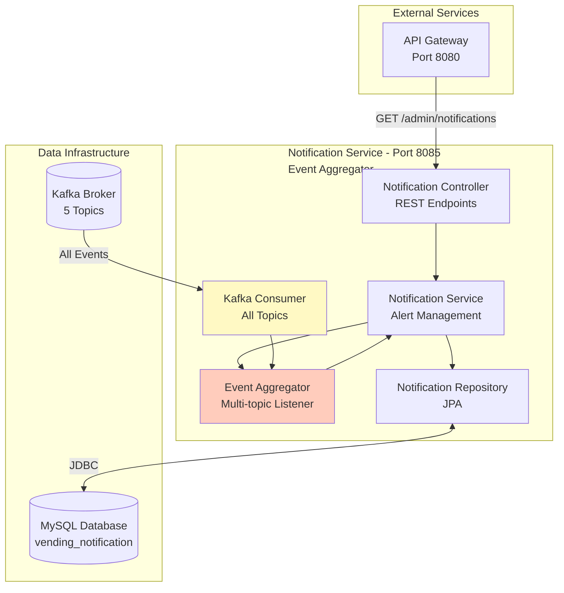
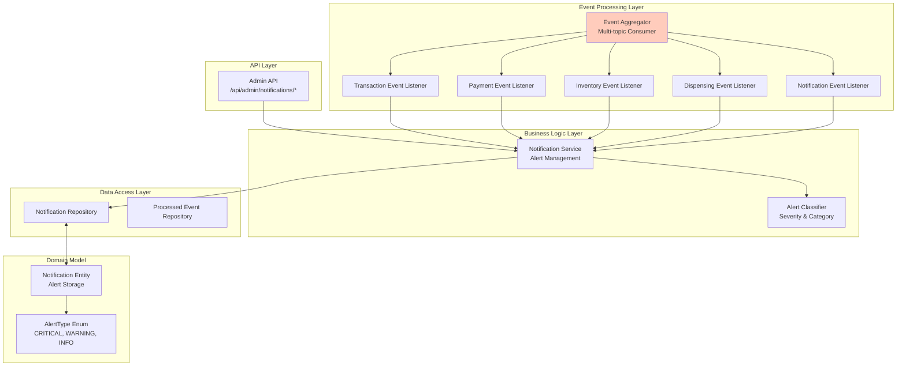
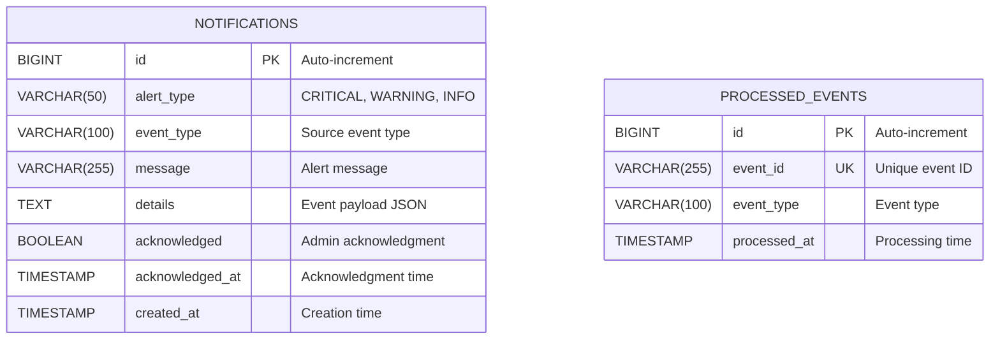
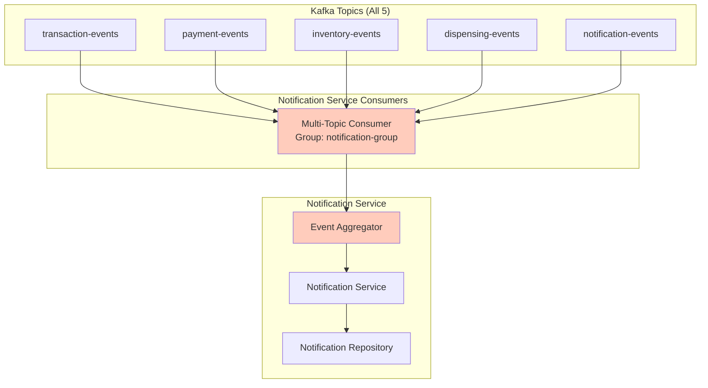
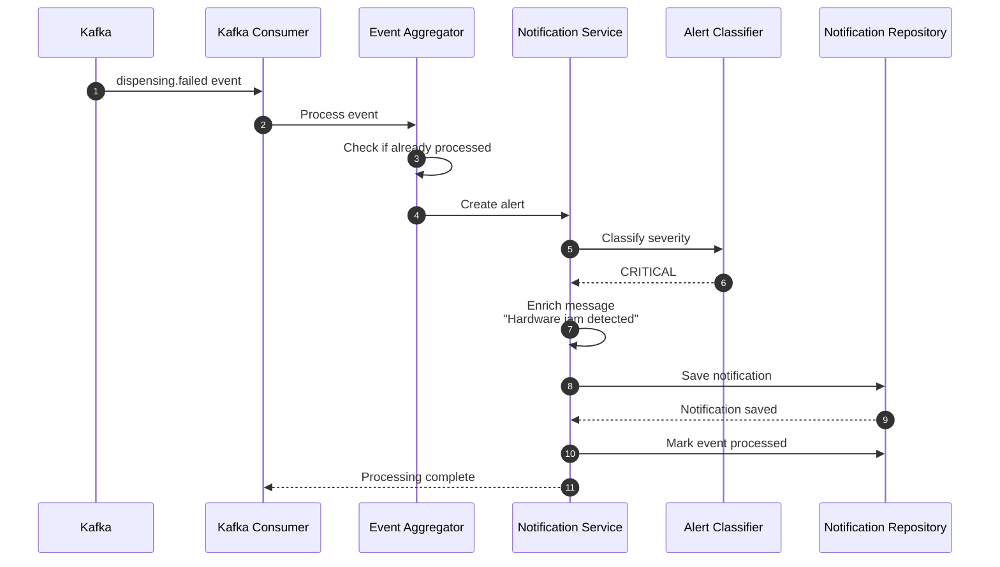
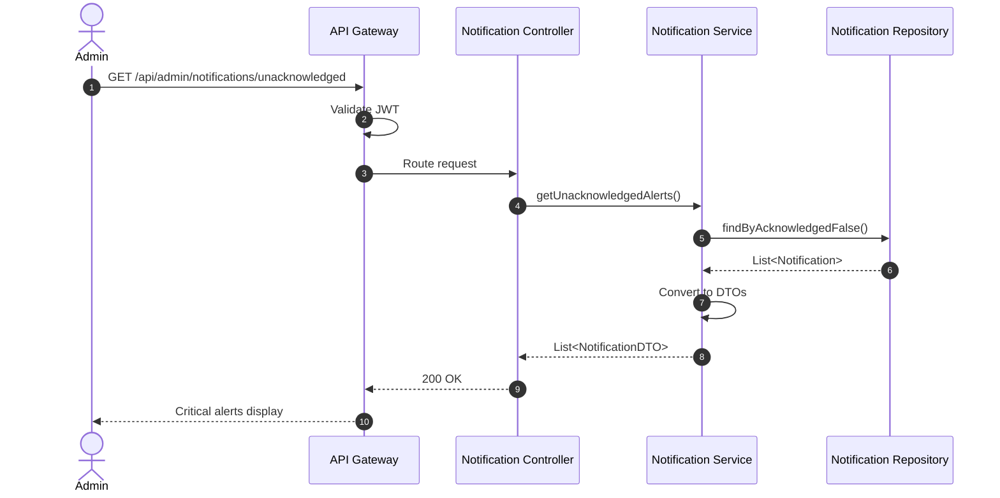
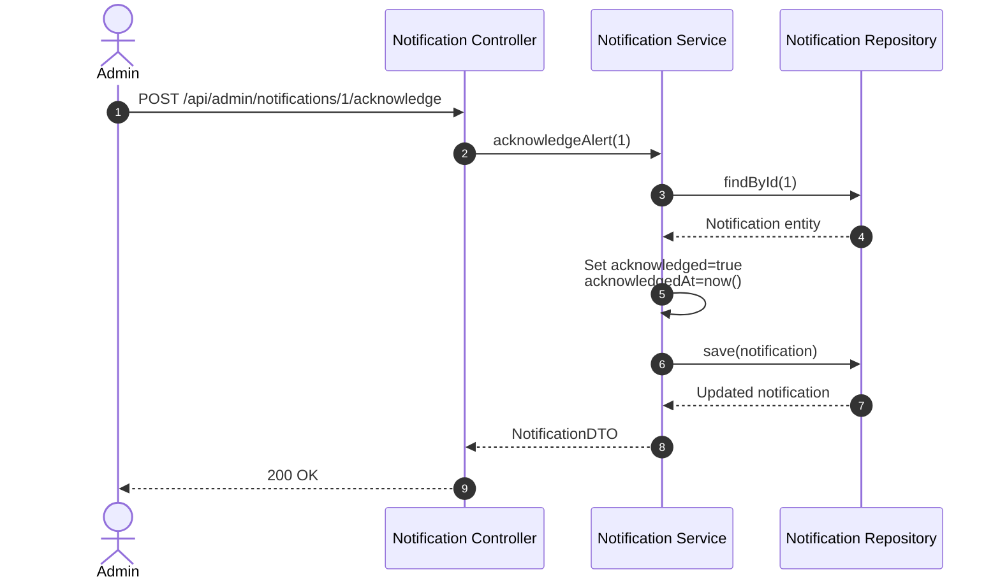

# Notification Service Diagrams

## Table of Contents

- [Service Context Diagram](#service-context-diagram)
- [Component Diagram](#component-diagram)
- [Event Aggregation Flow](#event-aggregation-flow)
- [Entity Relationship Diagram](#entity-relationship-diagram)
- [Kafka Topic Flow](#kafka-topic-flow)
- [Sequence Diagrams](#sequence-diagrams)

---

## Service Context Diagram



---

## Component Diagram



---

## Event Aggregation Flow

```mermaid
flowchart TD
    START([Event Received from Kafka]) --> DEDUPE{Already Processed?}
    DEDUPE -->|Yes| SKIP[Skip duplicate event]
    DEDUPE -->|No| CLASSIFY{Classify Event Type}

    CLASSIFY -->|transaction.failed| TRANS_FAIL[Create CRITICAL alert<br/>"Transaction Failed"]
    CLASSIFY -->|payment.failed| PAY_FAIL[Create CRITICAL alert<br/>"Payment Failed"]
    CLASSIFY -->|dispensing.failed| DISP_FAIL[Create CRITICAL alert<br/>"Dispensing Failed"]
    CLASSIFY -->|stock.low| STOCK_LOW[Create WARNING alert<br/>"Low Stock Alert"]
    CLASSIFY -->|stock.depleted| STOCK_DEP[Create CRITICAL alert<br/>"Stock Depleted"]
    CLASSIFY -->|transaction.completed| TRANS_OK[Create INFO alert<br/>"Transaction Completed"]

    TRANS_FAIL --> ENRICH[Enrich with event data]
    PAY_FAIL --> ENRICH
    DISP_FAIL --> ENRICH
    STOCK_LOW --> ENRICH
    STOCK_DEP --> ENRICH
    TRANS_OK --> ENRICH

    ENRICH --> SAVE[Save notification to database]
    SAVE --> MARK[Mark event as processed]

    MARK --> END([Return success])
    SKIP --> END

    style TRANS_FAIL fill:#ffcdd2
    style PAY_FAIL fill:#ffcdd2
    style DISP_FAIL fill:#ffcdd2
    style STOCK_LOW fill:#fff9c4
    style STOCK_DEP fill:#ffcdd2
    style TRANS_OK fill:#c8e6c9
```

### Alert Classification

| Event Type            | Alert Type | Severity | Action Required       |
| --------------------- | ---------- | -------- | --------------------- |
| transaction.failed    | CRITICAL   | High     | Investigate cause     |
| payment.failed        | CRITICAL   | High     | Verify payment system |
| dispensing.failed     | CRITICAL   | High     | Check hardware        |
| stock.low             | WARNING    | Medium   | Restock soon          |
| stock.depleted        | CRITICAL   | High     | Restock immediately   |
| transaction.completed | INFO       | Low      | None                  |
| payment.completed     | INFO       | Low      | None                  |
| dispensing.completed  | INFO       | Low      | None                  |

---

## Entity Relationship Diagram



---

## Kafka Topic Flow



---

## Sequence Diagrams

### Critical Alert Processing



### Admin Dashboard Query



### Alert Acknowledgment



---

## API Endpoints

### Admin Endpoints

#### Get All Notifications

- **Endpoint**: `GET /api/admin/notifications`
- **Auth**: JWT (ADMIN or SUPER_ADMIN)
- **Response**:

```json
[
  {
    "id": 1,
    "alertType": "CRITICAL",
    "eventType": "dispensing.failed",
    "message": "Hardware jam detected",
    "details": "{\"productId\":1,\"transactionId\":100}",
    "acknowledged": false,
    "createdAt": "2024-01-15T10:30:00Z"
  }
]
```

#### Get Unacknowledged Alerts

- **Endpoint**: `GET /api/admin/notifications/unacknowledged`
- **Auth**: JWT (ADMIN or SUPER_ADMIN)

#### Acknowledge Alert

- **Endpoint**: `POST /api/admin/notifications/{id}/acknowledge`
- **Auth**: JWT (ADMIN or SUPER_ADMIN)

#### Get Alerts by Type

- **Endpoint**: `GET /api/admin/notifications/type/{alertType}`
- **Auth**: JWT (ADMIN or SUPER_ADMIN)

---

## Performance Characteristics

- **Event Processing**: < 50ms per event
- **Database Writes**: 1 per notification
- **Event Deduplication**: < 10ms
- **Admin Dashboard Query**: < 200ms
- **Kafka Consumer Lag**: < 100 events

---

## Conclusion

Notification Service aggregates events from all Kafka topics and classifies them into actionable alerts for administrators. It provides a centralized dashboard for system monitoring and alerting.
