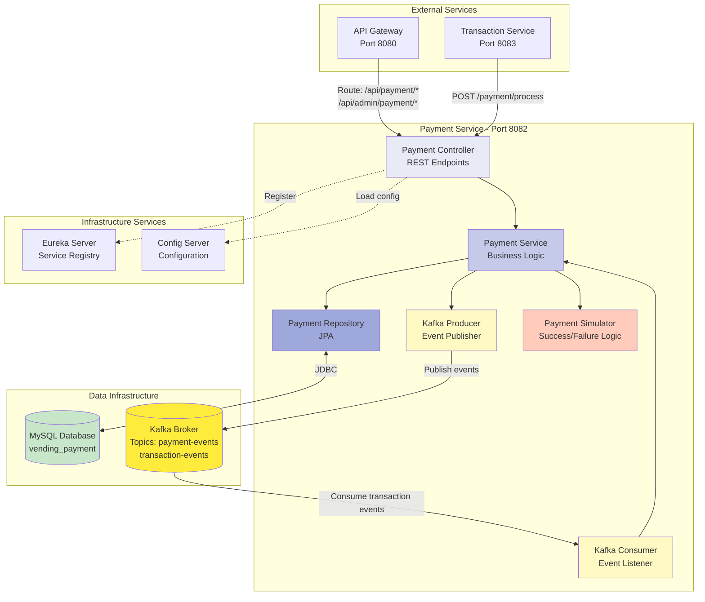
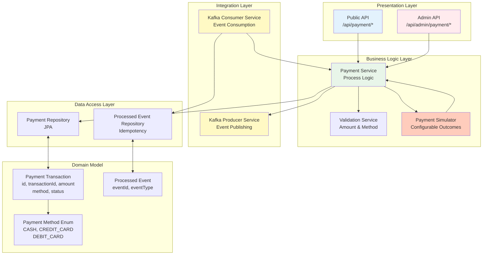
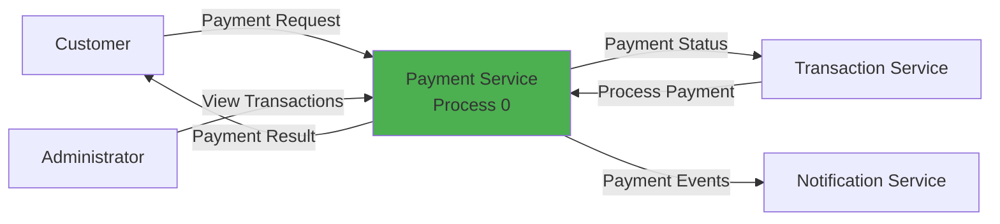
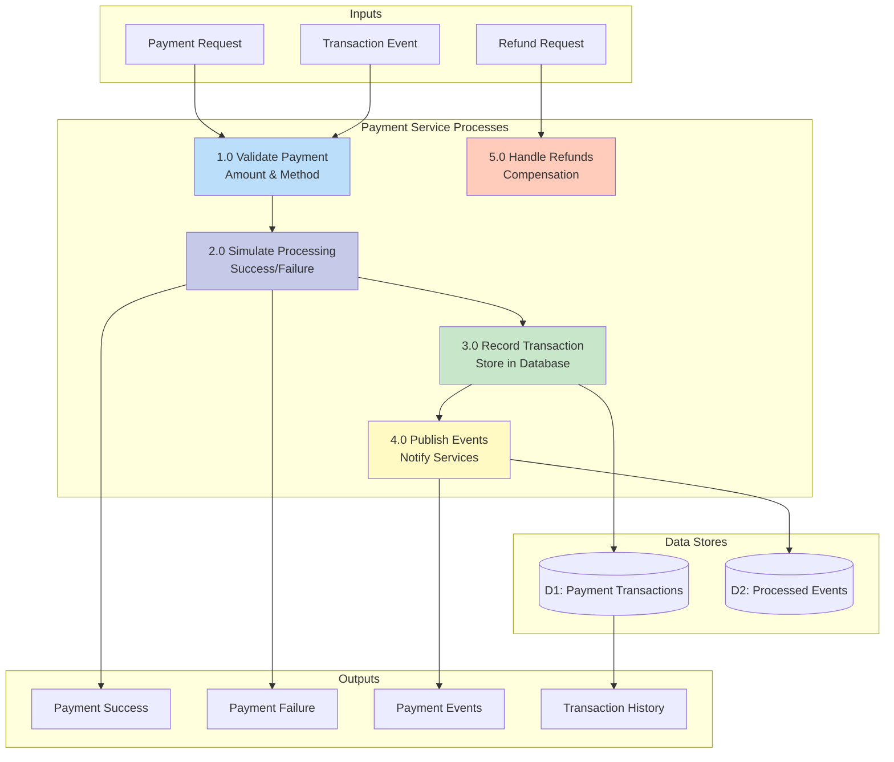
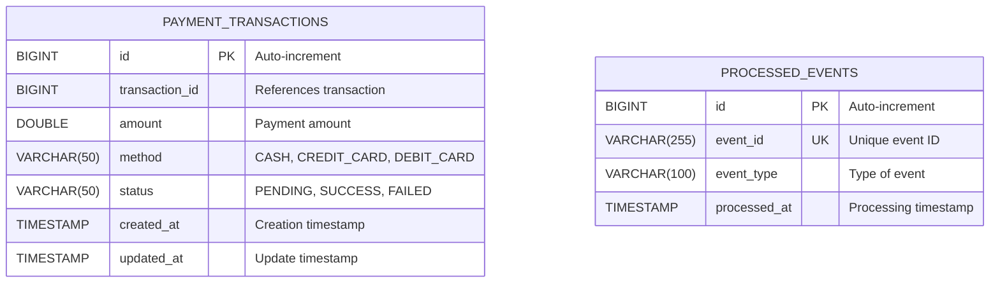
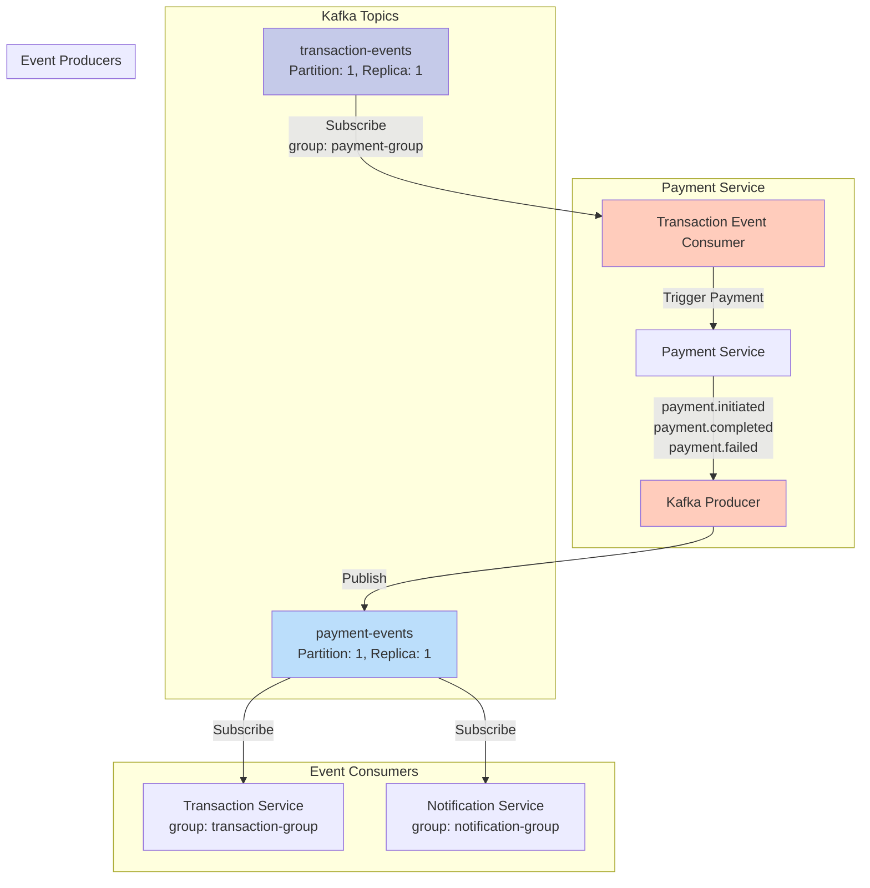
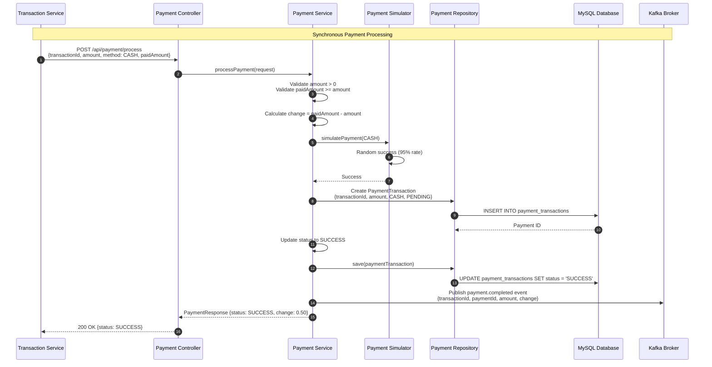
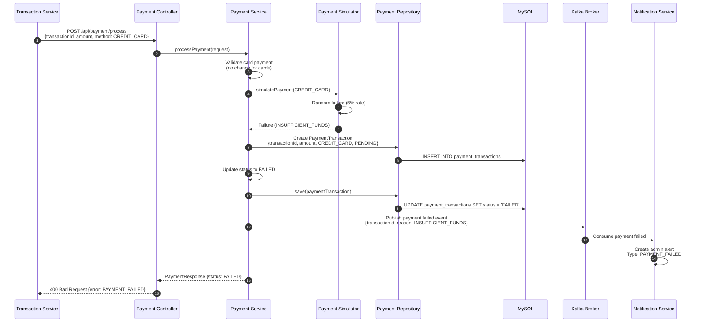
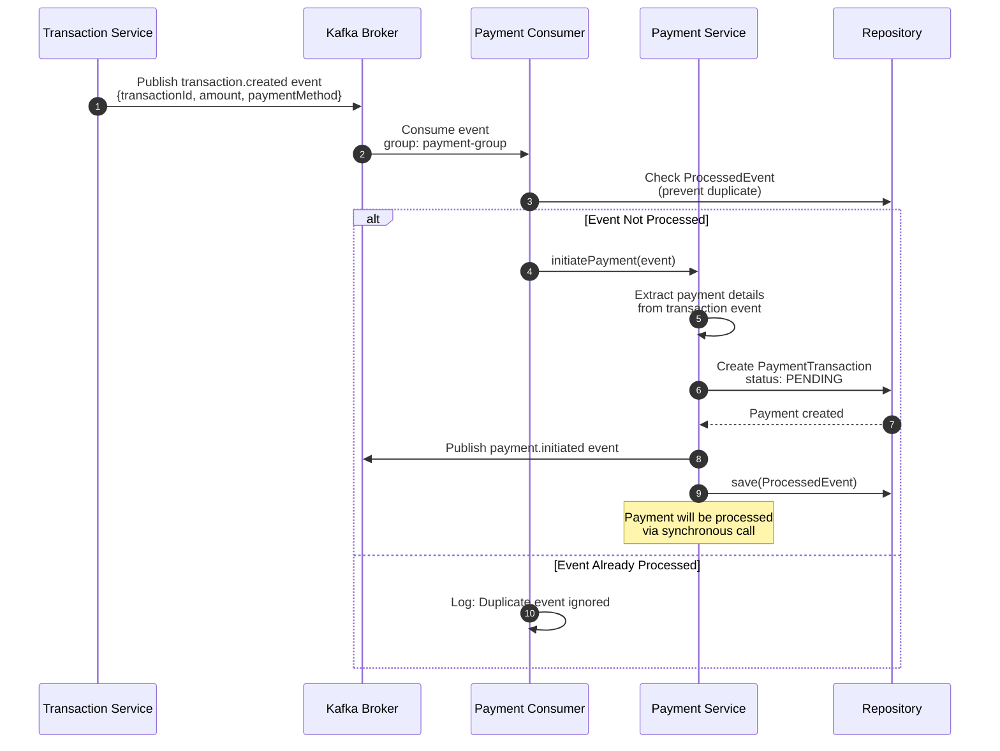
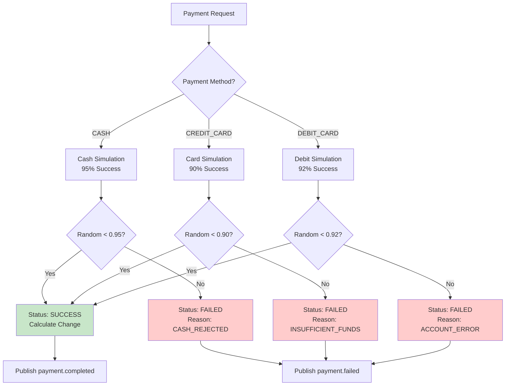

# Payment Service Diagrams

## Table of Contents

- [Service Context Diagram](#service-context-diagram)
- [Component Diagram](#component-diagram)
- [Data Flow Diagram](#data-flow-diagram)
- [Entity Relationship Diagram](#entity-relationship-diagram)
- [Kafka Topic Flow](#kafka-topic-flow)
- [Sequence Diagrams](#sequence-diagrams)

---

## Service Context Diagram

Shows how Payment Service interacts with other system components.



---

## Component Diagram

Internal architecture showing all components and their relationships.



---

## Data Flow Diagram

Flow of data through the Payment Service for key operations.

### DFD Level 0 - Context Level



### DFD Level 1 - Detailed Processes



---

## Entity Relationship Diagram

Database schema for Payment Service (vending_payment database).



### Table Details

#### Payment Transactions Table

- **Primary Key**: `id` (BIGINT, auto-increment)
- **Indexes**:
  - Primary key index on `id`
  - Index on `transaction_id` (for lookup by transaction)
  - Index on `status` (for filtering)
  - Index on `created_at` (for time-based queries)
- **Payment Methods**: CASH, CREDIT_CARD, DEBIT_CARD
- **Status Values**: PENDING, SUCCESS, FAILED

#### Processed Events Table

- **Primary Key**: `id` (BIGINT, auto-increment)
- **Unique Constraints**: `event_id` (prevent duplicate event processing)
- **Purpose**: Idempotency control for Kafka event consumption
- **Indexes**:
  - Primary key index on `id`
  - Unique index on `event_id`

---

## Kafka Topic Flow

Payment Service's interaction with Kafka topics.



### Event Schemas

#### Published Events (payment-events topic)

##### payment.initiated

```json
{
  "eventId": "uuid-123",
  "eventType": "PAYMENT_INITIATED",
  "timestamp": "2024-01-15T10:30:00Z",
  "correlationId": "transaction-uuid",
  "payload": {
    "transactionId": 100,
    "amount": 2.5,
    "paymentMethod": "CASH",
    "status": "PENDING"
  }
}
```

##### payment.completed

```json
{
  "eventId": "uuid-456",
  "eventType": "PAYMENT_COMPLETED",
  "timestamp": "2024-01-15T10:30:02Z",
  "correlationId": "transaction-uuid",
  "payload": {
    "transactionId": 100,
    "paymentId": 50,
    "amount": 2.5,
    "paymentMethod": "CASH",
    "status": "SUCCESS",
    "paidAmount": 3.0,
    "changeAmount": 0.5
  }
}
```

##### payment.failed

```json
{
  "eventId": "uuid-789",
  "eventType": "PAYMENT_FAILED",
  "timestamp": "2024-01-15T10:30:02Z",
  "correlationId": "transaction-uuid",
  "payload": {
    "transactionId": 100,
    "amount": 2.5,
    "paymentMethod": "CREDIT_CARD",
    "status": "FAILED",
    "failureReason": "INSUFFICIENT_FUNDS",
    "errorCode": "ERR_PAYMENT_001"
  }
}
```

#### Consumed Events (transaction-events topic)

##### transaction.created

```json
{
  "eventId": "uuid-321",
  "eventType": "TRANSACTION_CREATED",
  "timestamp": "2024-01-15T10:29:58Z",
  "correlationId": "transaction-uuid",
  "payload": {
    "transactionId": 100,
    "totalAmount": 2.5,
    "paymentMethod": "CASH",
    "items": [
      {
        "productId": 1,
        "quantity": 1,
        "unitPrice": 2.5
      }
    ]
  }
}
```

---

## Sequence Diagrams

### Cash Payment Processing Flow



### Card Payment Processing Flow



### Event-Driven Payment Initiation



---

## API Endpoints

### Public Endpoints

#### Process Payment

- **Endpoint**: `POST /api/payment/process`
- **Auth**: None (called by Transaction Service)
- **Request**:

```json
{
  "transactionId": 100,
  "amount": 2.5,
  "paymentMethod": "CASH",
  "paidAmount": 3.0
}
```

- **Response (Success)**:

```json
{
  "id": 50,
  "amount": 2.5,
  "method": "CASH",
  "status": "SUCCESS",
  "changeAmount": 0.5,
  "createdAt": "2024-01-15T10:30:00Z",
  "updatedAt": "2024-01-15T10:30:02Z"
}
```

- **Response (Failure)**:

```json
{
  "id": 51,
  "amount": 2.5,
  "method": "CREDIT_CARD",
  "status": "FAILED",
  "failureReason": "INSUFFICIENT_FUNDS",
  "createdAt": "2024-01-15T10:30:00Z"
}
```

#### Process Refund

- **Endpoint**: `POST /api/payment/refund`
- **Auth**: None (internal use)
- **Request**:

```json
{
  "paymentId": 50,
  "reason": "DISPENSING_FAILED"
}
```

### Admin Endpoints

#### Get All Transactions

- **Endpoint**: `GET /api/admin/payment/transactions`
- **Auth**: JWT (ADMIN or SUPER_ADMIN)
- **Response**:

```json
[
  {
    "id": 50,
    "transactionId": 100,
    "amount": 2.5,
    "method": "CASH",
    "status": "SUCCESS",
    "createdAt": "2024-01-15T10:30:00Z",
    "updatedAt": "2024-01-15T10:30:02Z"
  }
]
```

#### Get Payment Statistics

- **Endpoint**: `GET /api/admin/payment/statistics`
- **Auth**: JWT (ADMIN or SUPER_ADMIN)
- **Response**:

```json
{
  "totalPayments": 150,
  "successfulPayments": 142,
  "failedPayments": 8,
  "successRate": 94.67,
  "totalAmount": 375.0,
  "paymentMethods": {
    "CASH": 80,
    "CREDIT_CARD": 50,
    "DEBIT_CARD": 20
  }
}
```

---

## Payment Simulation Logic

### Success Rates (Configurable)



### Failure Scenarios

| Payment Method | Possible Failures                                 | Failure Rate |
| -------------- | ------------------------------------------------- | ------------ |
| CASH           | CASH_REJECTED, INSUFFICIENT_AMOUNT                | 5%           |
| CREDIT_CARD    | INSUFFICIENT_FUNDS, CARD_DECLINED, CARD_EXPIRED   | 10%          |
| DEBIT_CARD     | ACCOUNT_ERROR, INSUFFICIENT_BALANCE, CARD_BLOCKED | 8%           |

---

## Error Handling

### Error Scenarios

1. **Invalid Amount**

   - HTTP Status: 400
   - Response: `{"error": "Amount must be positive", "correlationId": "uuid"}`

2. **Insufficient Paid Amount (Cash)**

   - HTTP Status: 400
   - Response: `{"error": "Paid amount less than total", "required": 2.50, "paid": 2.00}`

3. **Payment Processing Failed**

   - HTTP Status: 400
   - Response: `{"error": "Payment failed", "reason": "INSUFFICIENT_FUNDS", "paymentId": 51}`

4. **Transaction Not Found**
   - HTTP Status: 404
   - Response: `{"error": "Transaction not found", "transactionId": 999}`

---

## Performance Characteristics

- **Payment Processing Time**: < 500ms average
- **Success Rate**: 95% for CASH, 90% for CREDIT_CARD, 92% for DEBIT_CARD
- **Database Writes**: 2 per payment (create + update status)
- **Event Publishing**: < 100ms to Kafka
- **Connection Pool**: HikariCP with 10-20 connections
- **Idempotency**: ProcessedEvent table prevents duplicate processing

---

## Monitoring & Health Checks

### Actuator Endpoints

- `/actuator/health` - Overall service health
- `/actuator/metrics` - Application metrics
- `/actuator/info` - Service information

### Custom Metrics

- `payment.processing.count` - Total payments processed
- `payment.success.count` - Successful payments
- `payment.failure.count` - Failed payments
- `payment.method.cash.count` - Cash payments
- `payment.method.card.count` - Card payments
- `payment.processing.duration` - Average processing time

### Health Indicators

- Database connectivity
- Kafka broker connectivity
- Eureka registration status
- Payment simulator status

---

## Business Rules

### Payment Validation

1. **Amount Validation**: Must be positive (> 0)
2. **Cash Payments**: Paid amount must be >= total amount
3. **Card Payments**: No change calculation (exact amount)
4. **Transaction Association**: Must reference valid transaction ID

### Payment Flow Rules

1. All payments start with status PENDING
2. Successful payments update to SUCCESS
3. Failed payments update to FAILED with reason
4. Events published after status update
5. Idempotent processing via ProcessedEvent table

---

## Conclusion

The Payment Service provides payment processing simulation with configurable success/failure rates for testing. Key features include:

- Multiple payment method support (CASH, CREDIT_CARD, DEBIT_CARD)
- Realistic payment simulation with configurable outcomes
- Change calculation for cash payments
- Event-driven architecture for payment status updates
- Complete audit trail for all payment transactions
- Idempotent event processing for data consistency
- Admin interface for payment monitoring and statistics
