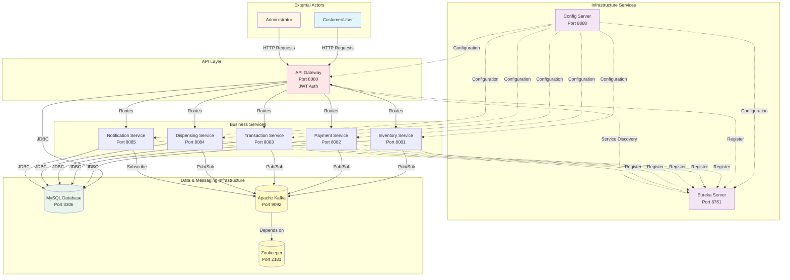
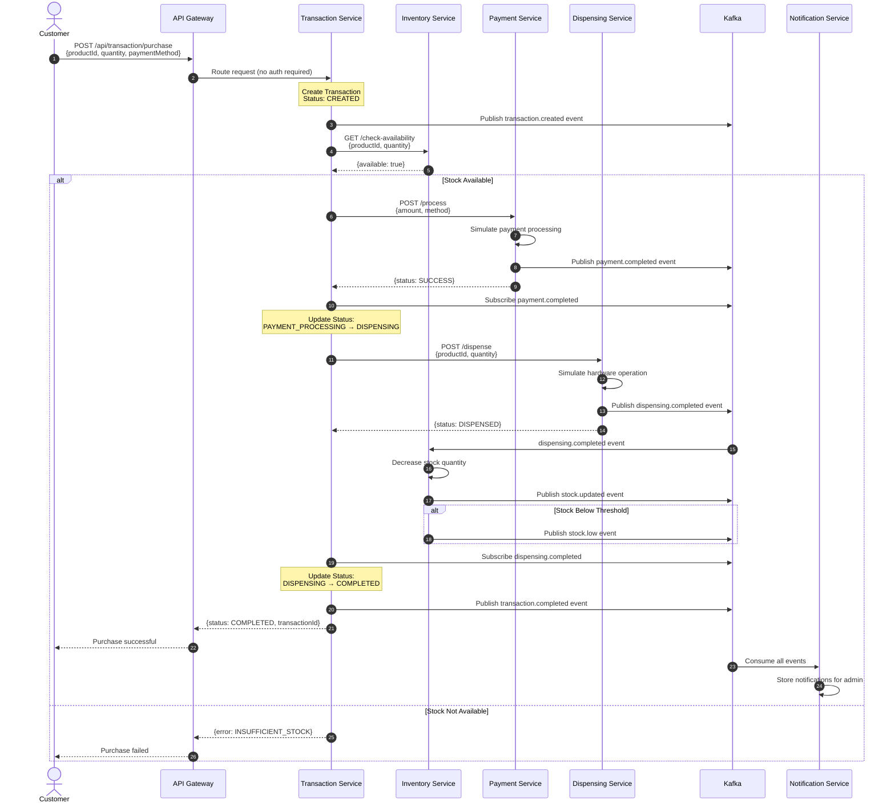
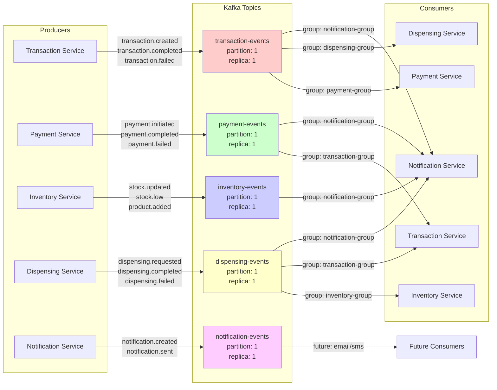
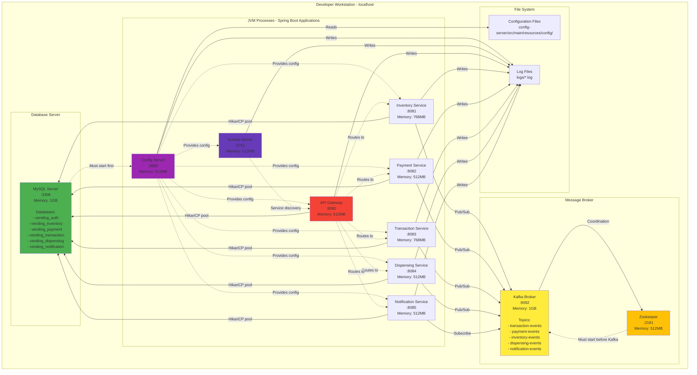
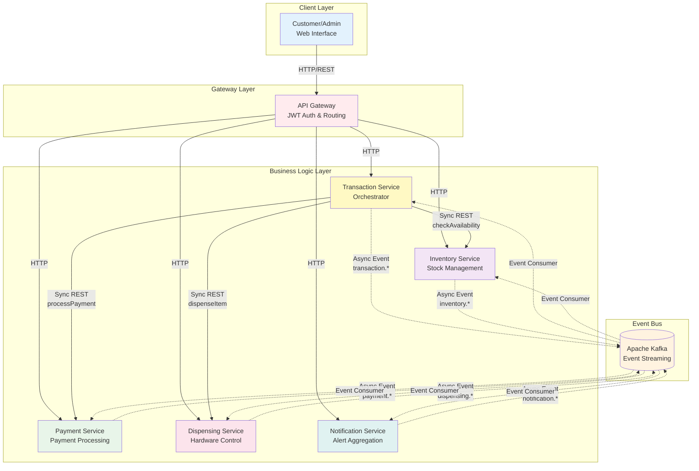
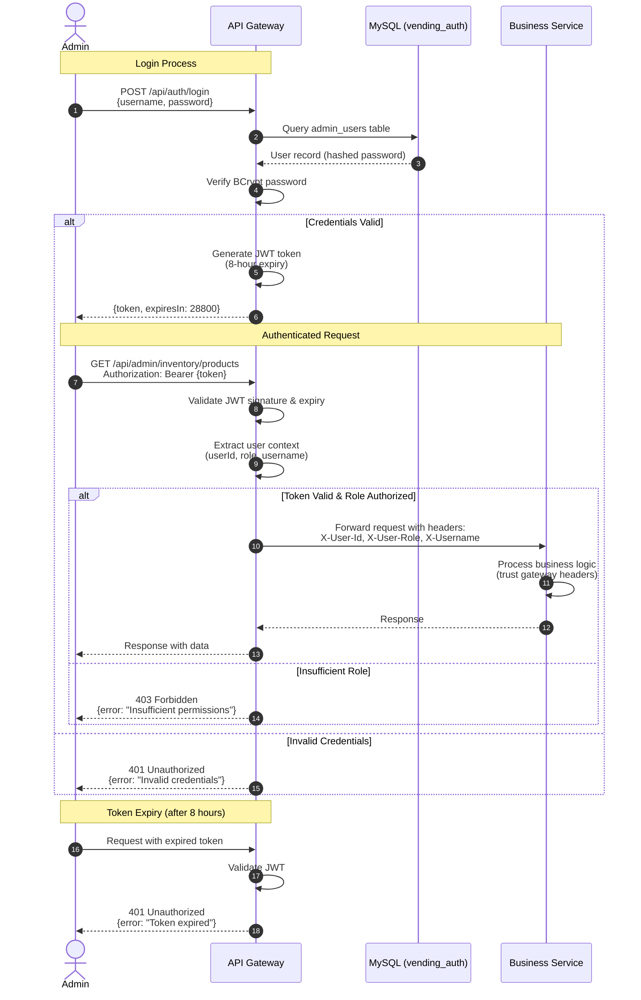
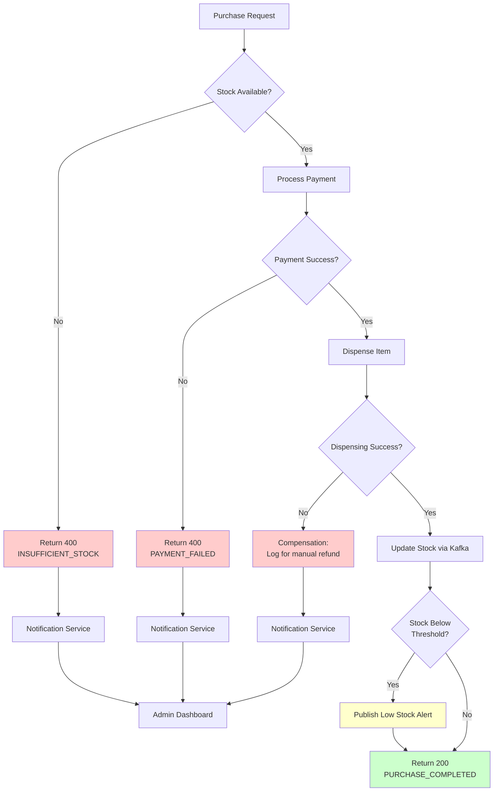
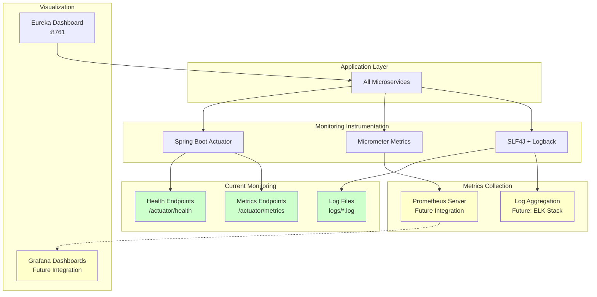

# System Overview - Vending Machine Microservices

## Table of Contents

- [System Context Diagram](#system-context-diagram)
- [Purchase Flow Sequence Diagram](#purchase-flow-sequence-diagram)
- [Kafka Topic Flow Diagram](#kafka-topic-flow-diagram)
- [Deployment Diagram](#deployment-diagram)
- [Service Interaction Map](#service-interaction-map)

---

## System Context Diagram

This diagram shows the high-level system architecture with all services and external dependencies.

---

## Purchase Flow Sequence Diagram

Complete sequence diagram showing a successful purchase transaction from customer request to item dispensing.

---

## Kafka Topic Flow Diagram

Detailed view of Kafka topics and their producer-consumer relationships.

### Event Flow Details

| Topic                   | Event Types                                                    | Producers            | Consumers                                                    | Purpose                                 |
| ----------------------- | -------------------------------------------------------------- | -------------------- | ------------------------------------------------------------ | --------------------------------------- |
| **transaction-events**  | transaction.created, transaction.completed, transaction.failed | Transaction Service  | Payment Service, Dispensing Service, Notification Service    | Transaction lifecycle coordination      |
| **payment-events**      | payment.initiated, payment.completed, payment.failed           | Payment Service      | Transaction Service, Notification Service                    | Payment processing results              |
| **inventory-events**    | stock.updated, stock.low, product.added                        | Inventory Service    | Notification Service                                         | Inventory updates and alerts            |
| **dispensing-events**   | dispensing.requested, dispensing.completed, dispensing.failed  | Dispensing Service   | Inventory Service, Transaction Service, Notification Service | Dispensing operations and stock updates |
| **notification-events** | notification.created, notification.sent                        | Notification Service | Future integrations                                          | System-wide notifications               |

---

## Deployment Diagram

Local development deployment architecture showing all components and their network connections.

### System Requirements

| Component            | Memory   | Disk     | CPU    | Network   |
| -------------------- | -------- | -------- | ------ | --------- |
| Config Server        | 512MB    | 50MB     | Low    | localhost |
| Eureka Server        | 512MB    | 50MB     | Low    | localhost |
| API Gateway          | 512MB    | 100MB    | Medium | localhost |
| Inventory Service    | 768MB    | 200MB    | Medium | localhost |
| Payment Service      | 512MB    | 100MB    | Low    | localhost |
| Transaction Service  | 768MB    | 200MB    | Medium | localhost |
| Dispensing Service   | 512MB    | 100MB    | Low    | localhost |
| Notification Service | 512MB    | 100MB    | Low    | localhost |
| MySQL Server         | 1GB      | 500MB    | Medium | localhost |
| Kafka + Zookeeper    | 1.5GB    | 1GB      | Medium | localhost |
| **Total**            | **~6GB** | **~2GB** | -      | -         |

---

## Service Interaction Map

High-level view of service communication patterns (synchronous vs asynchronous).

### Communication Patterns

#### Synchronous Communication (HTTP/REST)

- **Use Case**: Real-time transactions requiring immediate response
- **Pattern**: Request-Response
- **Examples**:
  - Customer purchase initiation
  - Inventory availability check
  - Payment processing
  - Dispensing request
  - Admin operations

#### Asynchronous Communication (Kafka Events)

- **Use Case**: State updates, notifications, eventual consistency
- **Pattern**: Publish-Subscribe
- **Examples**:
  - Stock level updates
  - Payment completion notifications
  - Transaction status changes
  - Low stock alerts
  - Dispensing completion

### Service Responsibilities

| Service                  | Primary Responsibility            | Communication Pattern       |
| ------------------------ | --------------------------------- | --------------------------- |
| **API Gateway**          | Authentication, Routing, Security | Synchronous (HTTP)          |
| **Transaction Service**  | Purchase orchestration            | Sync + Async (Orchestrator) |
| **Inventory Service**    | Product & stock management        | Sync + Async                |
| **Payment Service**      | Payment processing                | Sync + Async                |
| **Dispensing Service**   | Hardware simulation               | Sync + Async                |
| **Notification Service** | Alert aggregation                 | Async only (Event-driven)   |

---

## Authentication Flow Diagram

JWT-based authentication and authorization flow at API Gateway level.

### Role-Based Access Matrix

| Endpoint Pattern              | SUPER_ADMIN | ADMIN | Public |
| ----------------------------- | ----------- | ----- | ------ |
| `/api/auth/login`             | ✓           | ✓     | ✓      |
| `/api/admin/users/**`         | ✓ (manage)  | ✗     | ✗      |
| `/api/admin/inventory/**`     | ✓           | ✓     | ✗      |
| `/api/admin/payment/**`       | ✓           | ✓     | ✗      |
| `/api/admin/transaction/**`   | ✓           | ✓     | ✗      |
| `/api/admin/dispensing/**`    | ✓           | ✓     | ✗      |
| `/api/admin/notifications/**` | ✓           | ✓     | ✗      |
| `/api/inventory/products`     | ✓           | ✓     | ✓      |
| `/api/transaction/purchase`   | ✓           | ✓     | ✓      |

---

## Error Flow Diagram

Error handling and recovery patterns across services.

---

## Performance Monitoring Architecture

---

## Conclusion

This system overview provides comprehensive diagrams for understanding the complete Vending Machine Microservices architecture. Key takeaways:

1. **Hybrid Communication**: Synchronous HTTP for real-time operations, asynchronous Kafka for eventual consistency
2. **Centralized Security**: JWT authentication at API Gateway with role-based access control
3. **Event-Driven Architecture**: Kafka enables loose coupling and scalability
4. **Service Independence**: Each service owns its data and business logic
5. **Observability**: Comprehensive monitoring through Actuator, logs, and metrics

For service-specific details, refer to individual service diagram documents in this directory.
