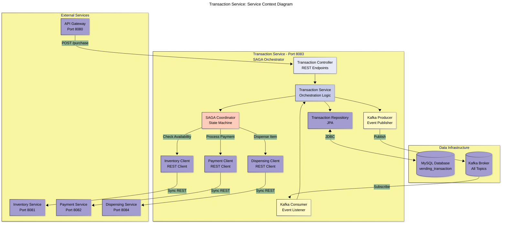
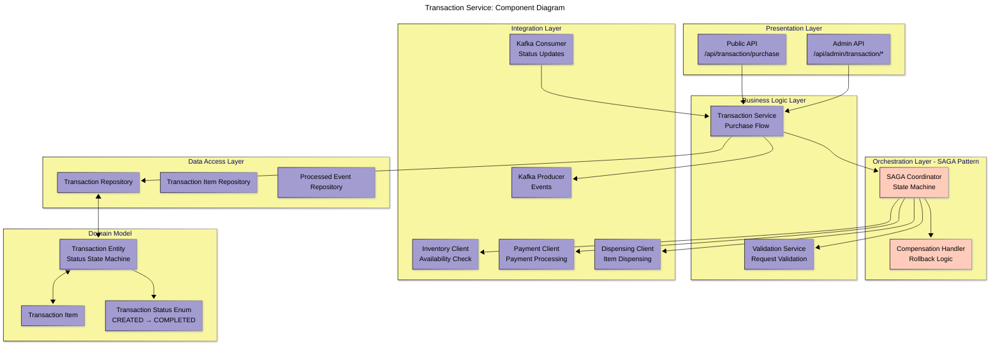
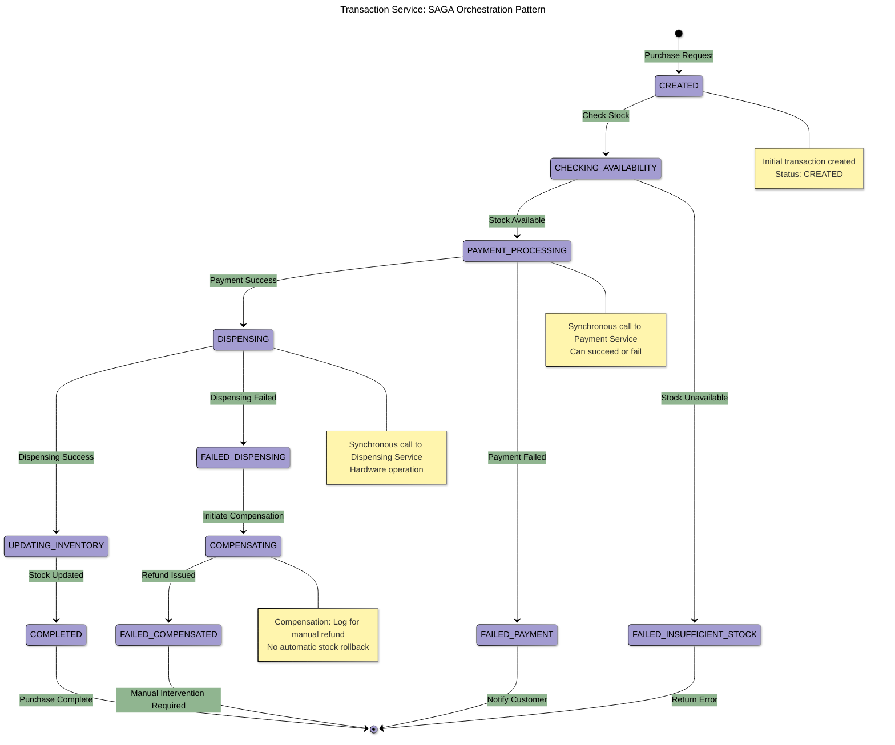
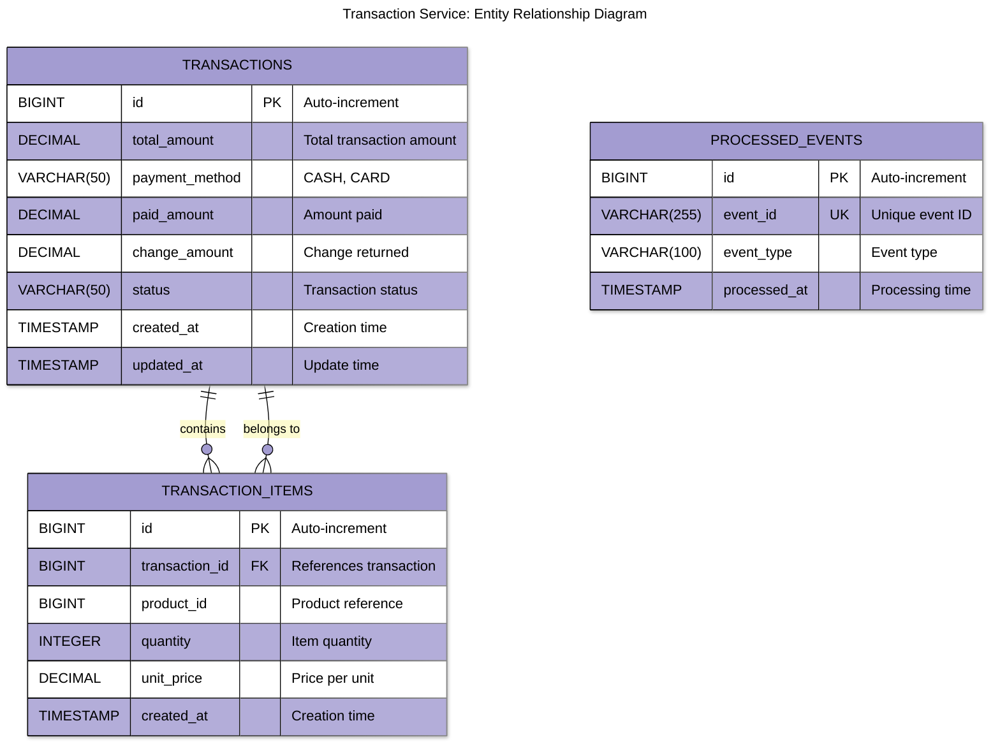
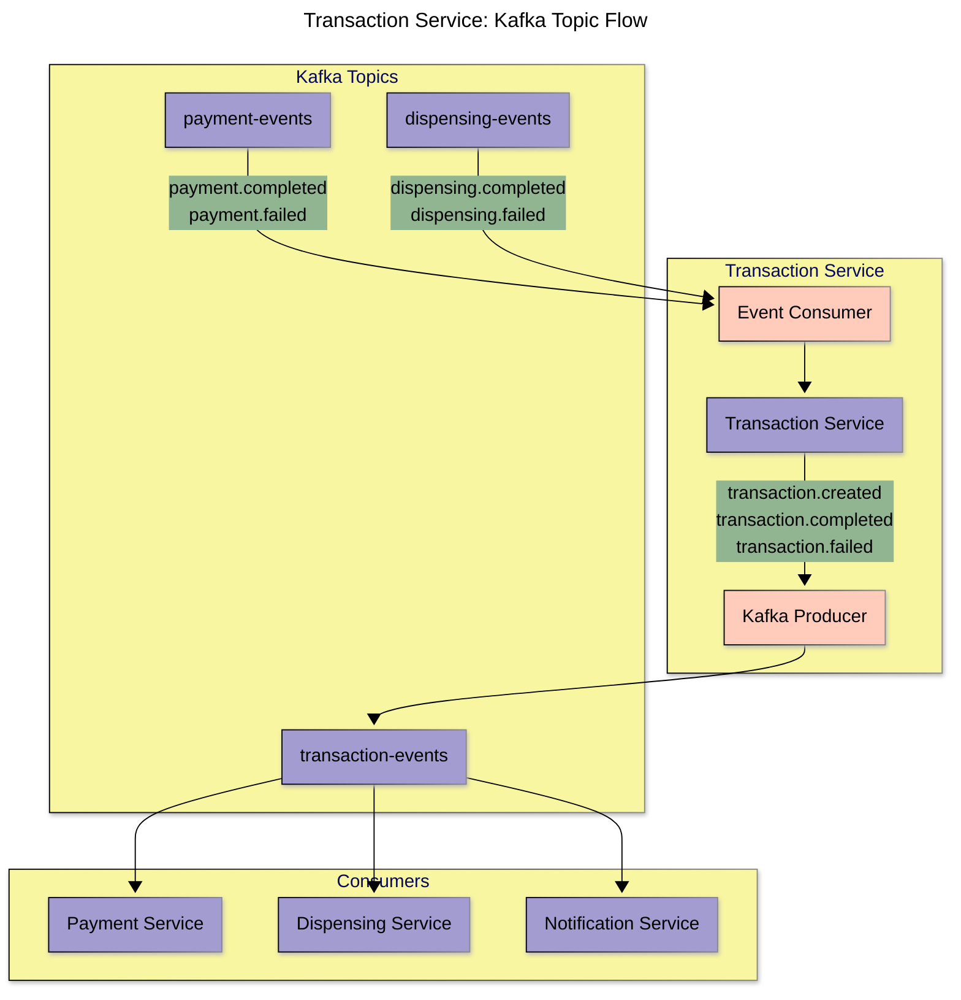
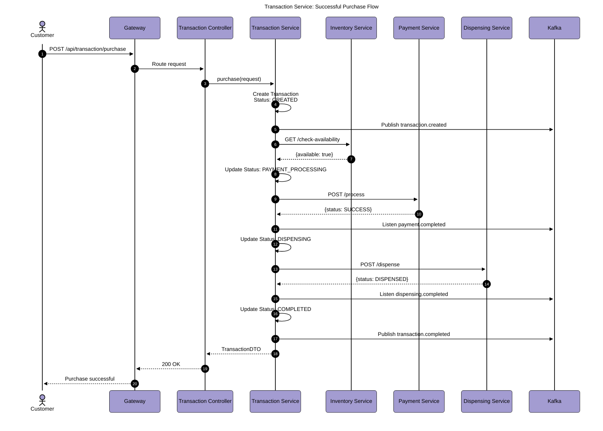
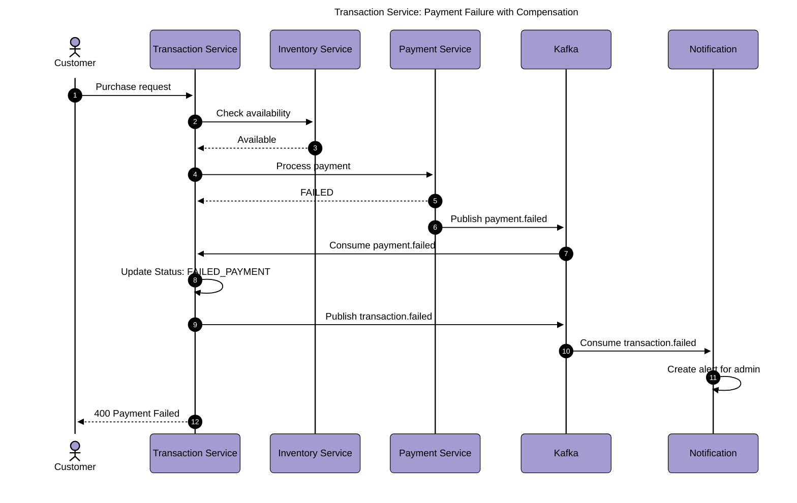
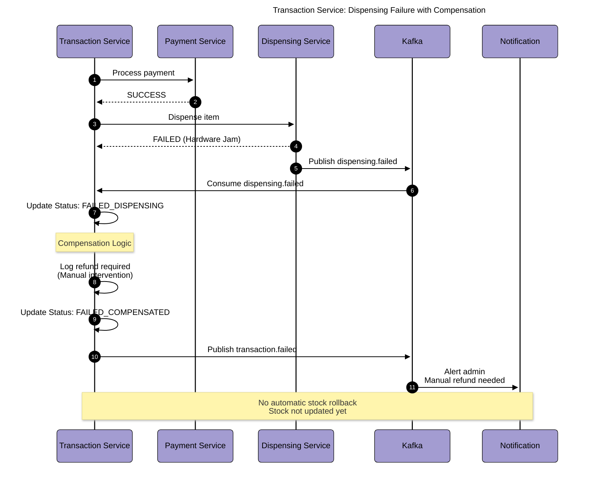

# Transaction Service Diagrams

## Table of Contents

- [Service Context Diagram](#service-context-diagram)
- [Component Diagram](#component-diagram)
- [SAGA Orchestration Pattern](#saga-orchestration-pattern)
- [Entity Relationship Diagram](#entity-relationship-diagram)
- [Kafka Topic Flow](#kafka-topic-flow)
- [Sequence Diagrams](#sequence-diagrams)

---

## Service Context Diagram

Transaction Service as the central orchestrator coordinating the entire purchase flow.



---

## Component Diagram



---

## SAGA Orchestration Pattern

Transaction Service implements orchestration-based SAGA for distributed transaction management.



### SAGA Steps

| Step | Action               | Service Called | Sync/Async  | Compensation               |
| ---- | -------------------- | -------------- | ----------- | -------------------------- |
| 1    | Check Availability   | Inventory      | Sync REST   | None needed                |
| 2    | Process Payment      | Payment        | Sync REST   | Refund (logged)            |
| 3    | Dispense Item        | Dispensing     | Sync REST   | Manual intervention        |
| 4    | Update Stock         | Inventory      | Async Kafka | None (event not published) |
| 5    | Complete Transaction | Self           | Internal    | None                       |

---

## Entity Relationship Diagram



### Transaction Status Enum

```plaintext
CREATED → PAYMENT_PROCESSING → DISPENSING → COMPLETED
                ↓                    ↓
        FAILED_PAYMENT      FAILED_DISPENSING
                                     ↓
                            FAILED_COMPENSATED
```

---

## Kafka Topic Flow



---

## Sequence Diagrams

### Successful Purchase Flow



### Payment Failure Flow with Compensation



### Dispensing Failure with Compensation



---

## API Endpoints

### Public Endpoints

#### Purchase Transaction

- **Endpoint**: `POST /api/transaction/purchase`
- **Auth**: None
- **Request**:

```json
{
  "productId": 1,
  "quantity": 1,
  "paymentMethod": "CASH",
  "paidAmount": 3.0
}
```

- **Response**:

```json
{
  "id": 100,
  "items": [
    {
      "productId": 1,
      "productName": "Coca Cola 500ml",
      "quantity": 1,
      "unitPrice": 2.5
    }
  ],
  "totalAmount": 2.5,
  "paidAmount": 3.0,
  "changeAmount": 0.5,
  "paymentMethod": "CASH",
  "status": "COMPLETED",
  "createdAt": "2024-01-15T10:30:00Z"
}
```

### Admin Endpoints

#### Get Transaction History

- **Endpoint**: `GET /api/admin/transaction/history`
- **Auth**: JWT (ADMIN or SUPER_ADMIN)

#### Get Transaction Statistics

- **Endpoint**: `GET /api/admin/transaction/statistics`
- **Auth**: JWT (ADMIN or SUPER_ADMIN)

---

## Performance Characteristics

- **End-to-End Purchase**: < 5 seconds
- **Availability Check**: < 200ms
- **Payment Processing**: < 500ms
- **Dispensing**: < 1 second
- **Event Publishing**: < 100ms
- **Database Writes**: 3-5 per transaction

---

## Monitoring & Health Checks

### Custom Metrics

- `transaction.purchase.count` - Total purchases
- `transaction.success.count` - Successful transactions
- `transaction.failure.count` - Failed transactions
- `transaction.duration.avg` - Average completion time
- `transaction.step.inventory.duration` - Inventory check time
- `transaction.step.payment.duration` - Payment processing time
- `transaction.step.dispensing.duration` - Dispensing time

---

## Conclusion

The Transaction Service is the central orchestrator implementing SAGA pattern for distributed transaction management. It coordinates inventory checks, payment processing, and item dispensing while handling failures gracefully with compensation logic.
