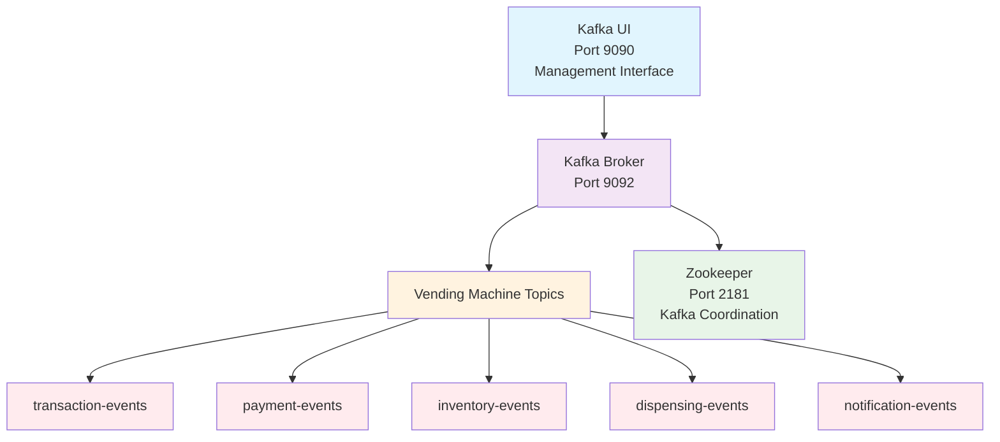

# 🚀 Vending Machine Kafka Infrastructure

Standalone Kafka infrastructure for the Vending Machine Microservices ecosystem.

## 📋 Description

This directory contains all the configuration needed to run Apache Kafka as a message broker for communication between the Vending Machine microservices, including:

- Docker Compose configuration optimized for Vending Machine topics
- Automated management scripts
- Complete documentation
- Development-friendly settings

## 🏗️ Architecture



## 🚀 Quick Start

### Prerequisites

- Docker installed and running
- Docker Compose
- PowerShell (Windows)

### 1. Navigate to Infrastructure Directory

```bash
cd vending-machine-system/kafka-infrastructure
```

### 2. Start Infrastructure

```powershell
.\scripts\kafka-manager.ps1 start
```

### 3. Check Status

```powershell
.\scripts\kafka-manager.ps1 status
```

### 4. Access Kafka UI

- **URL**: <http://localhost:9090>
- **Bootstrap Servers**: localhost:9092

## 📁 Repository Structure

```plain
kafka-infrastructure/
├── docker-compose.yml              # Main Docker configuration
├── README.md                       # This file
├── .env.example                    # Example environment variables
├── .gitignore                      # Git ignore rules
├── scripts/                        # Management scripts
│   └── kafka-manager.ps1           # PowerShell management script
├── config/                         # Kafka configurations
│   ├── kafka.properties            # Custom Kafka settings
│   └── log4j.properties            # Logging configuration
└── docs/                           # Documentation
    ├── SETUP.md                    # Detailed setup guide
    ├── QUICK_GUIDE.md              # Quick usage guide
    ├── TROUBLESHOOTING.md          # Common issues and solutions
    └── INTEGRATION.md              # Microservice integration guide
```

## 🛠️ Available Commands

### Management Script

| Command                                     | Description                      |
| ------------------------------------------- | -------------------------------- |
| `.\scripts\kafka-manager.ps1 start`         | Starts the entire infrastructure |
| `.\scripts\kafka-manager.ps1 stop`          | Stops all services               |
| `.\scripts\kafka-manager.ps1 restart`       | Restarts services                |
| `.\scripts\kafka-manager.ps1 status`        | Shows current status             |
| `.\scripts\kafka-manager.ps1 logs`          | Streams real-time logs           |
| `.\scripts\kafka-manager.ps1 topics`        | Lists all topics                 |
| `.\scripts\kafka-manager.ps1 create-topics` | Creates Vending Machine topics   |
| `.\scripts\kafka-manager.ps1 help`          | Displays full help               |

### Direct Docker Compose

```powershell
# Start services
docker-compose up -d

# Stop services
docker-compose down

# View logs
docker-compose logs -f kafka

# View status
docker-compose ps
```

## 📋 Configured Topics

| Topic               | Partitions | Replication | Description                     |
| ------------------- | ---------- | ----------- | ------------------------------- |
| transaction-events  | 1          | 1           | Transaction lifecycle events    |
| payment-events      | 1          | 1           | Payment processing events       |
| inventory-events    | 1          | 1           | Stock and inventory changes     |
| dispensing-events   | 1          | 1           | Hardware dispensing operations  |
| notification-events | 1          | 1           | System notifications and alerts |

## 🔧 Microservice Integration

### Spring Boot Configuration

Add to your `application.properties`:

```properties
# Kafka Configuration
spring.kafka.bootstrap-servers=localhost:9092
spring.kafka.consumer.auto-offset-reset=earliest
spring.kafka.consumer.key-deserializer=org.apache.kafka.common.serialization.StringDeserializer
spring.kafka.consumer.value-deserializer=org.springframework.kafka.support.serializer.JsonDeserializer
spring.kafka.consumer.properties.spring.json.trusted.packages=*
spring.kafka.producer.key-serializer=org.apache.kafka.common.serialization.StringSerializer
spring.kafka.producer.value-serializer=org.springframework.kafka.support.serializer.JsonSerializer
```

### Event Flow

- **Transaction Service** → Publishes to `transaction-events`
- **Payment Service** → Publishes to `payment-events`, consumes `transaction-events`
- **Inventory Service** → Publishes to `inventory-events`, consumes `transaction-events`
- **Dispensing Service** → Publishes to `dispensing-events`, consumes multiple topics
- **Notification Service** → Publishes to `notification-events`, consumes all topics

## 🌐 Ports Used

| Service   | Host Port | Container Port | Description           |
| --------- | --------- | -------------- | --------------------- |
| Zookeeper | 2181      | 2181           | Zookeeper client port |
| Kafka     | 9092      | 9092           | Bootstrap servers     |
| Kafka JMX | 9101      | 9101           | JMX metrics           |
| Kafka UI  | 9090      | 8080           | Web interface         |

## 🔍 Monitoring & Debug

### Kafka UI Dashboard

Visit <http://localhost:9090> to:

- View topics and messages
- Monitor consumers
- Analyze throughput
- Manage configurations

### Useful CLI Commands

```powershell
# List topics
docker exec vending-kafka kafka-topics --bootstrap-server localhost:9092 --list

# Describe a topic
docker exec vending-kafka kafka-topics --bootstrap-server localhost:9092 --describe --topic transaction-events

# Consume live messages
docker exec vending-kafka kafka-console-consumer --bootstrap-server localhost:9092 --topic transaction-events --from-beginning

# Produce test messages
docker exec -it vending-kafka kafka-console-producer --bootstrap-server localhost:9092 --topic transaction-events
```

## 📚 Additional Documentation

- [Detailed Setup Guide](docs/SETUP.md)
- [Quick Usage Guide](docs/QUICK_GUIDE.md)
- [Troubleshooting](docs/TROUBLESHOOTING.md)
- [Microservice Integration](docs/INTEGRATION.md)

## 🚀 Integration with Vending Machine Services

This infrastructure is designed to integrate with:

- **API Gateway** (port 8080)
- **Config Server** (port 8888)
- **Eureka Server** (port 8761)
- **Inventory Service** (port 8081)
- **Payment Service** (port 8082)
- **Transaction Service** (port 8083)
- **Dispensing Service** (port 8084)
- **Notification Service** (port 8085)

## ⚠️ Important Notes

- **Kafka must be running BEFORE starting the microservices**
- Topics are created automatically on startup if they don't exist
- Single broker configuration optimized for development
- Data is persisted using Docker volumes
- For production use, consider the multi-broker configuration in docs

## 🆘 Support

If you encounter issues:

1. Check that Docker is running
2. Verify ports 9092, 2181, and 9090 are available
3. Check logs: `.\scripts\kafka-manager.ps1 logs`
4. Restart infrastructure: `.\scripts\kafka-manager.ps1 restart`
5. Review [troubleshooting documentation](docs/TROUBLESHOOTING.md)

---

**Built for the Vending Machine Microservices ecosystem** 🏪
